<center><font color="black" size=6 face="宋体"> Lab1:组合逻辑电路 </font></center>

## 1、4 路 3 位数据传输实验

### (1)实验整体方案设计
&emsp;&emsp;<font size=2>多路选择器和多路分配器级联使用可以实现多通道数据的分时传送。在发送端通过多路选择器将各路数据分时送到总线，接收端再由多路分配器将总线上的数据适时分配到相应的输出端，从而传送到目的部件。实现一个这样的4路3位数据传输远见，需要3位4-1路多路选择器和3位1-4多路分配器。输入信号$D0,D1,D2,D3$以及2位控制信号$S$。输出信号$Y0,Y1,Y2,Y3$。</font>
### (2)功能表、原理图、关键设计语句与源码
&emsp;&emsp;功能表：

| S  | Y0 | Y1 | Y2 | Y3 |
|---| --- |--- |--- |--- |
|00 | D0  |    |    |    |
|01 |     | D1 |    |    |
|10 |     |    | D2 |    |
|11 |     |    |    | D3 |

&emsp;&emsp;原理图：
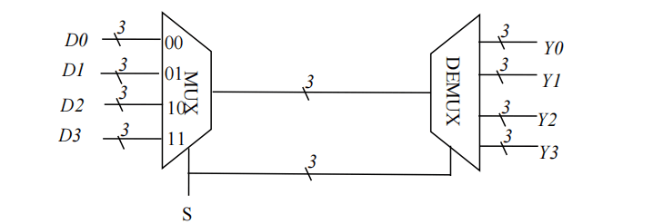
源码：
mux4to1
```
`timescale 1ns / 1ps
module mux4to1(
    output reg [2:0] y, // 注意此处 y 类型为 reg。
    input [2:0]d0,d1,d2,d3, // 声明 4 个 wire 
    //型输入变量 d0-d3，其宽度为 3 位。
    input [1:0]s // 声明 1 个 wire 型输入变量 s，其宽度为 2 位。
    );
    always @(*) //相当于 @( s0, s1, d0, d1, d2, d3)
        case (s)
            2'b00: y=d0;
            2'b01: y=d1;
            2'b10: y=d2;
            2'b11: y=d3;
        endcase
endmodule
```
dmux1to4
```
`timescale 1ns / 1ps
module dmux1to4(
    output [2:0] d0,d1,d2,d3, 
    //4 路 3 位的输出信号 d0~d3。
    input [2:0] d, // 3 位输入信号 d。
    input [1:0] s // 2 位选择控制信号 s。
    );
    assign d0 = ( ~s[1] & ~s[0] ) ? d : 3'bz;
    assign d1 = ( ~s[1] & s[0] ) ? d : 3'bz;
    assign d2 = ( s[1] & ~s[0] ) ? d : 3'bz;
    assign d3 = ( s[1] & s[0] ) ? d : 3'bz;
endmodule
```
trans4to4
```
`timescale 1ns / 1ps
module trans4to4(
    output  [2:0] Y0,Y1,Y2,Y3,
    input   [2:0] D0,D1,D2,D3,
    input   [1:0] S
); 
// add your code here
    wire [2:0] connection;
    mux4to1 mux(.y(connection),.s(S),.d0(D0),
    .d1(D1),.d2(D2),.d3(D3));
    dmux1to4 dmux(.d0(Y0),.d1(Y1),.d2(Y2),
    .d3(Y3),.d(connection),.s(S));
endmodule
```
### (3)实验数据仿真测试波形图
仿真测试代码：
```
`timescale 1ns / 1ps
module trans4to4_tb(    );
   wire [2:0] Y0,Y1,Y2,Y3;
   reg [2:0] D0,D1,D2,D3; // 输入变量声明为 reg 型变量
   reg [1:0] S;         // 输入变量声明为 reg 型变量
   trans4to4 uut (.Y0(Y0),.Y1(Y1),.Y2(Y2),
   .Y3(Y3),.S(S),.D0(D0),.D1(D1),.D2(D2),.D3(D3) );
   initial
   begin
   D0=$random % 8;D1=$random % 8;
   D2=$random % 8;D3=$random % 8;
   // D0=2'b00;D1=2'b01;D2=2'b10;D3=2'b11;
       S=2'b00;
   #50 S=2'b01;
   #50 S=2'b10;
   #50 S=2'b11;
   #50 S=2'b00;
   $stop;
   end

endmodule
```
&emsp;&emsp;仿真测试波形图如下：
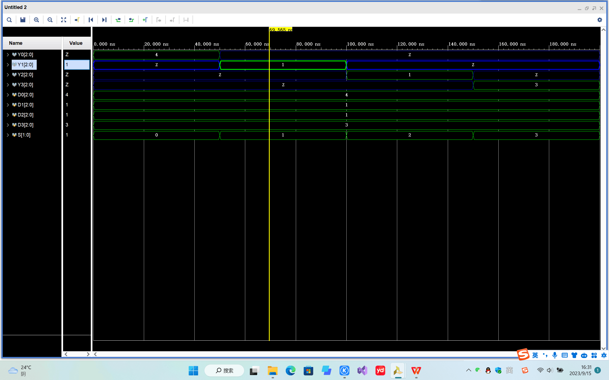
仿真测试波形符合实验要求
电路图：
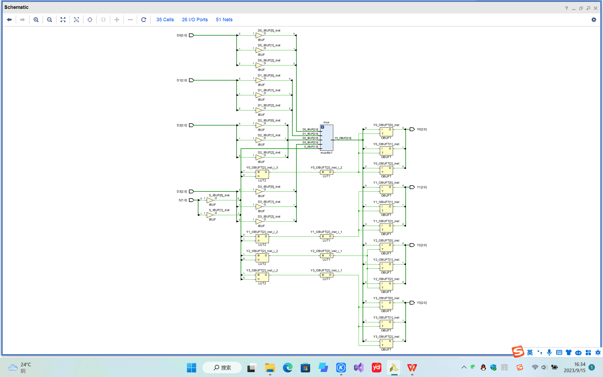
mux4-1电路图：
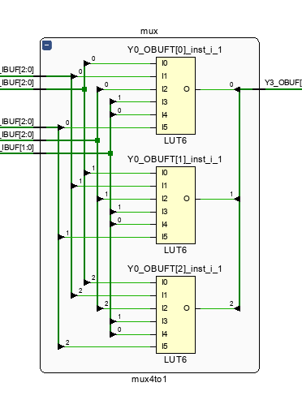
### (4)验证
加入限制文件，生成比特流文件，下载到开发板后测试如图：
$D0=100B,D1=011B,D2=010B,D3=111B$,S分别选$00,01,10,11$的验证结果如下：
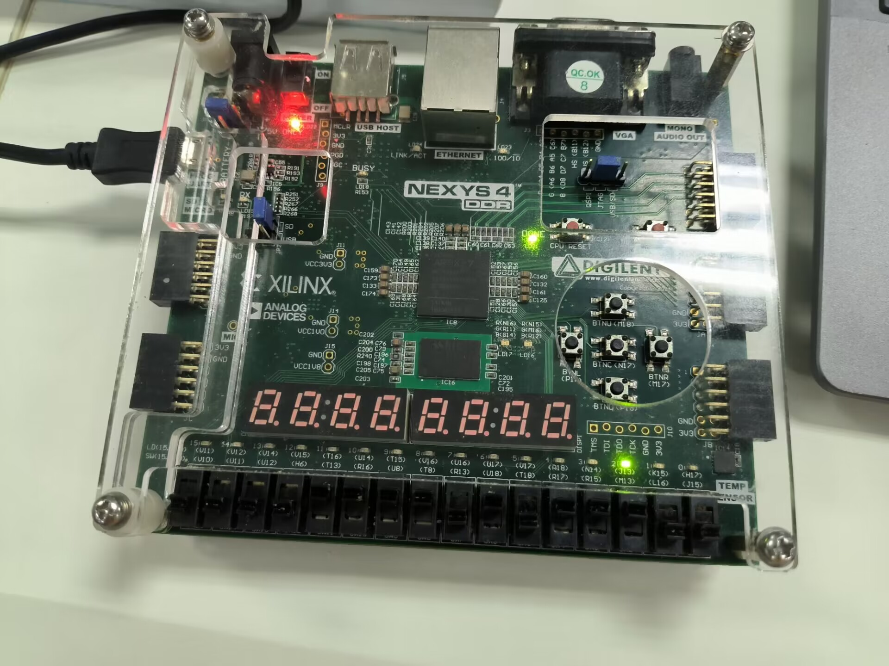


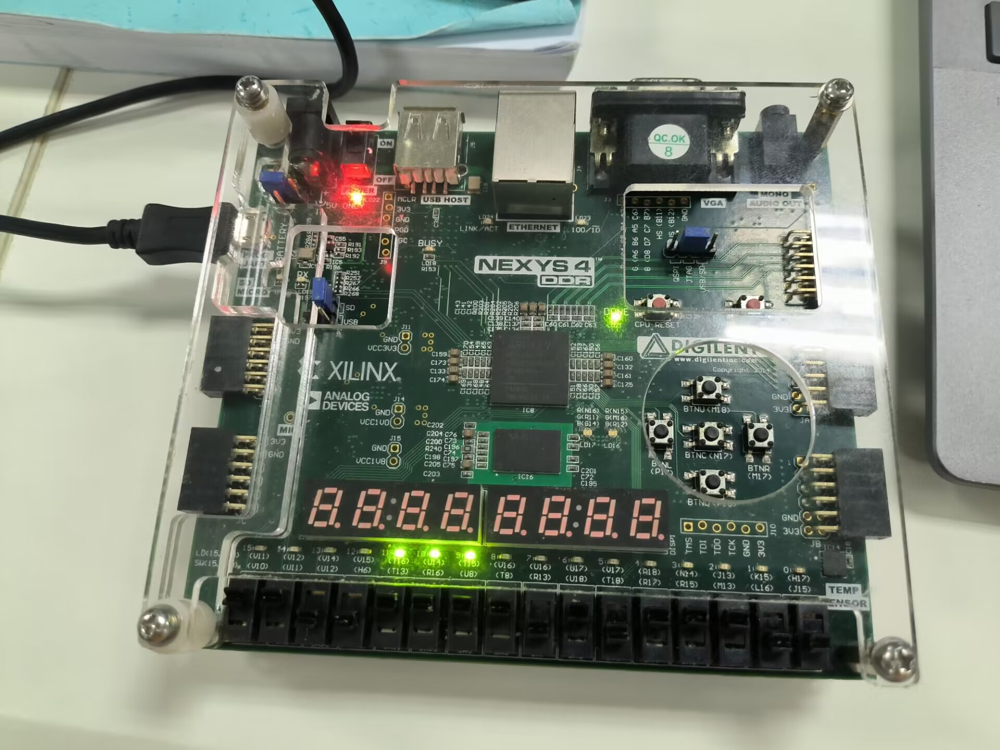
### (5)错误现象及分析
&emsp;&emsp;完成该实验的过程中，没有出现错误。

## 2、七段数码管实验

### (1)实验整体方案设计
&emsp;&emsp;<font size=2>七段 LED 数码管由译码驱动电路和 LED 数码管组成，主要用于显示十进制数字、小数点和部分字符。数字和字符的字形用 7 个发光二极管组成的线段来表示，这 7 个字段 a~g 分别由译码驱动器的 7 个输出端 Oa~Og 控制是否发光</font>
数码管编号：

数码管驱动：

&emsp;&emsp;<font size=2>Nexys A7-100T 实验开发板上有 8 个带小数点的七段数码管，这些数码管是共阳极连接方式，如果给数码管的某个引脚输入低电平则数码管会被点亮，若输入高电平则数码管变暗。每个数码管都有八个 LED 段组成，分别标识为 CA、CB、CC、CD、CE、CF 和 CG，小数点标识为 DP。
&emsp;&emsp;每个数码管的共阳极端相当于是一个数码管的选通端，可以通过在 M1(AN7)、L1(AN6)、N4(AN5)、N2(AN4)、N5(AN3)、M3(AN2)、M6(AN1)和 N6(AN0)端输出低电平选中某个数码管，通过在 L3(CA)、N1(CB)、L5(CC)、L4(CD)、K3(CE)、M2(CF)、L6(CG)和 M4(DP)端输出低电平点亮此数码管的某段(注意是低电平！)。
&emsp;&emsp;根据数码管的原理，设计7位显示段输出O_seg,8位数码管输出控制信号O_led,4位数据输入I,3位译码选择输入S。
&emsp;&emsp;可以用一个3-8译码器对信号S进行译码，用于控制选择要显示的数码管。</font>
### (2)功能表、原理图、关键设计语句与源码
共阳极数码管真值表：
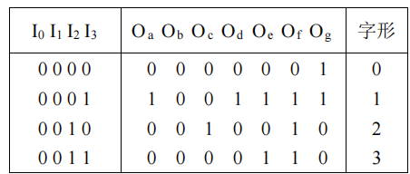
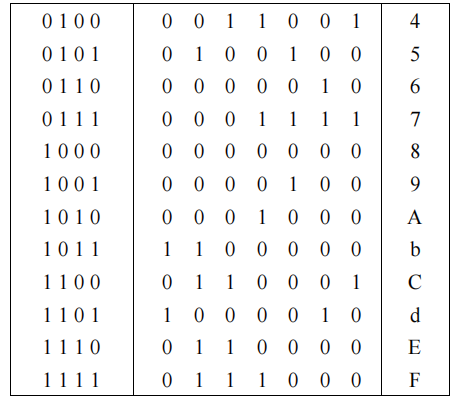
七段数码管原理图：
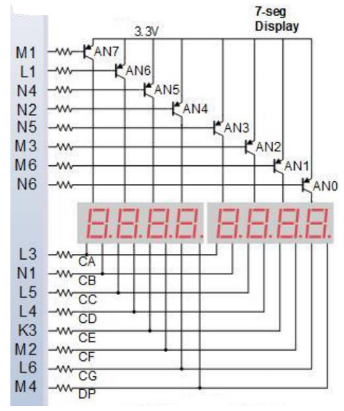
3-8译码器源码（关键）：
*注意，该译码器是低电平输出的！
```
`timescale 1ns / 1ps
module decode3to8(
    output [7:0] Out,
    input [2:0] In,
    input En
    );
    assign Out[0] =!En ? (!(In==3'b000)) : 1;
    assign Out[1] =!En ? (!(In==3'b001)) : 1;
    assign Out[2] =!En ? (!(In==3'b010)) : 1;
    assign Out[3] =!En ? (!(In==3'b011)) : 1;
    assign Out[4] =!En ? (!(In==3'b100)) : 1;
    assign Out[5] =!En ? (!(In==3'b101)) : 1;
    assign Out[6] =!En ? (!(In==3'b110)) : 1;
    assign Out[7] =!En ? (!(In==3'b111)) : 1;
endmodule
```
七段数码管源码：
```
`timescale 1ns / 1ps
module dec7seg(
//端口声明
output  reg  [6:0] O_seg,  //7位显示段输出
output  reg  [7:0] O_led,  //8个数码管输出控制
input   [3:0] I,           //4位数据输入，需要显示的数字   
input   [2:0] S          //3位译码选择指定数码管显示
); 
// add your code here
    wire [7:0] connection;
    decode3to8 dec(.In(S),.En(1'b0),.Out(connection));
    always@(*)
        begin
            O_led=connection;
        end
    always@(*)
        case(I)
            4'b0000: O_seg=7'b1000000;
            4'b0001: O_seg=7'b1111001;
            4'b0010: O_seg=7'b0100100;
            4'b0011: O_seg=7'b0110000;
            4'b0100: O_seg=7'b0011001;
            4'b0101: O_seg=7'b0010010;
            4'b0110: O_seg=7'b0000010;
            4'b0111: O_seg=7'b1111000;
            4'b1000: O_seg=7'b0000000;
            4'b1001: O_seg=7'b0010000;
            4'b1010: O_seg=7'b0001000;
            4'b1011: O_seg=7'b0000011;
            4'b1100: O_seg=7'b1000110;
            4'b1101: O_seg=7'b0100001;
            4'b1110: O_seg=7'b0000110;
            4'b1111: O_seg=7'b0001110;
        endcase
endmodule
```
### (3)实验数据仿真测试波形图
仿真测试源码：
```
`timescale 1ns / 1ps
module dec7seg_tb(   );
 wire [6:0] O_seg;
 wire [7:0] O_led;
 reg [3:0] I;
 reg [2:0] S;
 integer i;
 dec7seg dec7seg_impl(.O_seg(O_seg),.O_led(O_led),.I(I),.S(S));
 initial begin
   for (i=0;i<=15;i=i+1)
   begin S=i % 8; I=i;#50; end 
   $stop;
 end
endmodule
```
仿真测试图：

### (4)验证
综合后生成电路图
3-8译码器电路图：

7段数码管电路图:

加入限制文件，生成比特流文件，下载到开发板后测试如图：


### (5)错误现象及分析
&emsp;&emsp;开始的时候没有发现数码管是共阳极的，3-8译码器做的事高电平输出，导致错误。之后将3-8译码器改成低电平后正确。

## 3、汉明码纠错实验

### (1)实验整体方案设计
<font size=2>&emsp;&emsp;汉明码的主要思想是，将数据按某种规律分成若干组，对每组进行相应的奇偶检测，以提供多位校验信息，得到相应的故障字，根据故障字对发生的错误进行定位，并将其纠正。
&emsp;&emsp;进行汉明校验的主要思想如下：将需要进行检/纠错的数据分成 i 组，每组对应 1 位校验位，共有 i 位校验位，因此，故障字为 i位。若故障字为 0，表示无错；否则故障字的数值就是出错位在码字中的位置编号。除去 0 的情况，i 位故障字的编码个数为 2i-1，因此构造的码字最多有 2i-1 位，例如，当 i=3 时，码字可以有 7 位，其中 3 位为校验位，4位为数据位。为了方便判断码字中出错的是校验位还是数据位，可将校验位的位置编号设为 2 的幂次，即校验位排在第 1（001）、2（010）、4（100）、… 的位置上，其余位置上为数据位。这样，当故障字中只有一位为 1 时，说明是校验位出错，否则就是数据位出错。
&emsp;&emsp;本次实验需要设计7位汉明码校验电路，其中1,2,4位为校验位。实验需要用到一个3-8译码器，对校验生成的3个数据组成的3位输入翻译为错误的位，如果“错误”位为0，则表示汉明码正确，输出noerror。
&emsp;&emsp;同时本次实验需要3个4位奇偶检验器。</font>

### (2)功能表、原理图、关键设计语句与源码
7位汉明码的故障字和出错情况对应关系：

7位汉明码检查纠错电路原理图：

4位奇偶检验器源码：
```
`timescale 1ns / 1ps
module paritycheck4b(
    output odd, // 奇校验位
    output even, // 偶校验位
    input wire [3:0] In // 输入数据
    );
    assign odd= In [0] ^ In [1] ^ In [2] ^ In [3]; 
    // assign odd = ^ In;
    assign even =~ odd;
endmodule
```
3-8译码器源码：
```
`timescale 1ns / 1ps
module decode3to8(
    output [7:0] Out,
    input [2:0] In,
    input En
    );
    assign Out[0] =En ? (In==3'b000) : 0;
    assign Out[1] =En ? (In==3'b001) : 0;
    assign Out[2] =En ? (In==3'b010) : 0;
    assign Out[3] =En ? (In==3'b011) : 0;
    assign Out[4] =En ? (In==3'b100) : 0;
    assign Out[5] =En ? (In==3'b101) : 0;
    assign Out[6] =En ? (In==3'b110) : 0;
    assign Out[7] =En ? (In==3'b111) : 0;
endmodule

```
汉明码检测电路源码：
```
`timescale 1ns / 1ps
module hamming7check(
   output reg [7:1] DC,    //纠错输出7位正确的结果
   output reg  NOERROR,    //校验结果正确标志位
   input  [7:1] DU         //输入7位汉明码
);
// add your code here
    wire odd1,odd2,odd3;
    wire e0,e1,e2,e3,e4,e5,e6,e7;
    paritycheck4b pcheck1(.In({DU[1],DU[3],DU[5],DU[7]}),
    .odd(odd1),.even());
    paritycheck4b pcheck2(.In({DU[2],DU[3],DU[6],DU[7]}),
    .odd(odd2),.even());
    paritycheck4b pcheck3(.In({DU[4],DU[5],DU[6],DU[7]}),
    .odd(odd3),.even());
    decode3to8 dec(.In({odd3,odd2,odd1}),.En(1),
    .Out({e7,e6,e5,e4,e3,e2,e1,e0}));
    always@(*)
        begin
            NOERROR=e0;
            DC[1]=e1^DU[1];
            DC[2]=e2^DU[2];
            DC[3]=e3^DU[3];
            DC[4]=e4^DU[4];
            DC[5]=e5^DU[5];
            DC[6]=e6^DU[6];
            DC[7]=e7^DU[7];
        end
endmodule

```
### (3)实验数据仿真测试波形图
仿真测试源码：
```
`timescale 1ns / 1ps
module hamming7check_tb(   );
  reg [7:1] DI, DU;
  wire [7:1] DC;
  wire NOERR;
  reg [3:0] DATA;
  integer nib, i, errors;

hamming7check hamming7check_tst (.DU(DU), .DC(DC), 
.NOERROR(NOERR));

initial begin
  errors = 0;
  for (nib=0; nib<=15; nib=nib+1) begin
    DATA[3:0] = nib;
    DI[7:5] = DATA[3:1]; DI[3] = DATA[0]; 
    // Merge in data value
    DI[4] = DI[7] ^ DI[6] ^ DI[5];        
    // Merge in check bits
    DI[2] = DI[7] ^ DI[6] ^ DI[3];
    DI[1] = DI[7] ^ DI[5] ^ DI[3];
    DU = DI; #2 ;             // Check no-error case
    if ((DC!==DI) || (NOERR!==1'b1)) begin
      errors = errors + 1;
      $display("Error, DI=%b, DU=%b, DC=%b, NOERR=%b",DI,DU,
      DC,NOERR);
    end
    for (i=1; i<=7; i=i+1) begin      
    // Insert error in each bit position
      DU = DI; DU[i] = ~DI[i]; #2 ;  
      // and check that it's corrected
        if ((DC!==DI) || (NOERR!==1'b0)) begin
          errors = errors + 1;
          $display("Error, DI=%b, DU=%b, DC=%b, NOERR=%b",DI,
          DU,DC,NOERR);
        end
    end
  end
  $display("Test completed, %0d errors",errors);
  $stop(1); $fflush;
end     
endmodule
```
仿真测试波形图：

7位汉明码检查纠错电路电路图：

### (4)验证
加入限制文件，生成比特流文件，下载到开发板后测试如图：
1010101 正确：

1100110 正确：

1111000 正确：

1011011 错误，提示将第5位改为0:

修改后为1001011 正确：

### (5)错误现象及分析
&emsp;&emsp;完成该实验的过程中，没有出现错误。

## 4、思考题
### 1.设计 32 位比较器，综合后分析资源占用情况。
32位比较器源代码：
```
`timescale 1ns / 1ps
module compare32b(
    output PGTQ, PEQQ, PLTQ,
    //PGTQ大于，PEEQ，等于，PLTQ小于
    input [31:0] P,Q
    );
    assign PGTQ = ((P>Q)?1'b1:1'b0);
    assign PEQQ = ((P==Q)?1'b1:1'b0);
    assign PLTQ = ~PGTQ&~PEQQ;
endmodule
```
仿真测试代码:
```
`timescale 1ns / 1ps
module compare32b_tb();
    reg [31:0] P, Q;
    wire PGTQ, PEQQ, PLTQ;
    integer ii, errors;
    compare32b UUT ( .P(P), .Q(Q), .PGTQ(PGTQ), 
    .PEQQ(PEQQ), .PLTQ(PLTQ) );
    initial begin
        errors = 0;
        P = $random(1); // 设置随机数模式
        for (ii=0; ii<10000; ii=ii+1) begin
            P = $random; Q = $random;
            #10 ;
            if ( (PGTQ) !== (P>Q) || (PLTQ) !== (P<Q) |
            | (PEQQ) !== (P==Q) ) 
            begin
                errors = errors + 1;
                $display("P=%b(%0d), Q=%b(%0d), PGTQ=%b, 
                PEQQ=%b, PLTQ=%b",P, P, Q, Q, PGTQ, PEQQ, PLTQ);
            end
        end
        $display("Test done, %0d errors", errors);
    end
endmodule
```
仿真测试图：


资源占用情况：


Slice LUT 28个； Bonded IOB 67个
IOB Slave Pads 33, IOB Master Pads 32

### 2.设计 32 位译码器，综合后分析资源占用情况。
5-32译码器源码：
```
`timescale 1ns / 1ps
module decode5to32(
    output reg [31:0] Out,
    input [4:0] In,
    input En
    );
    always@(In,En)
        begin
            Out = 32'b00000000000000000000000000000000;
            if(En==1) Out[In] = 1;
        end
endmodule
```
仿真测试源码：
```
`timescale 1ns / 1ps
module decode5to32_tb();
    reg [4:0] In;
    reg En;
    wire [31:0] Out;
    integer i,errors;
    reg [31:0] expectY;
    decode5to32 dec(.Out(Out),.In(In),.En(En));
     initial
        begin
            errors=0;
            In=$random(1);
            En=$random(2);
            for(i=0;i<200;i=i+1)
             begin
                En={$random}%2;
                In={$random}%32;
                #20;
                expectY=32'b00000000000000000000000000000000;
                if(En==1) expectY[In]=1'b1;
                if(Out!=expectY) begin
                    $display("Error: En=%b, In = %3b, 
                    out = %8b", En, In, Out);
                    errors = errors + 1;
                end
             end
             $display("Test complete, %d errors",errors);
        end
endmodule
```
仿真测试图：


电路图：

资源占用情况分析：


Slice LUT 32个；IOB 38个

## 3.利用 8 个数码管来展示你的学号，每秒移动 1 位，实现滚动显示
初始实现时，利用9个寄存器组成移位寄存器，其中每个寄存器内数据位宽为7位，取前8个寄存器中的数据作为8个数码管各自的输出。
寄存器源码：
```
`timescale 1ns / 1ps
module register7b(
    output [6:0] q,
    input clk,we,init,
    input [6:0] In,
    input [6:0] Initnum
    );
    reg [6:0] q_r;
    always@(posedge clk)
        begin
            if(we==1) begin
                if(init==1) 
                    q_r<=Initnum;
                else q_r<=In;
            end
        end
    assign q=q_r;
endmodule
```
移位寄存器源码：
```
`timescale 1ns / 1ps
module regist7b9(
    output wire [6:0] Out8,//9个7位寄存器的输出
    output wire [6:0] Out7,
    output wire [6:0] Out6,
    output wire [6:0] Out5,
    output wire [6:0] Out4,
    output wire [6:0] Out3,
    output wire [6:0] Out2,
    output wire [6:0] Out1,
    output wire [6:0] Out0,
    input clk, we,init,//时钟信号，写使能，初始化信号
    input [6:0] Initnum8,//初始化输入
    input [6:0] Initnum7,
    input [6:0] Initnum6,
    input [6:0] Initnum5,
    input [6:0] Initnum4,
    input [6:0] Initnum3,
    input [6:0] Initnum2,
    input [6:0] Initnum1,
    input [6:0] Initnum0
    );
    //左移
    register7b re8(.q(Out8),.In(Out7),.Initnum(Initnum8),.clk(clk),.init(init),.we(we));
    register7b re7(.q(Out7),.In(Out6),.Initnum(Initnum7),.clk(clk),.init(init),.we(we));
    register7b re6(.q(Out6),.In(Out5),.Initnum(Initnum6),.clk(clk),.init(init),.we(we));
    register7b re5(.q(Out5),.In(Out4),.Initnum(Initnum5),.clk(clk),.init(init),.we(we));
    register7b re4(.q(Out4),.In(Out3),.Initnum(Initnum4),.clk(clk),.init(init),.we(we));
    register7b re3(.q(Out3),.In(Out2),.Initnum(Initnum3),.clk(clk),.init(init),.we(we));
    register7b re2(.q(Out2),.In(Out1),.Initnum(Initnum2),.clk(clk),.init(init),.we(we));
    register7b re1(.q(Out1),.In(Out0),.Initnum(Initnum1),.clk(clk),.init(init),.we(we));
    register7b re0(.q(Out0),.In(Out8),.Initnum(Initnum0),.clk(clk),.init(init),.we(we));
endmodule
```
学号滚动显示源码：
```
`timescale 1ns / 1ps
module show_student_number(//
//端口声明
    output  reg  [6:0] O_seg7,//8个7位显示段输出
    output  reg  [6:0] O_seg6,
    output  reg  [6:0] O_seg5,
    output  reg  [6:0] O_seg4,
    output  reg  [6:0] O_seg3,
    output  reg  [6:0] O_seg2,
    output  reg  [6:0] O_seg1,
    output  reg  [6:0] O_seg0,
    input  clk,we,init
); 
// add your code here
    wire [6:0] connection0;
    wire [6:0] connection1;
    wire [6:0] connection2;
    wire [6:0] connection3;
    wire [6:0] connection4;
    wire [6:0] connection5;
    wire [6:0] connection6;
    wire [6:0] connection7;
    regist7b9 reg7b9(.clk(clk),.we(we),.init(init),
    .Out8(connection7),.Out7(connection6),.Out6(connection5),.Out5(connection4),
    .Out4(connection3),.Out3(connection2),.Out2(connection1),.Out1(connection0),.Out0(),
    .Initnum8(7'b0100100),.Initnum7(7'b0100100),.Initnum6(7'b1111001),.Initnum5(7'b0100100),
    .Initnum4(7'b0100100),.Initnum3(7'b1000000),.Initnum2(7'b1111001),.Initnum1(7'b0100100),
    .Initnum0(7'b0000010));
    always@(*)
        begin
            O_seg7=connection7;
            O_seg6=connection6;
            O_seg5=connection5;
            O_seg4=connection4;
            O_seg3=connection3;
            O_seg2=connection2;
            O_seg1=connection1;
            O_seg0=connection0;
        end
endmodule
```
仿真测试源码：
```
`timescale 1ns / 1ps
module show_student_number_tb();
    reg clk,we,init;
    wire [6:0] O_seg7;//8个输出
    wire [6:0] O_seg6;
    wire [6:0] O_seg5;
    wire [6:0] O_seg4;
    wire [6:0] O_seg3;
    wire [6:0] O_seg2;
    wire [6:0] O_seg1;
    wire [6:0] O_seg0;
    integer i;
    show_student_number ssn(.clk(clk),.we(we),.init(init),
    .O_seg7(O_seg7),.O_seg6(O_seg6),.O_seg5(O_seg5),.O_seg4(O_seg4),
    .O_seg3(O_seg3),.O_seg2(O_seg2),.O_seg1(O_seg1),.O_seg0(O_seg0));
    initial begin
        clk=1'b0;
        we=1'b1;
        init=1'b1;//initialiazation
        #5 clk=1'b1;
        #5 clk=1'b0;
        init=1'b0;
        for(i=0;i<64;i=i+1)
            begin
                #5 clk=1'b1;
                #5 clk=1'b0;
            end
    end
endmodule
```
仿真测试图：


&emsp;&emsp;实际上由于NEXYS A7开发板的特性，源码需要修改。8个O_led选择信号不能同时输出，但可以在一个for循环内依次输出，其刷新频率对人眼而言是察觉不到的。
&emsp;&emsp;同时，由于开发板时钟频率是100MHz，所以要先用一个for循环作为计数器，到一秒后移动每一位。
&emsp;&emsp;保证数字一直显示，没过2ms选择一个数码管显示一次，相当于每16ms刷新一次。由于视觉暂留，肉眼无法察觉到。
修改后源代码：
```
`timescale 1ns / 1ps
module show_student_number(
//端口声明
    output  reg  [7:0] O_led,//选择数码管
    output  reg  [6:0] O_seg,//数码管的显示信号
    input  clk
); 
// add your code here
    wire [6:0] connection [8:0];//9位学号
    reg [26:0] counter;//计数器，一秒更新一次
    reg [15:0] counter2;//计数器二，用于刷新
    integer times=0;
    assign connection[8]=7'b0100100;
    assign connection[7]=7'b0100100;
    assign connection[6]=7'b1111001;
    assign connection[5]=7'b0100100;
    assign connection[4]=7'b0100100;
    assign connection[3]=7'b1000000;
    assign connection[2]=7'b1111001;
    assign connection[1]=7'b0100100;
    assign connection[0]=7'b0000010;
    always @(posedge clk)begin
        counter<=counter+1;
        counter2<=counter2+1;
        if(counter==99999999)begin
            counter<=0;
            times<=times+1;
        end
        case(counter2)
            200: begin 
                O_led<=8'b01111111;
                O_seg<=connection[(7+times)%9]; 
                end
            400: begin
                O_led<=8'b10111111;
                O_seg<=connection[(6+times)%9];
                end
            600: begin
                O_led<=8'b11011111;
                O_seg<=connection[(5+times)%9];
                end
            800: begin
                O_led<=8'b11101111;
                O_seg<=connection[(4+times)%9];
                end
            1000: begin
                O_led<=8'b11110111;
                O_seg<=connection[(3+times)%9];
                end
            1200: begin
                O_led<=8'b11111011;
                O_seg<=connection[(2+times)%9];
                end
            1400: begin
                O_led<=8'b11111101;
                O_seg<=connection[(1+times)%9];
                end
            1600: begin
                O_led<=8'b11111110;
                O_seg<=connection[times%9];
                counter2<=0;
                end
        endcase
    end
endmodule
```
电路图：
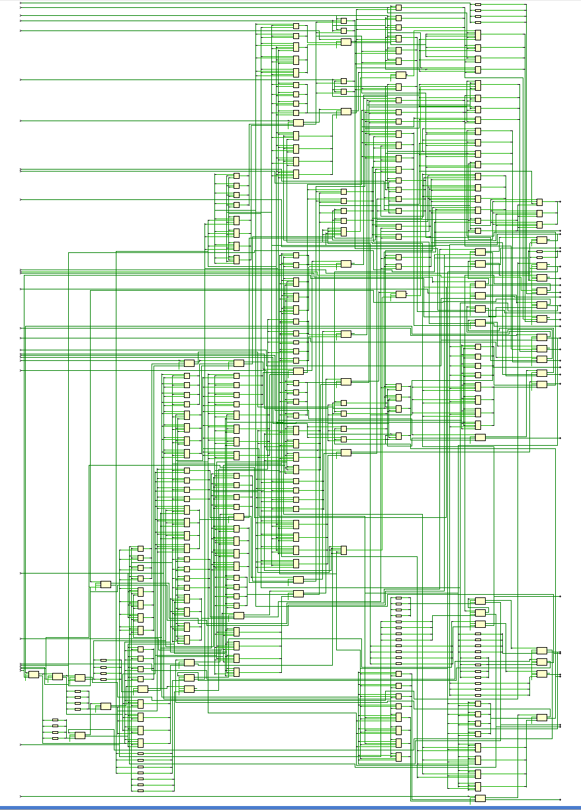
验证：
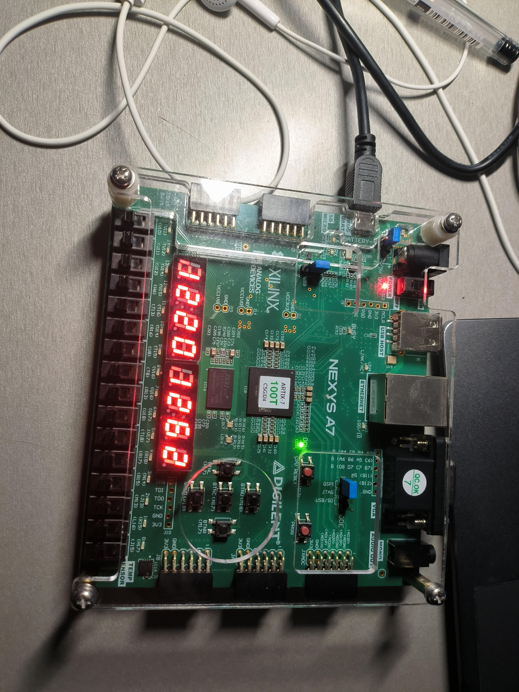
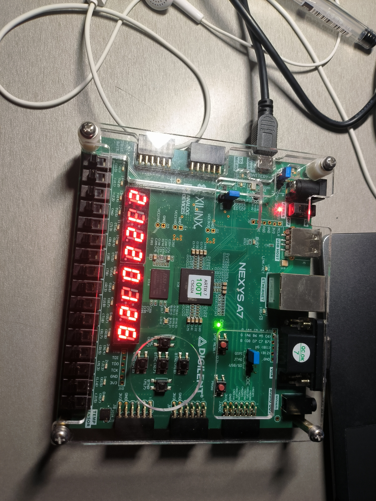

## 4.如何设计 8 位数据位的汉明码生成和验证电路
&emsp;&emsp;8位数据的汉明码需要4个校验位，生成12位汉明码。分别检测第$1,3,5,7,9,11,13(0),15(0)$位，第$2,3,6,7,10,11,14(0),15(0)$位，第$4,5,6,7,12,13(0),14(0),15(0)$位，第$8,9,10,11,12,13(0),14(0),15(0)$位。
&emsp;&emsp;和之前的7为汉明码校验电路类似，这里需要一个4-16译码器。同时需要4个8位奇偶检验器。
8位奇偶检验器源码：
```
`timescale 1ns / 1ps
module paritycheck8b(
    output odd, // 奇校验位
    output even, // 偶校验位
    input wire [7:0] In // 输入数据
    );
    assign odd=In[0]^In[1]^In[2]^In[3]^In[4]^In[5]^In[6]^In[7];
    assign even=~odd;
endmodule
```
4-16译码器源码：
```
`timescale 1ns / 1ps
module decode4to16(
    output [15:0] Out,
    input [3:0] In,
    input En
    );
    assign Out =En ? (1<<In) : 0;
endmodule
```
12位汉明码（8位数据位）校验源码：
```
`timescale 1ns / 1ps
module hamming12check(
   output reg [12:1] DC,    //纠错输出12位正确的结果
   output reg  NOERROR,    //校验结果正确标志位
   input  [12:1] DU         //输入12位汉明码
    );
    wire [15:1] connection;
    assign connection={3'b000,DU};//高3位为000
    wire odd1,odd2,odd3,odd4;
    wire e0,e1,e2,e3,e4,e5,e6,e7,e8,e9,e10,e11,e12,e13,e14,e15;
    paritycheck8b pcheck1(.In({connection[1],connection[3],connection[5],connection[7],connection[9]
    ,connection[11],connection[13],connection[15]}),.odd(odd1),.even());
    paritycheck8b pcheck2(.In({connection[2],connection[3],connection[6],connection[7],connection[10]
    ,connection[11],connection[14],connection[15]}),.odd(odd2),.even());
    paritycheck8b pcheck3(.In({connection[4],connection[5],connection[6],connection[7],connection[12]
    ,connection[13],connection[14],connection[15]}),.odd(odd3),.even());
    paritycheck8b pcheck4(.In(connection[15:8]),.odd(odd4),.even());
    decode4to16 dec(.In({odd4,odd3,odd2,odd1}),.En(1),
    .Out({e15,e14,e13,e12,e11,e10,e9,e8,e7,e6,e5,e4,e3,e2,e1,e0}));
    always@(*)begin
        NOERROR=e0;
        DC[1]=e1^DU[1];
        DC[2]=e2^DU[2];
        DC[3]=e3^DU[3];
        DC[4]=e4^DU[4];
        DC[5]=e5^DU[5];
        DC[6]=e6^DU[6];
        DC[7]=e7^DU[7];
        DC[8]=e8^DU[8];
        DC[9]=e9^DU[9];
        DC[10]=e10^DU[10];
        DC[11]=e11^DU[11];
        DC[12]=e12^DU[12];
    end
endmodule
```
仿真测试源码：
```
`timescale 1ns / 1ps
module hamming12check_tb();
  reg [12:1] DI, DU;
  wire [12:1] DC;
  wire NOERR;
  reg [7:0] DATA;
  integer nib, i, errors;

hamming12check hamming12check_tst (.DU(DU), .DC(DC), .NOERROR(NOERR));

initial begin
  errors = 0;
  for (nib=0; nib<=255; nib=nib+1) begin
    DATA[7:0] = nib;
    DI[12:9]=DATA[7:4];DI[7:5]=DATA[3:1];DI[3]=DATA[0]; // Merge in data value
    DI[8]=DI[9]^DI[10]^DI[11]^DI[12]^1'b0^1'b0^1'b0;
    DI[4] = DI[7]^DI[6]^DI[5]^DI[12]^1'b0^1'b0^1'b0;        // Merge in check bits
    DI[2] = DI[7]^DI[6]^DI[3]^DI[10]^DI[11]^1'b0^1'b0;
    DI[1] = DI[7]^DI[5]^DI[3]^DI[9]^DI[11]^1'b0^1'b0;
    DU = DI; #2 ;             // Check no-error case
    if ((DC!==DI) || (NOERR!==1'b1)) begin
      errors = errors + 1;
      $display("Error, DI=%b, DU=%b, DC=%b, NOERR=%b",DI,DU,DC,NOERR);
    end
    for (i=1; i<=12; i=i+1) begin      // Insert error in each bit position
      DU = DI; DU[i] = ~DI[i]; #2 ;  // and check that it's corrected
        if ((DC!==DI) || (NOERR!==1'b0)) begin
          errors = errors + 1;
          $display("Error, DI=%b, DU=%b, DC=%b, NOERR=%b",DI,DU,DC,NOERR);
        end
    end
  end
  $display("Test completed, %0d errors",errors);
  $stop(1); $fflush;
end     
endmodule
```
仿真测试图：

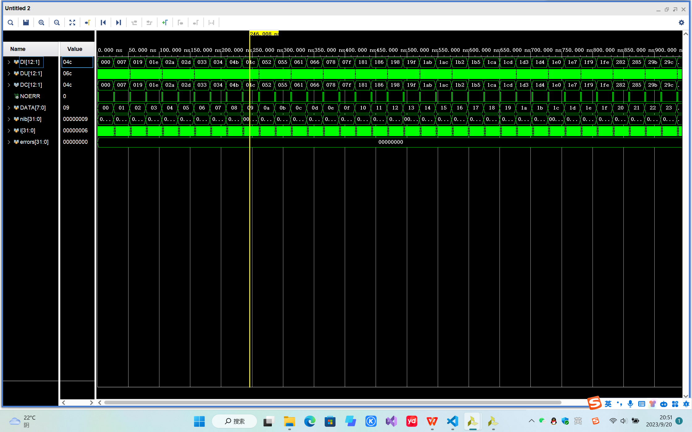
电路图：
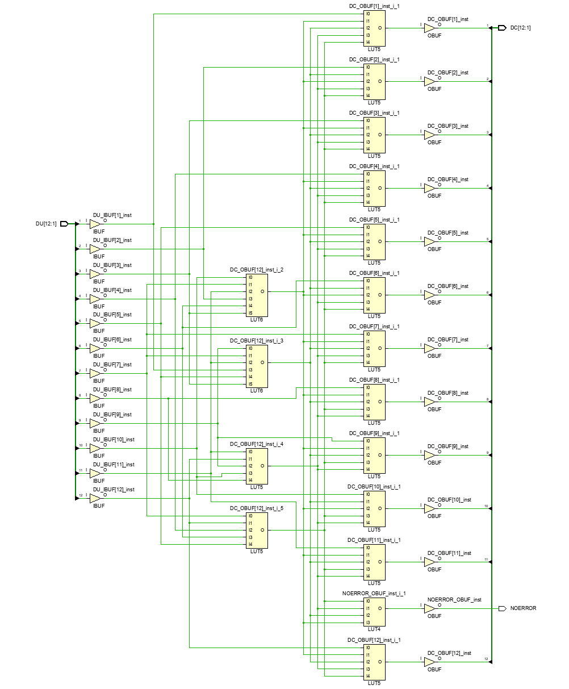
添加限制文件，综合，生成流文件并加载到开发板上验证：
011001100000 正确
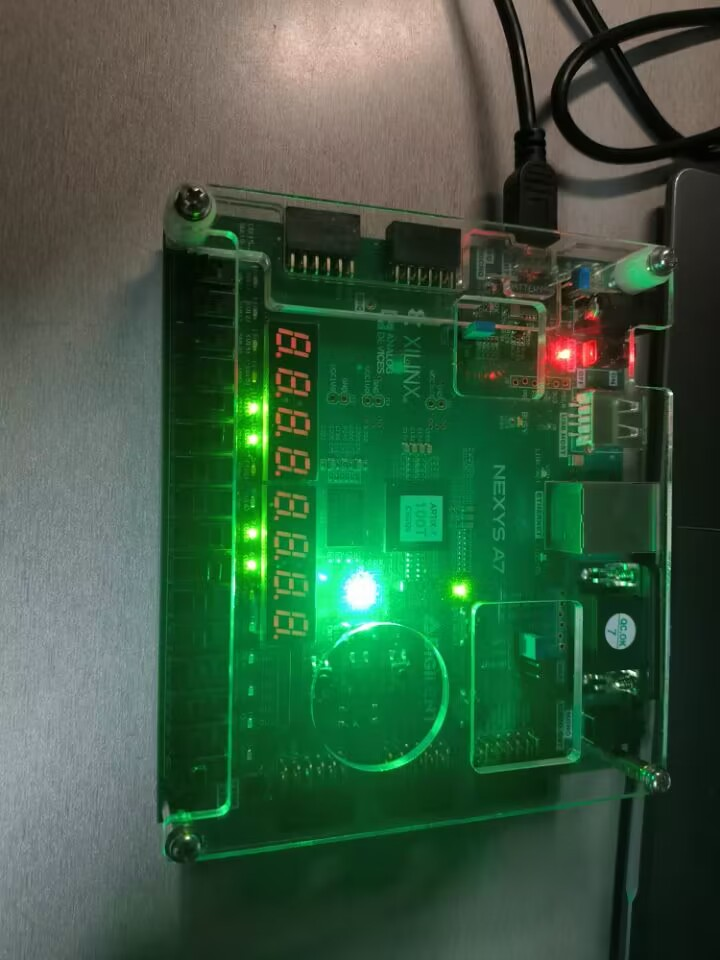
000001100110 正确
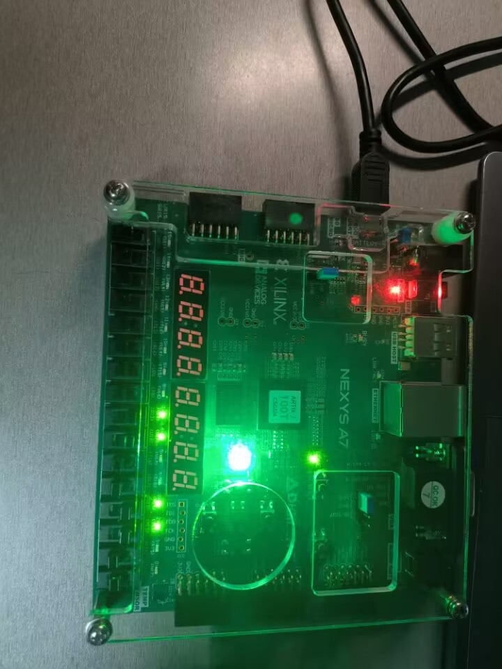
010101000110 错误，提示改为010101001110
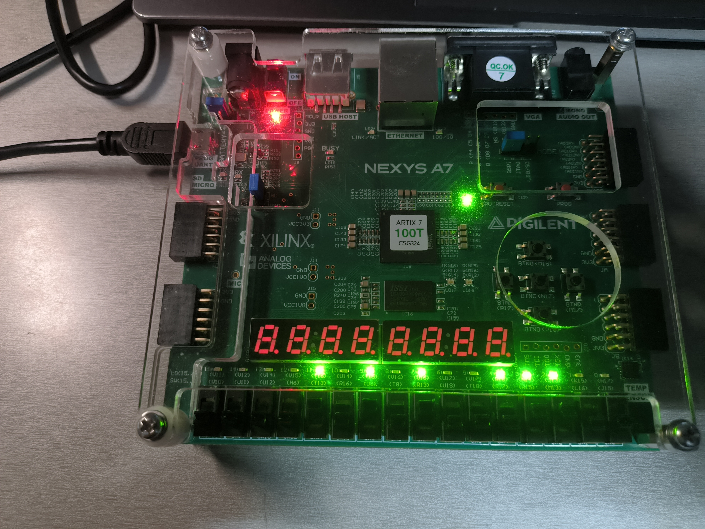
改为010101001110 正确
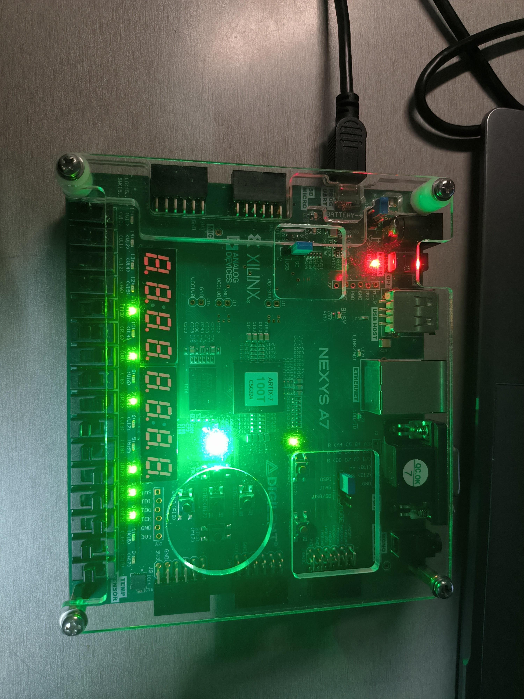