<center><font color="black" size=6 face="宋体">Lab2 时序逻辑电路实验</font></center>

## 1、寄存器堆设计
### (1)实验整体方案设计
<font size=2>&emsp;&emsp;寄存器堆也称为通用寄存器组（General Purpose Register set，GPRs），它由许多寄存器组成，每个寄存器有一个编号，CPU 可以对指定编号的寄存器进行读写。寄存器堆的外部连接如图：

这也是顶层模块设计图。
寄存器堆中有两个读口和一个写口，每个读口或写口包括一个寄存器编号输入端和一个读数据端或写数据端，此外，还有一个写使能输入端 WE，它用来控制是否在下个时钟触发边沿到来时，开始将 busW 线上的数据写入寄存器堆中。</font>

### (2)功能表、原理图、关键设计语句与源码
寄存器堆原理图：
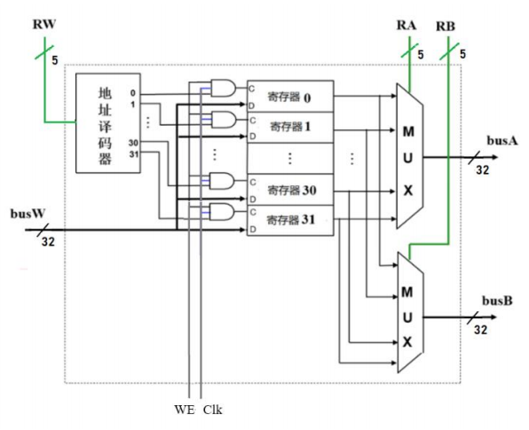
外部连接：

寄存器堆源码:
```
`timescale 1ns / 1ps
module regfile32(
   output  [31:0] busa,
   output  [31:0] busb,
   input [31:0] busw,
   input [4:0] ra,
   input [4:0] rb,
   input [4:0] rw,
   input clk, we
);
// add your code 
// 32个32位寄存器
  reg [31:0] registers [31:0];
  // 写操作
  always @(negedge clk)
    begin
      if (we==1&&rw!=5'b00000)
        registers[rw] <= busw;
    end
      // 读操作
      assign busa = 
      (ra==5'b00000)?8'h00000000:registers[ra];
      assign busb = 
      (rb==5'b00000)?8'h00000000:registers[rb];
endmodule
```
寄存器堆外部连接源码:
```
`timescale 1ns / 1ps
module regfile_top(
   output  [7:0] busa8,
   output  [7:0] busb8,
   input [3:0] busw,
   input [2:0] ra,
   input [2:0] rb,
   input [2:0] rw,
   input [1:0] rd_hi,
   input clk, we
   );
   wire [31:0] busa32;
   wire [31:0] busb32;
   wire [31:0] busw32;
   wire [4:0] ra32;
   wire [4:0] rb32;
   wire [4:0] rw32;
// add your code
   assign busw32={8{busw}};
   assign ra32={rd_hi,ra};
   assign rb32={rd_hi,rb};
   assign rw32={rd_hi,rw};
   regfile32 regfile32_check(.busa(busa32),
   .busb(busb32),.busw(busw32),.ra(ra32),
   .rb(rb32),.rw(rw32),.clk(clk),.we(we));
// add your code
   assign busa8=busa32[7:0];
   assign busb8=busb32[7:0];
endmodule
```
### (3)实验数据仿真测试波形图
仿真测试代码:
```
`timescale 1ns / 1ps
module regfile32_tb(   );
 wire [31:0] busa;
 wire [31:0] busb;
 reg [31:0] busw;
 reg [4:0] ra,rb,rw; 
 reg clk, we;
 integer i, errors;
  regfile32 d_register_inst(busa, busb, busw, 
  ra, rb, rw,clk, we);
 always
  # 5 clk=~clk;
  initial begin
  clk=1;errors=0;#10
  for (i=0;i<=31;i=i+1)
   begin
       we=1;rw=i; busw=(1<<i);
       #10;
   end
  for (i=0;i<=31;i=i+1)
   begin
       we=0;rw=i;busw=32'hffffffff;
       #10;
   end
     for (i=0;i<=31;i=i+1)
     begin
     ra=i;rb=i;
     #10 if (busa!=(1<<i)) begin
            $display("Error: busa=%8h, 1<<i = %8h,
            i=%5b",   busa, 1<<i,i); 
            errors=errors+1; 
          end
         if (busb!=(1<<i)) begin 
             $display("Error: busb=%8h, 1<<i = %8h,
             i=%5b", busb, 1<<i,i); 
             errors=errors+1; 
          end
     end
     $display("Test done, %d errors\n",errors);   
     $stop(1);
end
endmodule
```
仿真测试波形图:

寄存器堆读写顶层模块电路图：

寄存器堆电路图:


### (4)验证
En=1，rw=10110，ra=10010，rb=10110，busw=1100*8:


En=1，rw=01010，ra=01010，rb=01110，busw=0110*8:


n=0。调回，说明寄存器已存下值:

### (5)错误现象及分析
&emsp;&emsp;实验过程中，顶层模块将busw32错打成"buw32"，导致电路没有生成子模块并与之连接。发现错误并改正后，电路正常。

## 2、比特流加密实验
### (1)实验整体方案设计
<font size=2>&emsp;&emsp;本实验将利用线性移位寄存器 LFSR 产的随机比特流来对字符串进行加密和解密。异或操作可以用于加密和解密。假设消息数据为二进制变量 M，利用随机二进制密钥 K 可以通过 C=M⊕K 来生成加密信息 C。在接收端，如果已知密钥 K，可以用C⊕K=M⊕K⊕K=M⊕(K⊕K)=M⊕0=M 来恢复原始消息M。
&emsp;&emsp;用 64 位线性移位寄存器 LFSR 生成长度为$2^{64}-1$的随机二进制流，并利用64位的 seed 来初始化随机二进制流，然后用该随机二进制流作为密钥 K 对数据流进行加密。
&emps;&emsp;加密解密以输入时钟为上升沿有效，如果时钟上升沿时，load 信号为高电平，将 LFSR 的状态初始化为 seed 提供的 64 比特数据。同时加密解密过程也初始化，即生成比特计数重置为 0。
&emsp;&emsp;在 load 为低电平时，正常工作，每个时钟上升沿进行移位操作，并将生成比特计数加 1。生成比特计数器计数周期为 6，即在计数值从 5 变为 0 时，输出 ready 信号为高电平，持续一个时钟周期，其他情况ready 信号为低电平。在 ready 为高电平时，将输入数据的低 6 位与 LSFR 输出的高（[63:58]，即刚刚新移入的 6 个比特）进行异或并输出。如果第六周期 ready 信号不是高电平，测试系统会用 x 替代实际输出。
&emsp;&emsp;实验中，我们需要设计一个64位线性以为寄存器，寄存其在时钟信号上升沿时右移一位，在$load=1$时复位。线性移位寄存器每到周期数为5时，计数器清零，$ready<=1$，下一周期就会显示出8位加密输出字符串。</font>

### (2)功能表、原理图、关键设计语句与源码
原理图:

比特流加密源码:
```
`timescale 1ns / 1ps
module encryption6b(
    output [7:0] dataout,    //输出加密或解密后的8比特ASCII数据。
    output reg ready,       
    //输出有效标识，高电平说明输出有效，第6周期高电平
    output [5:0] key,       //输出6位加密码
    input clk,             // 时钟信号，上升沿有效
    input load,            //载入seed指示，高电平有效
    input [7:0] datain       //输入数据的8比特ASCII码。
);
wire  [63:0] seed=64'ha845fd7183ad75c4;       
//初始64比特seed=64'ha845fd7183ad75c4
//add your code here
    wire [63:0] lfsrout;
    reg [5:0] count;
    reg [5:0] keyout;
    reg [7:0] ddout;
    assign key=keyout;
    assign dataout=ddout;
    lfsr yiwei(.dout(lfsrout),.seed(seed),.clk(clk),.load(load));
    always @(posedge clk) begin
        if(load) begin
            count<=0;
            ready<=0;
        end
        else begin
            if(count==5)begin
                ready<=1;
                count<=0;//清零
            end
            else begin
                count<=count+1;
            end
            if(ready==1) begin
                keyout<=lfsrout[63:58];
                ddout<={datain[7:6],datain[5:0]^lfsrout[63:58]};
                ready<=0;
            end
        end
    end
endmodule

module lfsr(              //64位线性移位寄存器
	output reg [63:0] dout,
    input  [63:0]  seed,
	input  clk,
	input  load
	);
//add your code here
    wire next;
    assign next=dout[4]^dout[3]^dout[1]^dout[0]; 
    // LFSR feedback equation: x64 = x4 ^ x3 ^ x1 ^ x0
    always @(posedge clk or posedge load) begin
        if (load) begin
            dout <= seed;
        end
        else begin
            dout<={next,dout[63:1]};
        end
    end
endmodule
```
### (3)实验数据仿真测试波形图
仿真测试代码:
```
`timescale 1ns / 1ps
module encryption6b_tb();
// add your code
wire [7:0] dataout;
    wire ready;
    wire [5:0] key;
    reg clk;
    reg load;
    reg [7:0] datain;
    reg [7:0] stored;
    encryption6b encryption6b1(.dataout(dataout),.ready(ready),
    .key(key),.clk(clk),.load(load),.datain(datain));
    integer i;
    always #5 clk=~clk;
    initial begin
        datain=8'b00000000;
        load=1;
        #10;
        clk = 1;
        #10;
        load=0;
        for (i=0;i<18;i=i+1) begin
            #10;
        end
        $stop(1);
    end
endmodule
```
仿真测试图:

线性移位寄存器电路图:


比特流加密电路图:

### (4)验证
$seed=64'ha845fd7183ad75c4$
待加密码:$Nanjing\_University\_FPGA\_Lab$
第一个加密$'N'(8'b01001110)$,六个周期后$key=000010$,
加密后的字符变为:$8'h4C$

第二个加密$'a'(8'h61)$,再过六个周期后$key=011011$,
加密后字符变为:$8'h7a$

完成该实验的过程中，没有出现错误。

## 3、数字时钟实验
### (1)实验整体方案设计
<font size=2>&emsp;&emsp;用一位按钮 BTNC 表示复位信号 rst，当复位信号有效时，时钟清零。用 2 位输入开关表示时钟工作状态 s，当s=00 时，进入正常计时状态；当 s=01 时，进入设置小时初值状态；当s=10 时，进入设置分钟初值状态；当 s=11 时，进入设置秒初值状态。进入设置状态后读取分别用 4 位BCD 码表示高位和低位数值。时钟显示在七段数码管 AN7AN6-AN4AN3-AN1AN0 上。当到整点时，轮流3 色指示灯 ld16 的灯光，持续 5 秒钟后熄灭；计时到 23 时 59 分 59 秒后清零，轮流3色指示灯 ld16 的灯光，持续 10 秒钟后熄灭。
&emsp;&emsp;显示功能设置:</font>


### (2)功能表、原理图、关键设计语句与源码
分频电路源码:
```
`timescale 1ns / 1ps
module clkgen(input clkin, input rst, input clken, 
output reg clkout);
    parameter clk_freq=1;
    parameter countlimit=100000000/2/clk_freq-1; 
   reg[31:0] clkcount;
   initial
   begin clkcount=32'd0; clkout=1'b0; end
   always @ (posedge clkin) 
    if(rst)//重置
     begin
        clkcount<=0;
        clkout<=1'b0;
     end
    else
    begin
     if(clken)
        begin
            if(clkcount>=countlimit)
             begin
                clkcount<=32'd0;
                clkout<=~clkout;
             end
             else
             begin
                clkcount<=clkcount+1;

             end
         end
     end  
endmodule
```
7段数码管显示译码器源码:
```
`timescale 1ns / 1ps
module seg_decode(//BCD码转数码管段输入信号
    input [3:0] in,
    output reg [6:0] out
    );
    always @(*)
        case (in)
            0: out=7'b1000000;
            1: out=7'b1111001;
            2: out=7'b0100100;
            3: out=7'b0110000;
            4: out=7'b0011001;
            5: out=7'b0010010;
            6: out=7'b0000010;
            7: out=7'b1111000;
            8: out=7'b0000000;
            9: out=7'b0010000;
            default: out=7'b1000000;
        endcase
endmodule
```
数字时钟源码:
```
`timescale 1ns / 1ps
module DigitalTimer(  //端口声明
  input clk,
  input rst,            //复位，有效后00:00:00
  input [1:0] s,        
  // =00时，进入计数；01：设置小时；10：设置分钟；11：设置秒
  input [3:0] data_h,   //设置初值高位，使用BCD码表示
  input [3:0] data_l,   //设置初值低位，使用BCD码表示
  output [6:0] segs,   //七段数码管输入值，显示数字
  output [7:0] an,     //七段数码管控制位，控制时、分、秒 
  output [2:0] ledout   //输出3色指示灯
); 
// Add your code
    wire clk2;
    //秒分时低、高位
    reg [3:0] s_l;
    reg [3:0] s_h;
    reg [3:0] m_l; 
    reg [3:0] m_h;
    reg [3:0] h_l;
    reg [3:0] h_h;
    reg [2:0] threecolor;//3色灯
    reg tcs1;//提示3色灯闪烁5s
    reg tcs2;//提示3色灯闪烁10s
    reg [15:0] counter1;//计数器，用于数码显示管刷新
    reg [3:0] counter2;//计数器，由于整点3色灯闪烁计数
    reg [3:0] counter3;//计数器，用于0点3色灯闪烁计数
    reg [6:0] segsout;//段输入
    reg [7:0] anout;//位输入
    wire [6:0] connection [5:0];//连接数码段译码以及数码管
    clkgen clock(.clkin(clk),.rst(0),.clken(1),.clkout(clk2));
    seg_decode seg_hh(.in(h_h),.out(connection[5]));
    seg_decode seg_hl(.in(h_l),.out(connection[4]));
    seg_decode seg_mh(.in(m_h),.out(connection[3]));
    seg_decode seg_ml(.in(m_l),.out(connection[2]));
    seg_decode seg_sh(.in(s_h),.out(connection[1]));
    seg_decode seg_sl(.in(s_l),.out(connection[0]));
    assign segs=segsout;
    assign an=anout;
    assign ledout=threecolor;
    always @(posedge clk2) begin
        if(rst==1'b1) begin//复位
            s_l<=0;
            s_h<=0;
            m_l<=0;
            m_h<=0;
            h_l<=0;
            h_h<=0;
            tcs1<=0;
            tcs2<=0;
            threecolor<=0;
        end
        else begin
            case (s)
            2'b01: begin
                h_h<=data_h;
                h_l<=data_l;
            end
            2'b10: begin
                m_h<=data_h;
                m_l<=data_l;
            end
            2'b11: begin
                s_h<=data_h;
                s_l<=data_l;
            end
            2'b00: begin//计数
                if(m_h==5&&m_l==9&&s_h==5&&s_l==8) begin
                    if(h_h==2&&h_l==3) begin
                        tcs2<=1;//0点闪烁准备
                    end
                    else begin
                        tcs1<=1;//整点闪烁准备
                    end
                end
                if(tcs1) begin
                    threecolor<=(1<<(counter2%3));
                    if(counter2==5) begin
                        counter2<=0;
                        tcs1<=0;
                        threecolor<=0;//记得还原
                    end
                    else begin
                        counter2<=counter2+1;
                    end
                end
                else if(tcs2) begin
                    threecolor<=(1<<(counter3%3));
                    if(counter3==10) begin
                        counter3<=0;
                        tcs2<=0;
                        threecolor<=0;//记得还原
                    end
                    else begin
                        counter3<=counter3+1;
                    end
                end
                if(s_l<9) s_l<=s_l+1;
                else if(s_l==9&&s_h<5) begin
                    s_l<=0;
                    s_h<=s_h+1;
                end
                else begin
                    if(s_h==5&&m_l<9) begin
                        s_l<=0;
                        s_h<=0;
                        m_l<=m_l+1;
                    end
                    else if(m_l==9&&m_h<5)begin
                        s_l<=0;
                        s_h<=0;
                        m_l<=0;
                        m_h<=m_h+1;
                    end
                    else begin
                        if((m_h==5&&h_h<2&&h_l<9)
                        ||(m_h==5&&h_h==2&&h_l<3))begin
                            s_l<=0;
                            s_h<=0;
                            m_l<=0;
                            m_h<=0;
                            h_l<=h_l+1;
                        end
                        else begin
                            if(h_l==9&&h_h<2) begin
                                s_l<=0;
                                s_h<=0;
                                m_l<=0;
                                m_h<=0;
                                h_l<=0;
                                h_h<=h_h+1;
                            end
                            else if(h_h==2&&h_l==3) begin
                                s_l<=0;
                                s_h<=0;
                                m_l<=0;
                                m_h<=0;
                                h_l<=0;
                                h_h<=0;
                            end
                        end
                    end
                end
            end
            endcase
        end
    end
    always @(posedge clk) begin//数码管显示，注意用原时钟
        counter1<=counter1+1;
        case (counter1)
            6000: begin
                anout<=8'b01111111;
                segsout<=connection[5];
            end
            12000: begin
                anout<=8'b10111111;
                segsout<=connection[4];
            end
            18000: begin
                anout<=8'b11011111;
                segsout<=7'b0111111;
            end
            24000: begin
                anout<=8'b11101111;
                segsout<=connection[3];
            end
            30000: begin
                anout<=8'b11110111;
                segsout<=connection[2];
            end
            36000: begin
                anout<=8'b11111011;
                segsout<=7'b0111111;
            end
            42000: begin
                anout<=8'b11111101;
                segsout<=connection[1];
            end
            48000: begin
                anout<=8'b11111110;
                segsout<=connection[0];
                counter1<=0;
            end
        endcase
    end
endmodule
```
### (3)实验数据仿真测试波形图
此次实验不需要进行仿真测试，直接进行后续验证即可。
分频电路图:
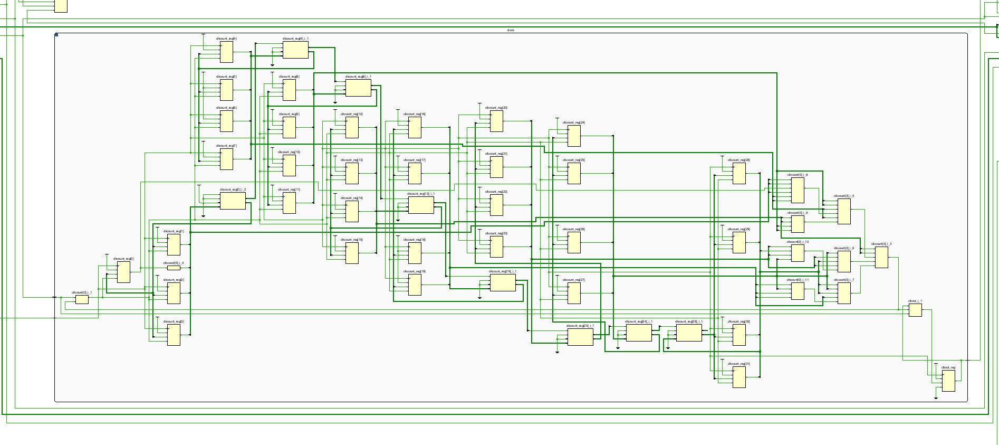
数字时钟电路图:
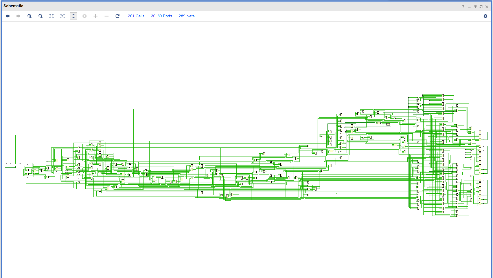
### (4)验证
实验报告中验证只放上部分图片，在附件里有验证的视频文件
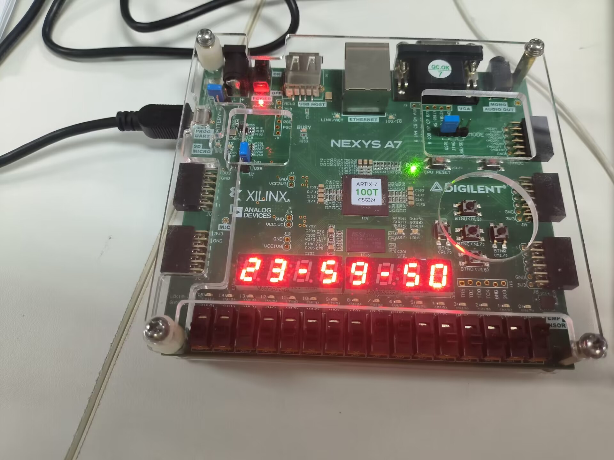
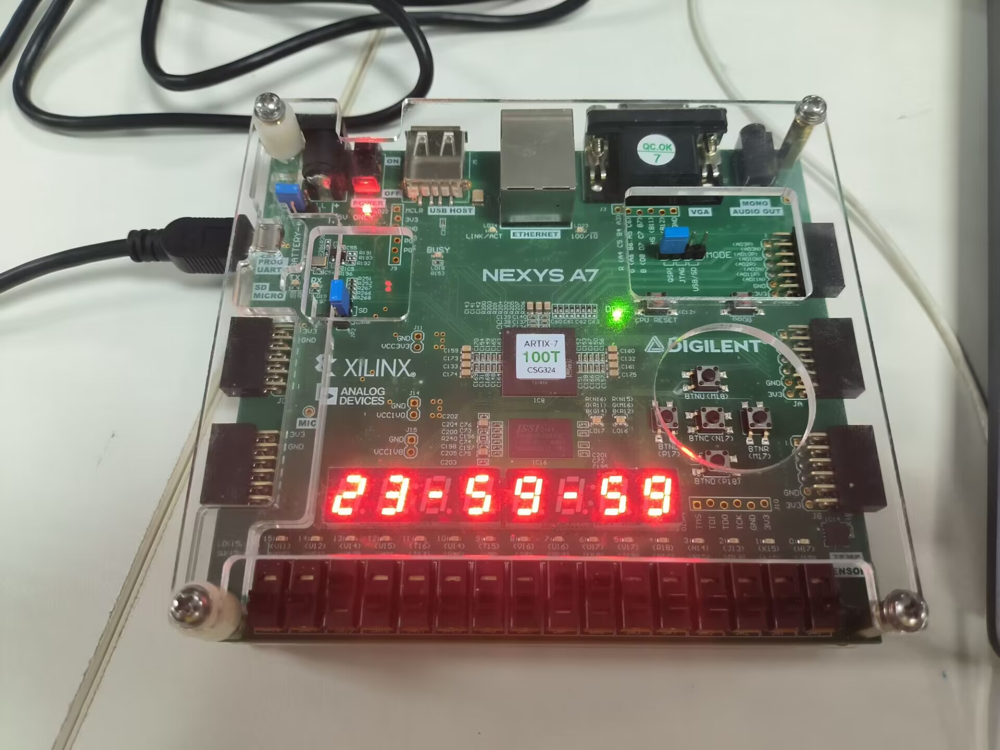
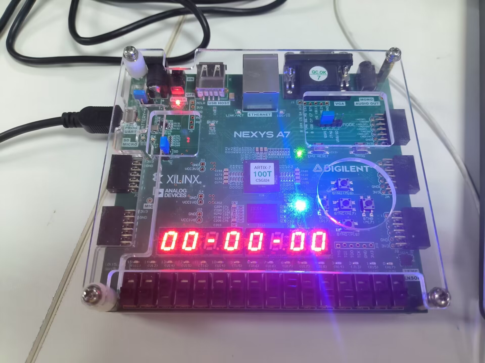
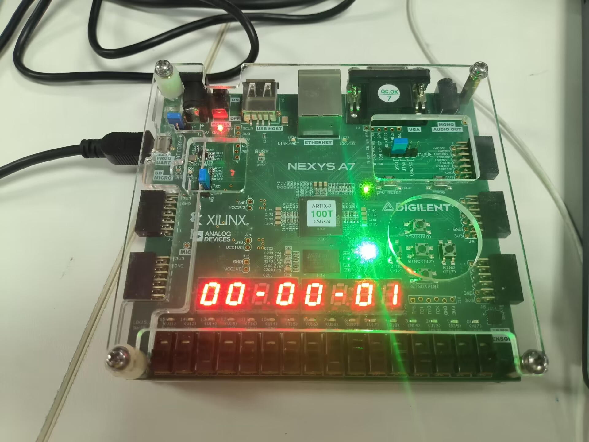
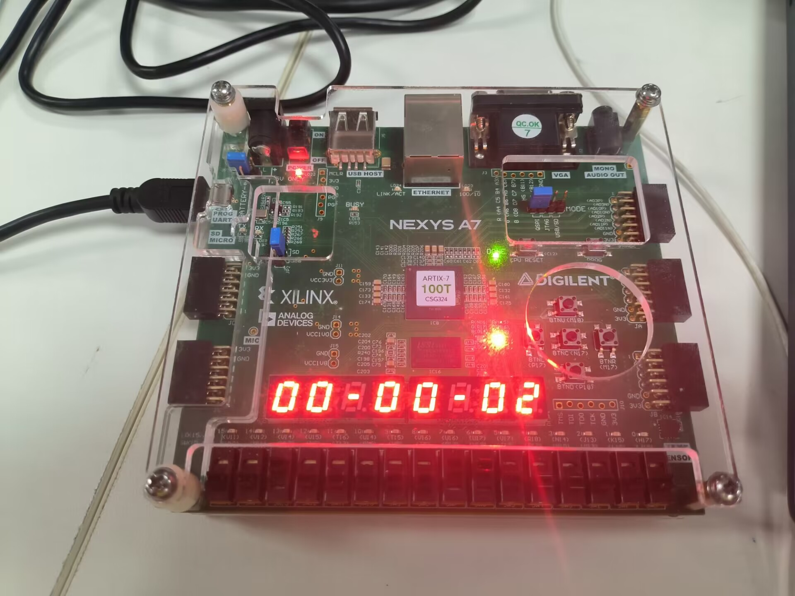

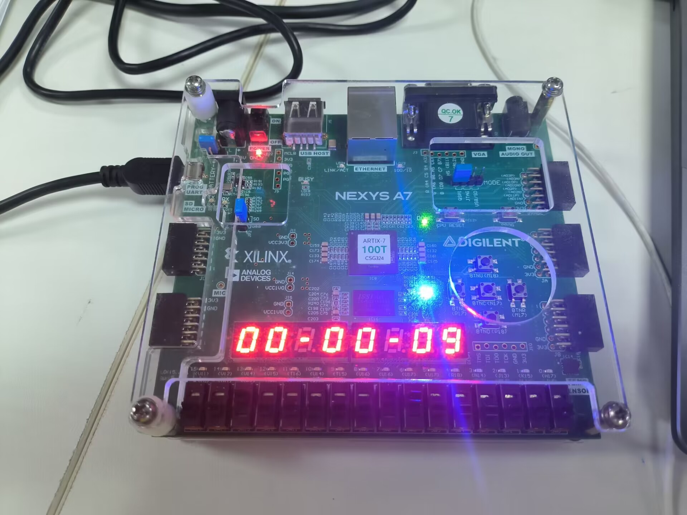
### (5)错误现象及分析
<font size=2>&emsp;&emsp;进行实验时，开始用了多个always语句，其中用两个reg型标志变量来判断是否需要进行整点闪烁和零点闪烁。这两个always语句里都有对标志变量的赋值语句。而当多个always语句都对同意变量有赋值语句时，会报错或选择最后一个进行赋值，从而导致错误。
&emsp;&emsp;解决方法:不能有两个always语句都有对这两个标志变量的赋值，将标志变量为1时闪烁的always语句写到之前的计时always语句，以防出现冲突。</font>

## 思考题
### 1、分析 32 个 32 位的寄存器堆占用的逻辑片资源。
占用资源如图:
LUT as Logic(逻辑片)占用17

占用百分比:


### 2、分析 64 位移位寄存器的时序性能和资源占用情况；并通过资料查找到其他的生成 LFSR 的反馈公式。
时序性能分析:
timing report没有报错，时序逻辑正确，时序分析如下:

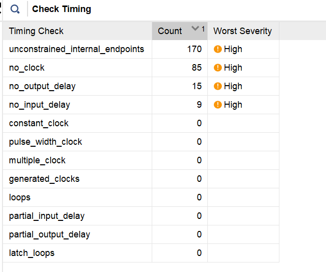

占用资源情况如图:

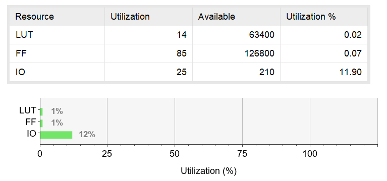
其他的生成LFSR的反馈公式:
例如斐波那契LFSR，其反馈公式为$x1=x4\oplus x3$。
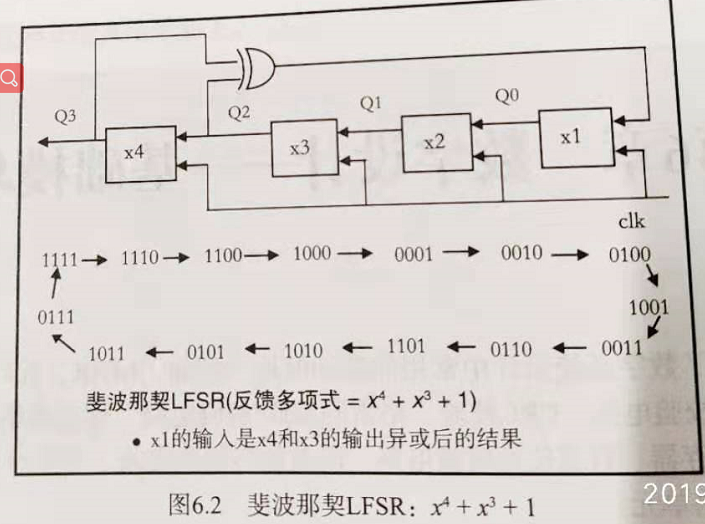
### 3、数字时钟中如何实现倒计时和毫秒计时器功能。
&emsp;&emsp;数字时钟实现倒计时，设定和之前一样，还是在s控制选择，$s=01$设置时,$s=10$,设置分,$s=11$,设置秒。剩下$s=00$进行倒计时。倒计时和原来一样，只是做减法。其中需要注意借位。当倒计时到了$00:00:00$时，停止倒计时，此时可以选择让RGB等颜色交替闪烁，提示倒计时结束。
&emsp;&emsp;关于毫秒计时功能，首先需要调整时钟周期。在原来的分频电路clkgen中调整需要分频的频率为100Hz。源码如下:
```
`timescale 1ns / 1ps
module clkgen(input clkin, input rst, input clken, output reg clkout);
    parameter clk_freq=100;//注意这里改成100Hz
    parameter countlimit=100000000/2/clk_freq-1; 
   reg[31:0] clkcount;
   initial
   begin clkcount=32'd0; clkout=1'b0; end
   always @ (posedge clkin) 
    if(rst)//重置
     begin
        clkcount<=0;
        clkout<=1'b0;
     end
    else
    begin
     if(clken)
        begin
            if(clkcount>=countlimit)
             begin
                clkcount<=32'd0;
                clkout<=~clkout;
             end
             else
             begin
                clkcount<=clkcount+1;

             end
         end
     end  
endmodule
```
同时我们还需要注意进位问题。毫秒是100进制的，当毫秒计数到了99，下一个时钟周期的时候就需要变为00，而秒进位$+1$。