<center><font size=6>Lab3 算术逻辑部件实验</font></center>

## 1、带标志位的加减运算部件
### (1)实验整体方案设计
&emsp;&emsp;<font size=2>实现带标志位的加减法运算部件，需要在无符号数加法器的基础上增加相应的门电路。利用加法器实现减法运算：把减数 Y 取反，低位进位 Cin 置1。因此，只要在原加法器的 Y 输入端，加 n 个反相器以实现取反的功能，再用一个 2 选 1 多路选择器来选择加法器的输入数据，用一个控制端 Sub 来控制选择将 Y（sub=0）还是 Y 反码（sub=1）输入到加法器的输入端，并将控制端 Sub 作为低位进位 Cin 送到加法器。
&emsp;&emsp;标志位共有4个，分别是OF,SF,CF,ZF。符号标志位$SF=F_{n-1}$,无符号数溢出标志位$CF=Cout\oplus Cin$,带符号数标志位$OF=C_n\oplus C_{n-1}$或者$OF=\overline{X_{n-1}}\cdot \overline{Y_{n-1}}\cdot F_{n-1}+X_{n-1}\cdot Y_{n-1}\cdot \overline{F_{n-1}}$,零标志位$ZF=(F==0)$。
&emsp;&emsp;利用上一节 16 位先行进位加法器 CLA_16 模块级联实现 32 位加法器。</font>
### (2)功能表、原理图、关键设计语句与源码
并行进位加法器原理图：

其中4位先行进位部件源码:
```
`timescale 1ns / 1ps
module CLU(
    output [4:1] c,
    input [4:1] p, g,
    input c0
    );
    assign c[1] = g[1] | (p[1] & c0);
    assign c[2] = g[2] | (p[2] & g[1]) | 
    (p[2] & p[1] & c0);
    // 以下两个表达式使用了位拼接运算和归约运算
    assign c[3] = g[3] | (p[3] & g[2]) | 
    (&{p[3:2], g[1]}) | (&{p[3:1], c0});
    assign c[4] = g[4] | (p[4] & g[3]) | 
    (&{p[4:3], g[2]}) | (&{p[4:2], g[1]}) | 
    (&{p[4:1], c0});
endmodule
```
4位组间进位加法器:
```
`timescale 1ns / 1ps
module CLA_group(
    output [3:0] f,
    output pg,gg,
    input [3:0] x, y,
    input cin
    );
    wire [4:0] c;
    wire [4:1] p, g;
    assign c[0] = cin;
    FA_PG fa0(.f(f[0]), .p(p[1]), .g(g[1]),
    .x(x[0]), .y(y[0]), .cin(c[0]));
    FA_PG fa1(.f(f[1]), .p(p[2]), .g(g[2]),
    .x(x[1]), .y(y[1]), .cin(c[1]));
    FA_PG fa2(.f(f[2]), .p(p[3]), .g(g[3]),
    .x(x[2]), .y(y[2]), .cin(c[2]));
    FA_PG fa3(.f(f[3]), .p(p[4]), .g(g[4]),
    .x(x[3]), .y(y[3]), .cin(c[3]));
    CLU clu(.c(c[4:1]),.p(p), .g(g), .c0(c[0]));
    assign pg=p[1] & p[2] & p[3] & p[4];
    assign gg= g[4] | (p[4] & g[3]) | 
    (p[4] & p[3] & g[2]) | 
    (p[4] & p[3] & p[2] & g[1]);
endmodule
```
带标志位的加减运算逻辑部件原理图:
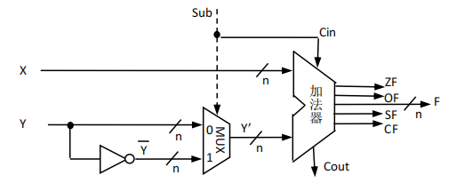
源码:
```
`timescale 1ns / 1ps
module Adder32(
      output [31:0] f,
      output OF, SF, ZF, CF,
      output cout,
      input [31:0] x, y,
      input sub
	);
//add your code here
    wire c16;
    wire [31:0] y2;
    mux32b mux(.out(y2),.s(sub),.a(y),.b(~y));
    CLA_16 clalow(.f(f[15:0]),.cout(c16),
    .x(x[15:0]),.y(y2[15:0]),.cin(sub));//低16位计算
    CLA_16 clahigh(.f(f[31:16]),.cout(cout),
    .x(x[31:16]),.y(y2[31:16]),.cin(c16));//高16位计算
    assign SF=f[31];
    assign CF=cout^sub;
    assign OF=((~x[31])&(~y[31])&f[31])|
    (x[31]&y[31]&(~f[31]));
    assign ZF=~|f;
endmodule
```
### (3)实验数据仿真测试波形图
仿真测试代码:
```
`timescale 1ns / 1ps
module Adder32_tb(    );
  parameter N = 32;      // Operand widths
  parameter SEED = 1;    
  // Change for a different random sequence
  reg [N-1:0] A, B;
  reg CIN;
  wire [N-1:0] S;
  wire COUT;
  wire OF,SF,ZF,CF;
  integer i, errors;
  reg xpectCF;
  reg [N-1:0] xpectS;

   Adder32 adder_inst(.f(S),.OF(OF),.SF(SF),
   .ZF(ZF),.CF(CF),.cout(COUT),.x(A),.y(B),.sub(CIN));
  task checkadd;
    begin
       {xpectCF,xpectS} = (CIN ? (A-B):(A+B));          
       //Verilog 加减运算结果比操作数增加1位，表示进位和借位。CIN=1表示减法运算
      if ( (xpectCF!==CF) || (xpectS!==S) ) begin
        errors = errors + 1;
        $display("ERROR: CIN,A,B = %1b,%8h,%8h, CF,S = %1b,%8h, should be %1b,%8h, OF,SF,
        
        ZF,COUT=%1b, %1b, %1b, %1b." ,
                 CIN, A, B, CF, S, xpectCF, xpectS ,OF,SF,ZF,COUT);
      end
      if ((B==A) && (CIN==1)&&(ZF==0 )) begin
        errors = errors + 1;
        $display("ERROR: CIN,A,B = %1b,%8h,%8h, CF,S = %1b,%8h, should be %1b,%8h, OF,SF,
        ZF,COUT=%1b, %1b, %1b, %1b." ,
                 CIN, A, B, CF, S, xpectCF, xpectS ,OF,SF,ZF,COUT);
      end
      if (((B[N-1]&A[N-1]&~S[N-1]) |(~A[N-1]&~B[N-1]&S[N-1]))  & (OF==0 )) begin
        errors = errors + 1;
        $display("ERROR: CIN,A,B = %1b,%8h,%8h, CF,S = %1b,%8h, should be %1b,%8h, OF,SF,
        ZF,COUT=%1b, %1b, %1b, %1b." ,
                 CIN, A, B, CF, S, xpectCF, xpectS ,OF,SF,ZF,COUT);
      end
    end
  endtask
  
  initial begin
    errors = 0;
           A = $random(SEED);                           // Set pattern based on seed parameter
   for (i=0; i<10000; i=i+1) begin             //计算10000次
          B = ~A; CIN = 0;  #10 ; checkadd;     // B是A的反码，相加
          B = ~A; CIN = 1;  #10 ; checkadd;     // B是A的反码，相减
          B = A;  CIN = 1;  #10 ; checkadd;    // 相等做减法，判断ZF
          A = $random; B= $random;                          
          CIN = 0; #10 ; checkadd;          // Check again
          CIN = 1; #10 ; checkadd;          // Try both values of CIN
    end
    $display("Adder32 test done. Errors: %0d .", errors);
    $stop(1);
  end

endmodule
```
仿真测试图:


### (4)验证
观察仿真测试图，没有出现error，表明正确。
### (5)错误现象及分析
完成本次实验的过程中没有出现错误。

## 2、桶形移位器
### (1)实验整体方案设计
<font size=2>&emsp;&emsp;先看8 位桶形移位器。其中输入数据 din 和输出数据 dout 均为 8 位，移位位数shamt 为 3 位。选择端 L/R 表示左移和右移，置为 0 为右移，置为 1 为左移。选择端 A/L 为算术/逻辑选择，置为 1 为算术右移，置为 0 为逻辑右移。
其顶层模块设计图如图:

&emsp;&emsp;类似的，我们可以设计32位桶形移位器。din,dout改为32位，shamt改为5位。
</font>

### (2)功能表、原理图、关键设计语句与源码
8位桶形移位器原理图:
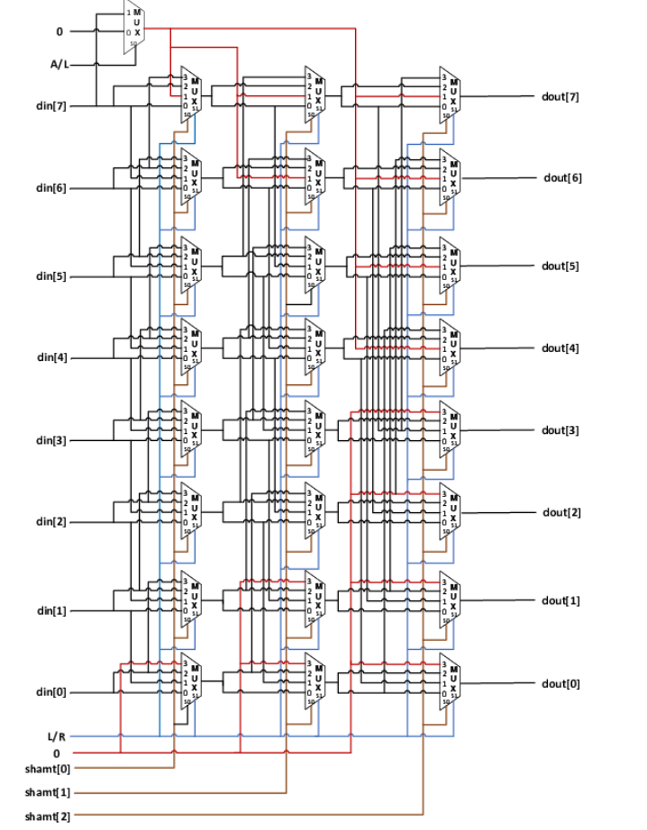
32位桶形移位器原理图(大概):
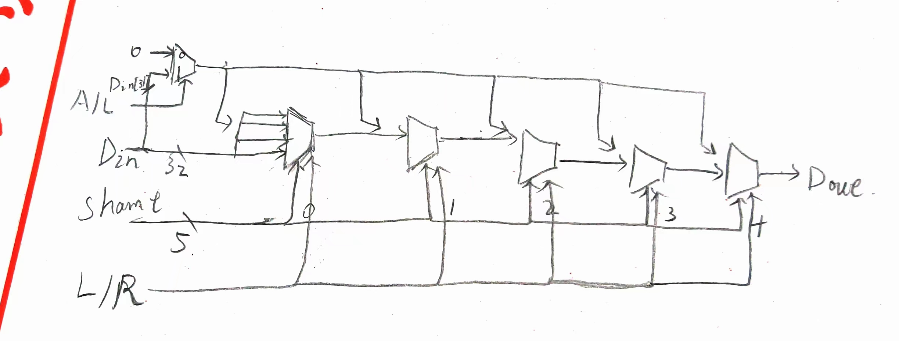
源码:
```
`timescale 1ns / 1ps
module barrelsft32(
      output [31:0] dout,
      input [31:0] din,
      input [4:0] shamt,     //移动位数
      input LR,           // LR=1时左移，LR=0时右移
      input AL            // AL=1时算术右移，AR=0时逻辑右移
	);
//add your code here
    reg [31:0] temp;
    assign dout=temp;
    always @(*) begin
        case ({LR,AL})
                2'b00: begin//逻辑右移
                        temp = shamt[0]?{1'b0,din[31:1]}:din;
                        temp = shamt[1]?{2'b00,temp[31:2]}:temp;
                        temp = shamt[2]?{4'h0,temp[31:4]}:temp;
                        temp = shamt[3]?{8'h00,temp[31:8]}:temp;
                        temp = shamt[4]?{16'h0000,temp[31:16]}:temp;
                   end
                2'b01: begin//算术右移
                        temp = shamt[0]?{din[31],din[31:1]}:din;
                        temp = shamt[1]?{{2{temp[31]}},temp[31:2]}:temp;
                        temp = shamt[2]?{{4{temp[31]}},temp[31:4]}:temp;
                        temp = shamt[3]?{{8{temp[31]}},temp[31:8]}:temp;
                        temp = shamt[4]?{{16{temp[31]}},temp[31:16]}:temp;
                   end
                2'b10,2'b11: begin
                        temp = shamt[0]?{din[30:0],1'b0}:din;
                        temp = shamt[1]?{temp[29:0],2'b00}:temp;
                        temp = shamt[2]?{temp[27:0],4'h0}:temp;
                        temp = shamt[3]?{temp[23:0],8'h00}:temp;
                        temp = shamt[4]?{temp[15:0],16'h0000}:temp;
                    end
        endcase
    end
endmodule
```
### (3)实验数据仿真测试波形图
仿真测试代码:
```
`timescale 1ns / 1ps
module barrelsft32_tb( );
 parameter N = 32;      // Operand widths
 parameter SEED = 1;    // Change for a different random sequence
 wire [N-1:0] DOUT;
 reg signed [N-1:0] DIN;  //必须设置成带符号数，否则算术右移出错
 reg [4:0] SHAMT;      //移动位数
 reg LR;               // LR=1 时左移,LR=0 时右移
 reg AL;              // AL=1 时算术右移,AR=0 时逻辑右移
  integer i, sh, errors;
  reg [N-1:0] xpectS; 
 
  barrelsft32 barrelsft32_inst(.dout(DOUT),.din(DIN),.shamt(SHAMT),.LR(LR),.AL(AL));

  task checksh;   // Task to compare barrelsft32_inst output (DOUT) with expected (xpectS)
   input LR,AL;
   begin
      xpectS=((LR==1) ? ((DIN << SHAMT) ):((AL==1) ?(DIN >>> SHAMT ):(DIN >> SHAMT)));
        if (xpectS!==DOUT) begin
        errors = errors + 1;
        $display("Error: LR=%1B,AL=%1B,SHAMT=%5b, DIN=%32b, want= %32b, got= %32b", 
        LR, AL, SHAMT,DIN, xpectS, DOUT);
      end
    end
  endtask
  
  initial begin
    errors = 0; DIN = $random(SEED);
    for (i=0; i<2500; i=i+1) begin      // Test 2500 random input data vectors
      DIN = $random;                    // Apply random data input
      for (sh=1; sh<=N-1; sh=sh+1) begin // Test all possible shift amounts
        SHAMT = sh;                         // Apply shift amount
                                       
        LR=1'b0;AL=1'b0; #10  ; checksh(LR,AL);
        LR=1'b0;AL=1'b1; #10  ; checksh(LR,AL);
        LR=1'b1;AL=1'b0; #10  ; checksh(LR,AL);
        LR=1'b1;AL=1'b1; #10  ; checksh(LR,AL);
      end
    end
    $display("BarrelShifter32 test done, %0d errors.", errors); $fflush; 
    $stop(1);
  end
endmodule
```
仿真测试图:

### (4)验证
&emsp;&emsp;errors恒为0，说明没有错误
### (5)错误现象及分析
完成该实验的过程中，没有出现错误。

## 3、32 位 ALU
### (1)实验整体方案设计
<font size = 2>&emsp;&emsp;RV32I包括 4 种 ALU 指令：比较运算、移位运算、逻辑运算和算术运算。比较运算通过操作数相减然后判断标志位来生成结果；移位运算通过桶形移位器来实现左移和右移；逻辑运算可直接通过逻辑门阵列来实现；算术运算通过加法器以及生成的标志位来实现。ALU 在操作控制信号 ALUctr 的指示下，执行相应运算，Result 作为 ALU 运算的结果被输出，零标志 Zero 被作为 ALU 的结果标志信息输出。
&emsp;&emsp;RV32I指令集下ALU最终结果 Result 输出是通过一个八选一选择器选择不同运算部件的结果，选择端用 OPctr 信号来控制。ALU 的具体操作通过 4 位控制信号 ALUctr 生成具体控制信号来确定。
&emsp;&emsp;控制信号如下:
&emsp;&emsp;SUBctr 信号：当 SUBctr=1 时，做减法运算，当SUBctr=0 时，做加法运算；
&emsp;&emsp;SIGctr 信号：当 SIGctr=1，则执行“带符号整数比较小于置 1” ，当 SIGctr=0，则执行“无符号数比较小于置 1”；
&emsp;&emsp;SFTctr 信号用来控制移位方向，当 SFTctr=0，则执行右移操作，当 SFTctr=1，则执行左移操作；
&emsp;&emsp;ALctr 信号用来设置算术移位还是逻辑移位，当 ALctr=0，则执行逻辑移位，当 ALctr=1，则执行算术移位；
&emsp;&emsp;OPctr[2:0]用来选择运算的结果 Result 输出
&emsp;&emsp;ALU顶层模块设计如图(也是原理图):
</font>

### (2)功能表、原理图、关键设计语句与源码
ALUctr 的四位编码及其对应的控制信号:

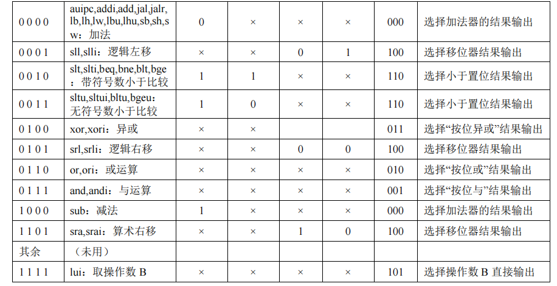
原理图:

源码:
控制信号生成部件:
```
`timescale 1ns / 1ps
module ALU_control_signal_generator(
    output SUBctr,SIGctr,ALctr,SFTctr,
    output [2:0] OPctr,
    input [3:0] ALUctr
    );
    assign SUBctr=ALUctr[1]||(ALUctr[0]&&ALUctr[1])||ALUctr[3];
    assign SIGctr=~ALUctr[0];
    assign ALctr=ALUctr[3];
    assign SFTctr=~ALUctr[2];
    assign OPctr[0]=(ALUctr==4'b0100)||(ALUctr==4'b0111)||(ALUctr==4'b1111);
    assign OPctr[1]=(ALUctr==4'b0010)||(ALUctr==4'b0011)||(ALUctr==4'b0100)||(ALUctr==4'b0110);
    assign OPctr[2]=(ALUctr==4'b0001)||(ALUctr==4'b0010)||(ALUctr==4'b0011)||(ALUctr==4'b0101)||
    (ALUctr==4'b1101)||(ALUctr==4'b1111);
endmodule
```
输出结果选择器:
```
`timescale 1ns / 1ps
module ALUmux(
    output reg [31:0] result,
    input [2:0] select,
    input [31:0] in0,in1,in2,in3,in4,in5,in6
    );
    always @(*)
        case(select)
            3'b000: result=in0;
            3'b001: result=in1;
            3'b010: result=in2;
            3'b011: result=in3;
            3'b100: result=in4;
            3'b101: result=in5;
            3'b110: result=in6;
            default: result=8'h00000000;
        endcase
endmodule
```
加法器和桶形移位器之前已经给出。
32位ALU:
```
`timescale 1ns / 1ps
module ALU32(
output  [31:0] result,      //32位运算结果
output  zero,               //结果为0标志位
input   [31:0] dataa,       //32位数据输入，送到ALU端口A   
input   [31:0] datab,       //32位数据输入，送到ALU端口B  
input   [3:0] aluctr        //4位ALU操作控制信号
); 
//add your code here
wire SUBctr,SIGctr,ALctr,SFTctr;
wire [2:0] OPctr;
wire [31:0] muxconnection [6:0];//结果选择mux的输入信号
wire of,sf,cf,mux_less_out;
//由aluctr生成控制信号
ALU_control_signal_generator Acsg(.SUBctr(SUBctr),.SIGctr(SIGctr),
.ALctr(ALctr),.SFTctr(SFTctr),.OPctr(OPctr),.ALUctr(aluctr));
//32位加法器
Adder32forALU my_adder(.f(muxconnection[0]),.sub(SUBctr),.x(dataa),.y(datab^{32{SUBctr}})
,.OF(of),.SF(sf),.CF(cf),.ZF(zero),.cout());
//桶形移位器
barrelsft32 my_barrel(.din(dataa),.dout(muxconnection[4]),.shamt(datab[4:0]),.LR(SFTctr),.AL(ALctr));
assign muxconnection[1]=dataa&datab;
assign muxconnection[2]=dataa|datab;
assign muxconnection[3]=dataa^datab;
assign muxconnection[5]=datab;
mux32b mux_less(.out(mux_less_out),.s(SIGctr),.a(cf),.b(of^sf));
assign muxconnection[6]={31'b0000000000000000000000000000000,mux_less_out};
//结果选择
ALUmux alu_mux(.result(result),.select(OPctr),.in0(muxconnection[0]),.in1(muxconnection[1])
,.in2(muxconnection[2]),.in3(muxconnection[3]),.in4(muxconnection[4]),.in5(muxconnection[5])
,.in6(muxconnection[6]));
endmodule
```
### (3)实验数据仿真测试波形图
仿真测试源码:
```
`timescale 1ns / 1ps
module ALU32_tb(    );
  parameter N = 32;               // 定义位宽
  parameter SEED = 1;              // 定义不同的随机序列
  wire [N-1:0] Result;              //32位运算结果
  wire zero;                         //结果为0标志位
  reg [N-1:0]  Data_A, Data_B;     //32位数据输入,送到ALU端口A
  reg [3:0]   ALUctr;             //4位ALU操作控制信号
  integer i, errors;
  reg [N-1:0] TempS;
  reg [4:0] shamt;
//  reg tempZero;
  reg less;
  reg signed [31:0] tempdata_a,tempdata_b;
  
  parameter Addctr  = 4'b0000,   // 定义不同运算的控制码
             Sllctr  = 4'b0001, 
             Sltctr  = 4'b0010, 
             Sltuctr = 4'b0011, 
             Xorctr  = 4'b0100, 
             Srlctr  = 4'b0101, 
             Orctr   = 4'b0110, 
             Andctr  = 4'b0111, 
             Subctr  = 4'b1000, 
             Sractr  = 4'b1101, 
             Luictr  = 4'b1111; 


ALU32 ALU32_inst(.result(Result),.zero(zero),.dataa(Data_A),.datab(Data_B),.aluctr(ALUctr));

  task checkalu;
    begin
    case (ALUctr)
    Addctr: begin 
                 TempS=Data_A+Data_B;   //加法运算
                 if (TempS!=Result) 
                  begin     
                       errors = errors + 1;
                      $display("ERROR: ALUctr,Data_A,Data_B = %4b,%8h,%8h, want= %8h, got=%8h,%1b." ,
                      ALUctr, Data_A, Data_B, TempS, Result,zero);                 
                  end
             end
    Sllctr: begin 
                 shamt=Data_B[4:0];
                 TempS=Data_A << shamt;   //左移运算
                 if (TempS!=Result) 
                  begin     
                       errors = errors + 1;
                      $display("ERROR: ALUctr,Data_A,Data_B = %4b,%8h,%8h, want= %8h, got=%8h,%1b." ,
                      ALUctr, Data_A, Data_B, TempS, Result,zero);                 
                  end
             end
    Sltctr: begin                 //带符号数小于比较运算
                 tempdata_a=Data_A;
                 tempdata_b=Data_B;
                 less=tempdata_a < tempdata_b;
                 TempS={28'h0000000,3'b000,less};
                 if (TempS!=Result)
                  begin     
                       errors = errors + 1;
                      $display("ERROR: ALUctr,Data_A,Data_B = %4b,%8h,%8h, want= %8h, got=%8h,%1b." ,
                      ALUctr, Data_A, Data_B, TempS, Result,zero);                 
                  end
             end
    Sltuctr: begin                 //无符号数小于比较运算
                 less=Data_A < Data_B;
                 TempS={28'h0000000,3'b000,less};
                 if (TempS!=Result)
                  begin     
                       errors = errors + 1;
                      $display("ERROR: ALUctr,Data_A,Data_B = %4b,%8h,%8h, want= %8h, got=%8h,%1b." ,
                      ALUctr, Data_A, Data_B, TempS, Result,zero);                 
                  end
             end
      Xorctr: begin 
                 TempS=Data_A ^ Data_B;   //异或运算
                 if (TempS!=Result) 
                  begin     
                       errors = errors + 1;
                      $display("ERROR: ALUctr,Data_A,Data_B = %4b,%8h,%8h, want= %8h, got=%8h,%1b." ,
                      ALUctr, Data_A, Data_B, TempS, Result,zero);                 
                  end
             end
      Srlctr: begin 
                 shamt=Data_B[4:0];
                 TempS=Data_A >> shamt;   //逻辑右移运算
                 if (TempS!=Result) 
                  begin     
                       errors = errors + 1;
                      $display("ERROR: ALUctr,Data_A,Data_B = %4b,%8h,%8h, want= %8h, got=%8h,%1b." ,
                      ALUctr, Data_A, Data_B, TempS, Result,zero);                 
                  end
             end
      Orctr: begin 
                 TempS=Data_A | Data_B;   //或运算
                 if (TempS!=Result) 
                  begin     
                       errors = errors + 1;
                      $display("ERROR: ALUctr,Data_A,Data_B = %4b,%8h,%8h, want= %8h, got=%8h,%1b." ,
                      ALUctr, Data_A, Data_B, TempS, Result,zero);                 
                  end
             end
      Andctr: begin 
                 TempS=Data_A & Data_B;   //与运算
                 if (TempS!=Result) 
                  begin     
                       errors = errors + 1;
                      $display("ERROR: ALUctr,Data_A,Data_B = %4b,%8h,%8h, want= %8h, got=%8h,%1b." ,
                      ALUctr, Data_A, Data_B, TempS, Result,zero);                 
                  end
             end
      Subctr: begin 
                 TempS=Data_A-Data_B;   //减法运算
                 if (TempS!=Result) 
                  begin     
                       errors = errors + 1;
                      $display("ERROR: ALUctr,Data_A,Data_B = %4b,%8h,%8h, want= %8h, got=%8h,%1b." ,
                      ALUctr, Data_A, Data_B, TempS, Result,zero);                 
                  end
             end
      Sractr: begin 
                 shamt=Data_B[4:0];
                 TempS=tempdata_a >>> shamt;   //算术右移运算
                 if (TempS!=Result) 
                  begin     
                       errors = errors + 1;
                      $display("ERROR: ALUctr,Data_A,Data_B = %4b,%8h,%8h, want= %8h, got=%8h,%1b." ,
                      ALUctr, Data_A, Data_B, TempS, Result,zero);                 
                  end
             end
    Luictr: begin 
                 TempS=Data_B;   //取操作数B
                 if (TempS!=Result) 
                  begin     
                       errors = errors + 1;
                      $display("ERROR: ALUctr,Data_A,Data_B = %4b,%8h,%8h, want= %8h, got=%8h,%1b." ,
                      ALUctr, Data_A, Data_B, TempS, Result,zero);                 
                  end
             end
           
             
    endcase
    end
  endtask
  
  initial begin
    errors = 0;
           Data_A = $random(SEED);                        // Set pattern based on seed parameter
   for (i=0; i<10000; i=i+1) begin                //计算10000次
          Data_B = ~Data_A; 
          ALUctr = Addctr;  #10 ; checkalu;     
          ALUctr = Sllctr;  #10 ; checkalu;     
          ALUctr = Sltctr;  #10 ; checkalu;     
          ALUctr = Sltuctr; #10 ; checkalu;     
          ALUctr = Xorctr;  #10 ; checkalu;     
          ALUctr = Srlctr;  #10 ; checkalu;     
          ALUctr = Orctr;   #10 ; checkalu;     
          ALUctr = Subctr;  #10 ; checkalu;     
          ALUctr = Sractr;  #10 ; checkalu;     
          ALUctr = Luictr;  #10 ; checkalu;     
          Data_B = Data_A; 
          ALUctr = Addctr;  #10 ; checkalu;     
          ALUctr = Sllctr;  #10 ; checkalu;     
          ALUctr = Sltctr;  #10 ; checkalu;     
          ALUctr = Sltuctr; #10 ; checkalu;     
          ALUctr = Xorctr;  #10 ; checkalu;     
          ALUctr = Srlctr;  #10 ; checkalu;     
          ALUctr = Orctr;   #10 ; checkalu;     
          ALUctr = Subctr;  #10 ; checkalu;     
          ALUctr = Sractr;  #10 ; checkalu;     
          ALUctr = Luictr;  #10 ; checkalu;     
          Data_A = $random; Data_B= $random;                          
          // Get random number, maybe > 32 bits wide
          ALUctr = Addctr;  #10 ; checkalu;     
          ALUctr = Sllctr;  #10 ; checkalu;     
          ALUctr = Sltctr;  #10 ; checkalu;     
          ALUctr = Sltuctr; #10 ; checkalu;     
          ALUctr = Xorctr;  #10 ; checkalu;     
          ALUctr = Srlctr;  #10 ; checkalu;     
          ALUctr = Orctr;   #10 ; checkalu;     
          ALUctr = Subctr;  #10 ; checkalu;     
          ALUctr = Sractr;  #10 ; checkalu;     
          ALUctr = Luictr;  #10 ; checkalu;     
    end
    $display("ALU32 test done. Errors: %0d .", errors);
    $stop(1);
  end
endmodule
```
仿真测试波形图:
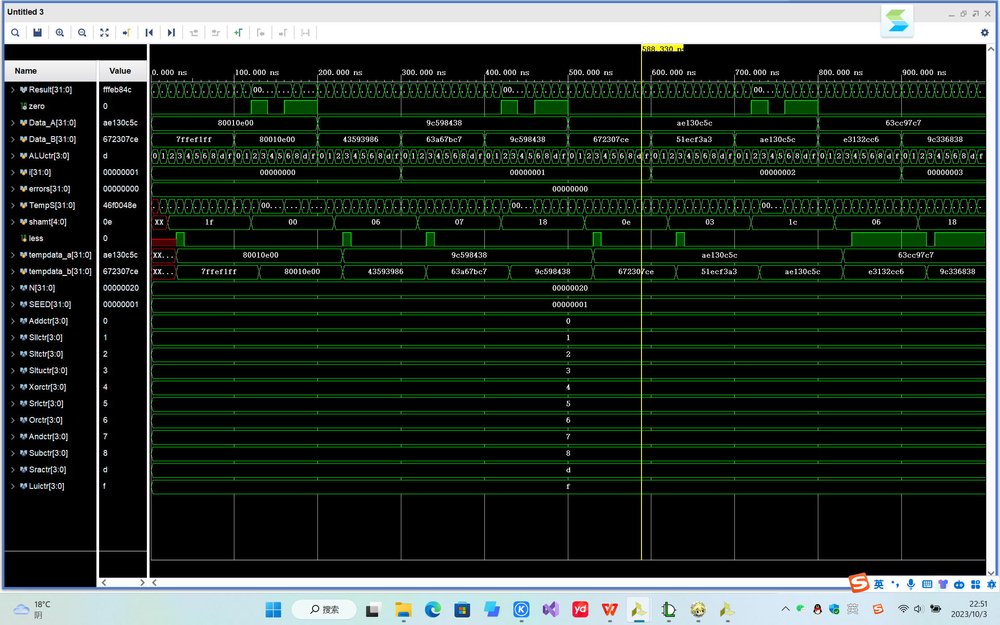
观察发现errors=0，说明此时没有错误发生。
### (4)验证
&emsp;&emsp;为了能够在实验板进行验证，分别使用 4 位输入开关表示输入端 a 和 b，使用 4 位输入开关表示 4 位ALU 控制码，32 位运算结果现在 8 个七段数码管上，运算结果的低 16 位输出到 16 个 led 指示灯，结果为0 的标志位输出到 3 色 led 的蓝色指示灯。
数码管显示译码器:
```
`timescale 1ns / 1ps
module seg_decode(
    input [3:0] in,
    output reg [6:0] out
    );
    always @(*)
        case (in)
            0: out=7'b1000000;
            1: out=7'b1111001;
            2: out=7'b0100100;
            3: out=7'b0110000;
            4: out=7'b0011001;
            5: out=7'b0010010;
            6: out=7'b0000010;
            7: out=7'b1111000;
            8: out=7'b0000000;
            9: out=7'b0010000;
            10: out=7'b0001000;
            11: out=7'b0000011;
            12: out=7'b1000110;
            13: out=7'b0100001;
            14: out=7'b0000110;
            15: out=7'b0001110;
            default: out=7'b1000000;
        endcase
endmodule
```
ALUtop源码:
```
`timescale 1ns / 1ps
module ALU32_top(
output [6:0] segs,           //七段数码管字形输出
output [7:0] AN,            //七段数码管显示32位运算结果 
output  [15:0] result_l,       //32位运算结果
output  zero,             //结果为0标志位
input   [3:0] data_a,           //4位数据输入，重复8次后送到ALU端口A   
input   [3:0] data_b,           //4位数据输入，重复8次后送到ALU端口B  
input   [3:0] aluctr,        //4位ALU操作控制信号
input   clk
); 
//add your code here
wire [31:0] res;
reg [15:0] counter;//数码管刷新计数器
reg [7:0] anout;
reg [6:0] segsout;
wire [6:0] connection [7:0];
assign result_l=res[15:0];
assign segs=segsout;
assign AN=anout;
ALU32 alu(.zero(zero),.dataa({8{data_a}}),.datab({8{data_b}}),.aluctr(aluctr),.result(res));
seg_decode seg_7(.in(res[31:28]),.out(connection[7]));
seg_decode seg_6(.in(res[27:24]),.out(connection[6]));
seg_decode seg_5(.in(res[23:20]),.out(connection[5]));
seg_decode seg_4(.in(res[19:16]),.out(connection[4]));
seg_decode seg_3(.in(res[15:12]),.out(connection[3]));
seg_decode seg_2(.in(res[11:8]),.out(connection[2]));
seg_decode seg_1(.in(res[7:4]),.out(connection[1]));
seg_decode seg_0(.in(res[3:0]),.out(connection[0]));
//数码管显示
always @(posedge clk) begin
    counter<=counter+1;
        case (counter)
            6000: begin
                anout<=8'b01111111;
                segsout<=connection[7];
            end
            12000: begin
                anout<=8'b10111111;
                segsout<=connection[6];
            end
            18000: begin
                anout<=8'b11011111;
                segsout<=connection[5];
            end
            24000: begin
                anout<=8'b11101111;
                segsout<=connection[4];
            end
            30000: begin
                anout<=8'b11110111;
                segsout<=connection[3];
            end
            36000: begin
                anout<=8'b11111011;
                segsout<=connection[2];
            end
            42000: begin
                anout<=8'b11111101;
                segsout<=connection[1];
            end
            48000: begin
                anout<=8'b11111110;
                segsout<=connection[0];
                counter<=0;
            end
        endcase
end
endmodule
```
ALUtop电路图:
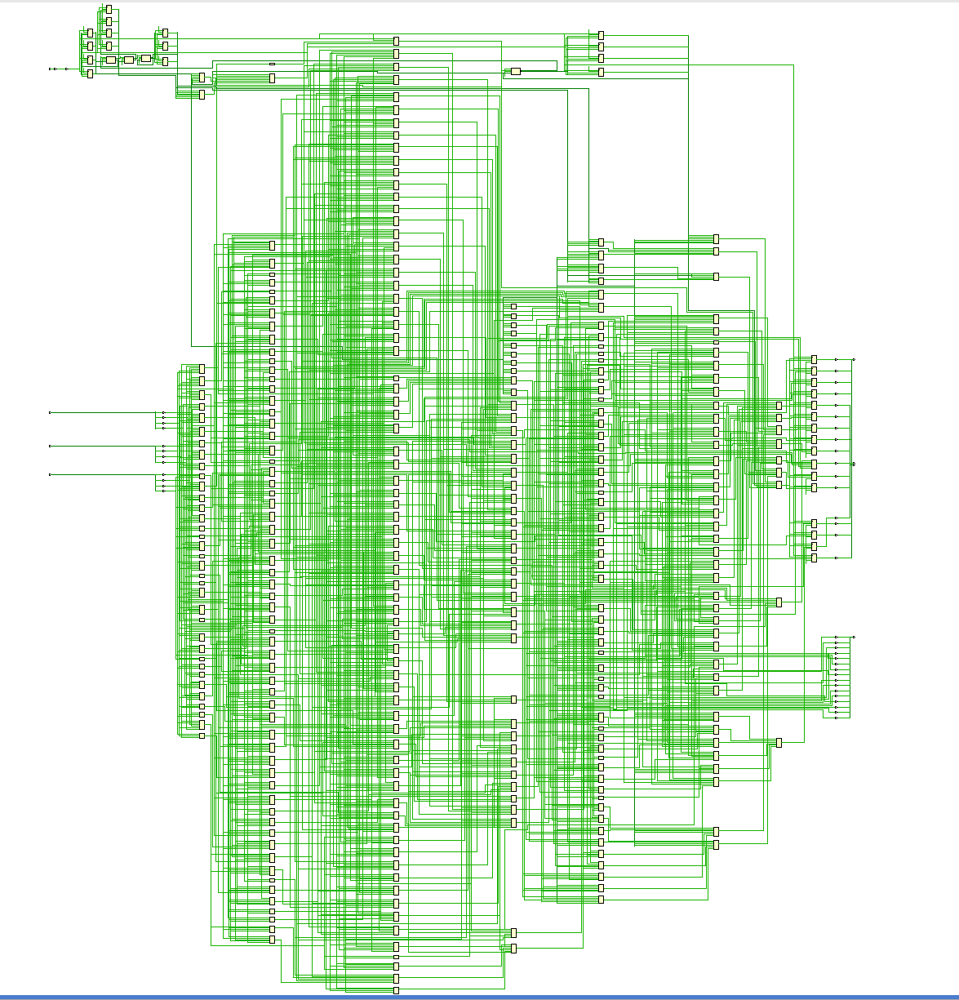
验证:
a=1001,b=1001,加

a=1001,b=1001,减

a=0011,b=0101,减
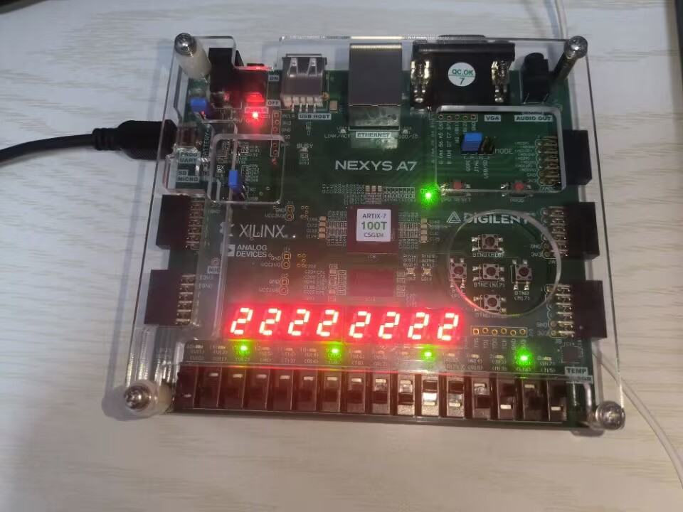
a=0101,b=0001,左移17位
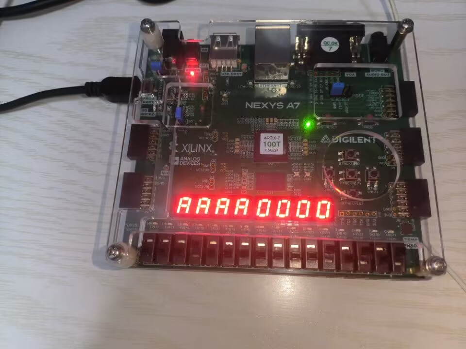
a=0101,b=0001,逻辑右移17位

a=1010,b=0001,算术右移17位
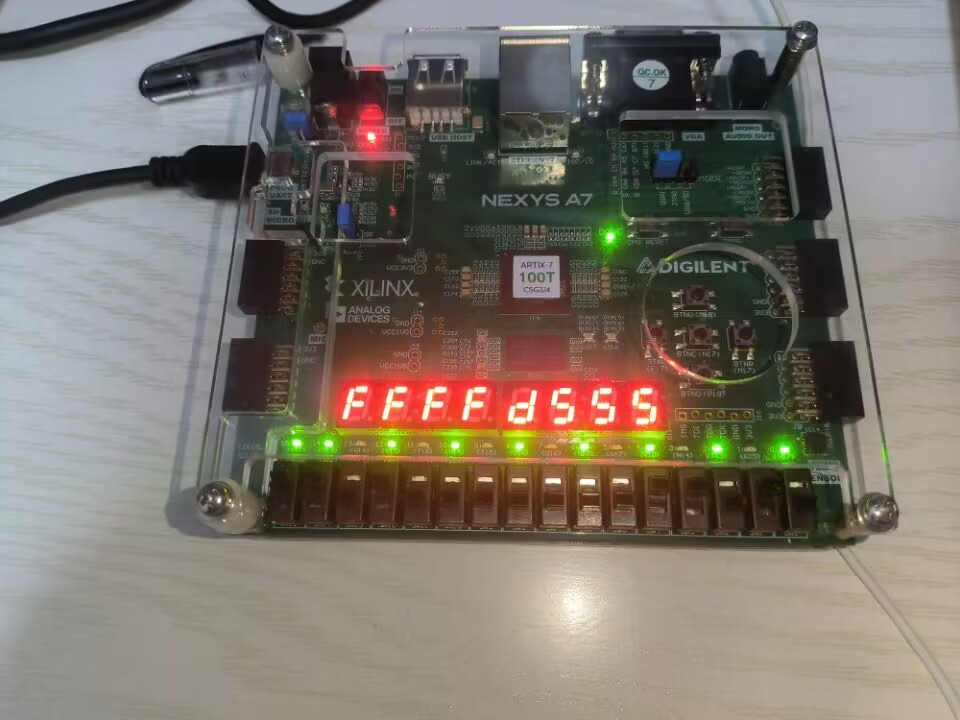
a=0101,b=1000,与
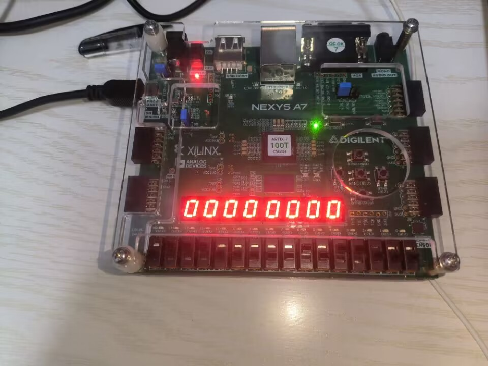
a=0101,b=1000,或
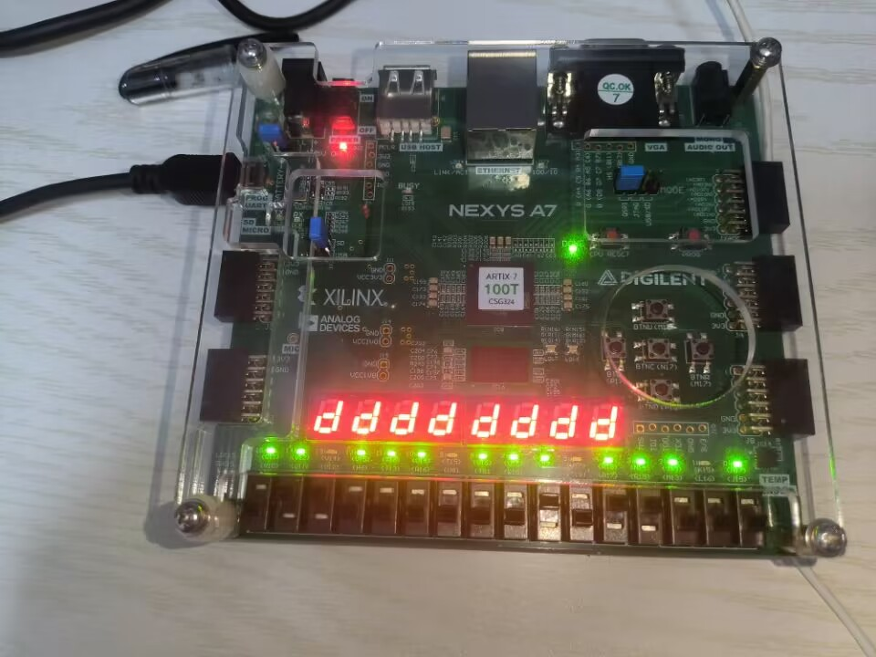
a=1100,b=0110,异或
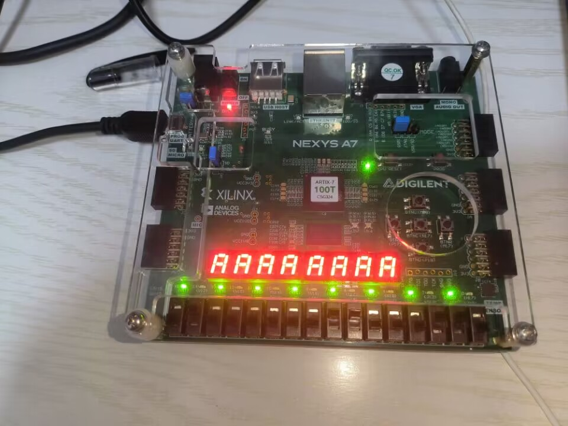
b=0001,取数
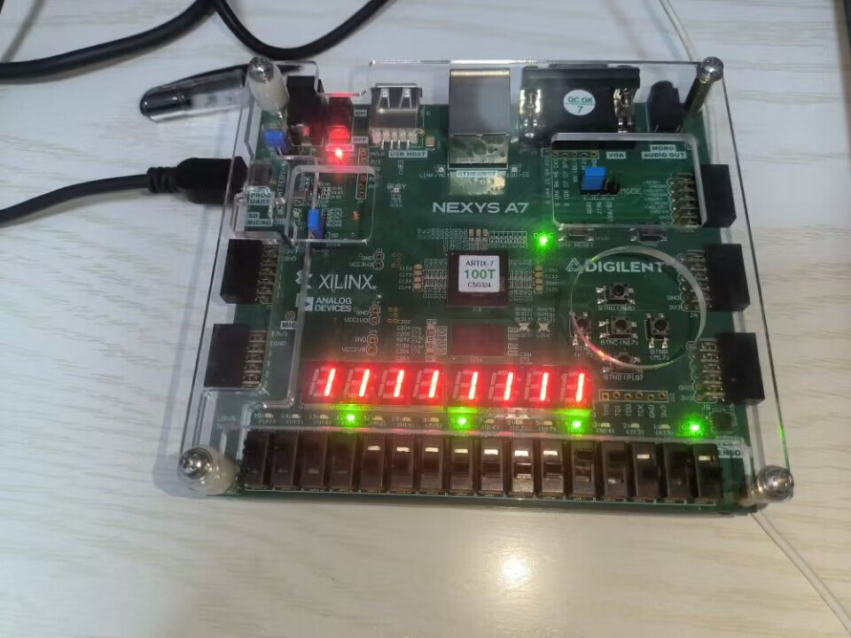
a=1111,b=1010,无符号数小于比较
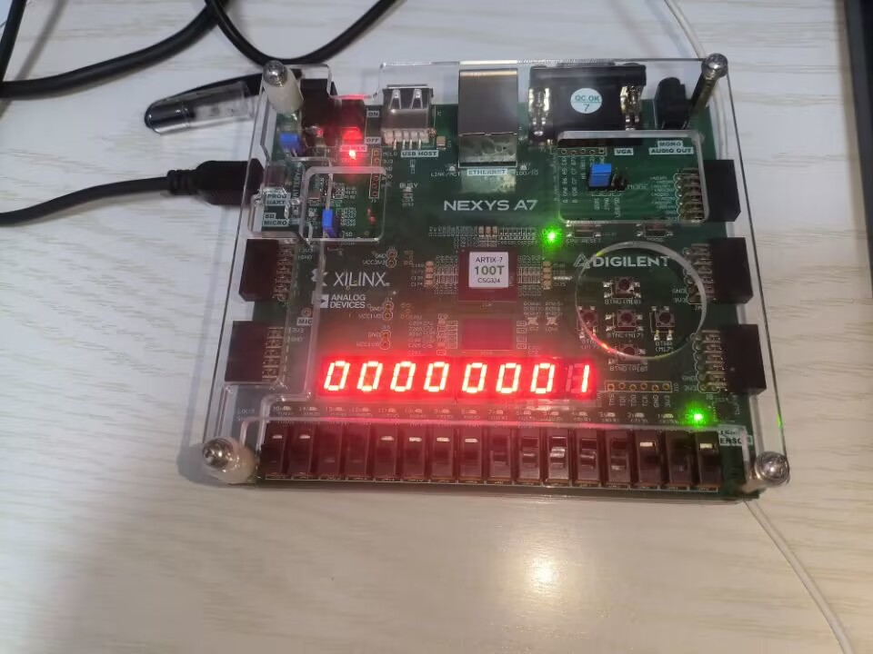
a=1010,b=1111,带符号数小于比较
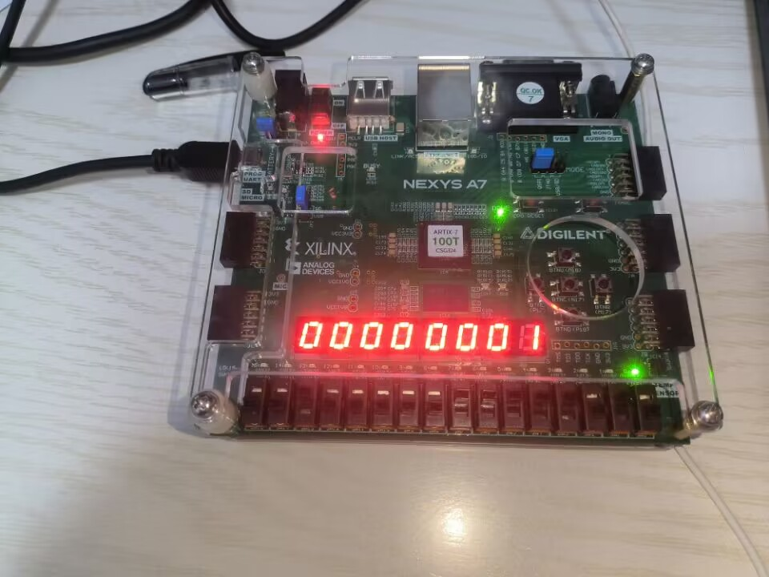
### (5)错误现象及分析
&emsp;&emsp;SUBctr符号扩展和操作数B异或本质上就是判断B是否需要取反。若SRBctr=1，表示减法，B取反再输入到加法器中。开始没有注意到这一点，直接将之前的带标志位的加法器放入作为这里的加法器，B进行了2次补码计算导致出错。

## 思考题
### 1、分析 32 位 ALU 的资源占用情况。


&emsp;&emsp;如图，LUT占用256，FF占用31，输入输出引脚IO占用45。占用比例见图2
### 2、如果比较运算直接使用组合电路比较器来实现，则 32 位 ALU 电路原理图需要做哪些修改？
&emsp;&emsp;由于组合电路比较器是利用从高位到低位位运算来实现的，并没有利用加法器进行减法操作。所以如果比较运算直接实用组合电路比较器来实现，则32位ALU电路原理图中，两个比较指令(ALUctr=0010和ALUctr=0011)需单独判断，即当ALUctr为这两个指令时，将A和B直接输入到比较器中。当ALUctr[0]=0时，执行带符号数比较；ALUctr[0]=1时，执行无符号数比较。
### 3、在 32 位 ALU 的基础上如何实现 64 位的 ALU？
&emsp;&emsp;相比于原来的32位ALU，64位ALU可以在原来32位ALU的基础上进行级联。一个ALU负责高32位计算，一个负责低32位计算。也可以对原来的内部部件进行修改，将加法器和移位器改为64位的。
&emsp;&emsp;(1)若是两个32位ALU级联，令低32位ALU为ALUl,高32位ALU为ALUh。输入两个64位数据A,B。分别取两数据的低32位和高32位输入到ALUl和ALUh中进行计算。进行加减法计算时，ALUl的加法器的Cout进位输入到ALUh的加法器作为Cin。注意:减法操作需要取B的补码，取反还是B低32位和高32位各自取反，加一本身是由SUBctr=1完成的。SUBctr只输入到ALUl的加法器中作为其Cin，ALUh的加法器Cin由ALUl的Cout给出。对于移位操作，左移操作没有太多需要注意的。对于右移操作，注意算术右移时移入的是A的最高位，即A[63]，对两个ALU都是这样。
&emsp;&emsp;(2)将加法器和桶形移位器改为64位的:类似于之前的写法。加法器可以用之前的CLA16和CLU一起构建为并行加法器。这样运算速度更快。桶形移位器则需要6个6-64MUX，其余写法类似。
### 4、查找资料说明还有哪些并行加法器的设计方法，并详细介绍其中一种方法。
&emsp;&emsp;这里介绍进位跳过加法器(也叫也叫进位旁路加法器CBA，carry bypass adder)
&emsp;&emsp;相较于CRA和CLA，CBA是一种更为折中的设计，更适合用于位数高一些的加法器的实现。
&emsp;&emsp;RCA需要逐位传递进位，CBA单元内部也是如此。如下图:

&emsp;&emsp;但在CBA单元间，CBA通过旁路让跨位较大的进位跳过了CBA模块内FA的进位链，从而大大减少了较坏情况下的进位延迟。
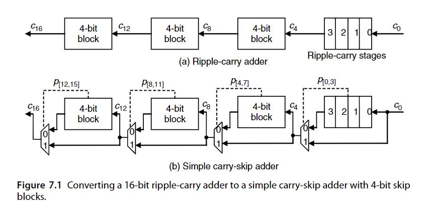
&emsp;&emsp;例如对64位加法器，如果是CRA，那么最低位进位输入到最高位的进位将经过64个加法器，但如果是CBA，则只需要经过大约 64/n 个CBA单元（n是单个CBA单元的位宽）。由于进位信号可以直接跨过CBA单元内部。CBA得以在不增加过多元件数的情况下，大大减少了进位延迟。
&emsp;&emsp;组成CBA的每个CBA单元的位数不一定非得一致，比如可以让第一个CBA单元是5bits的，第二个却是3bits的。也可以在CBA单元内用CLA实现CBA单元的功能，低位数CLA的规模还不是非常大。还可以在多个CBA单元之间添加旁路，让这些CBA单元组合变成一个更大的CBA单元。这在大位数的情况下可以进一步改善性能。