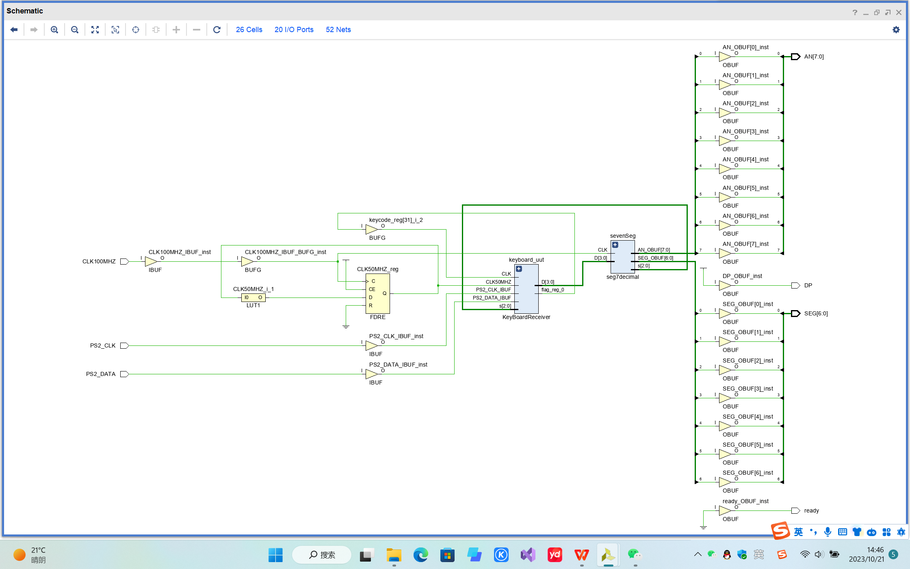
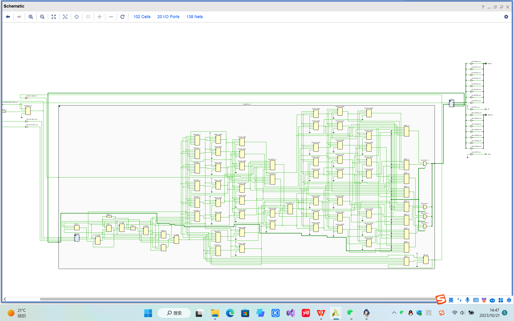
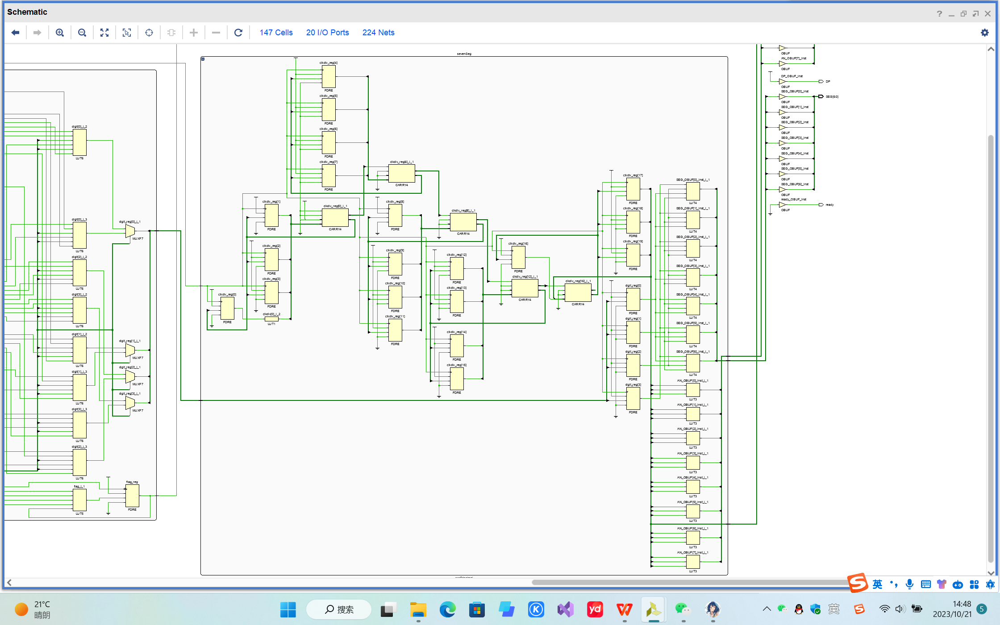
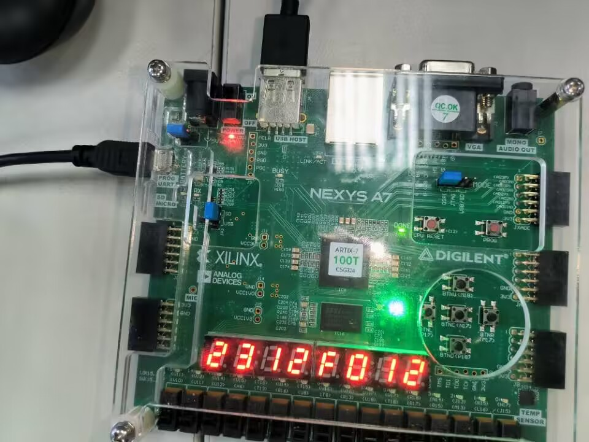
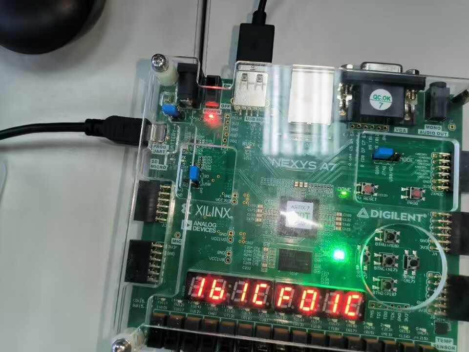
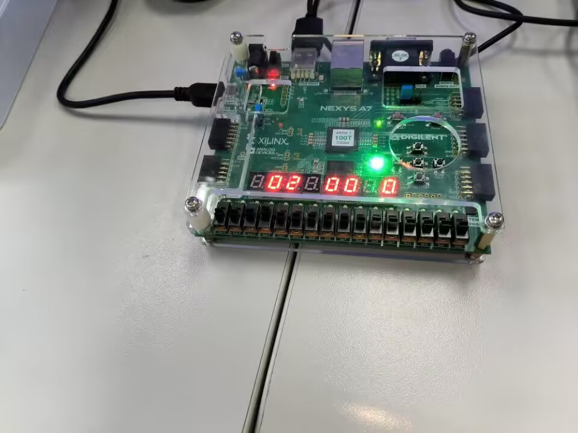
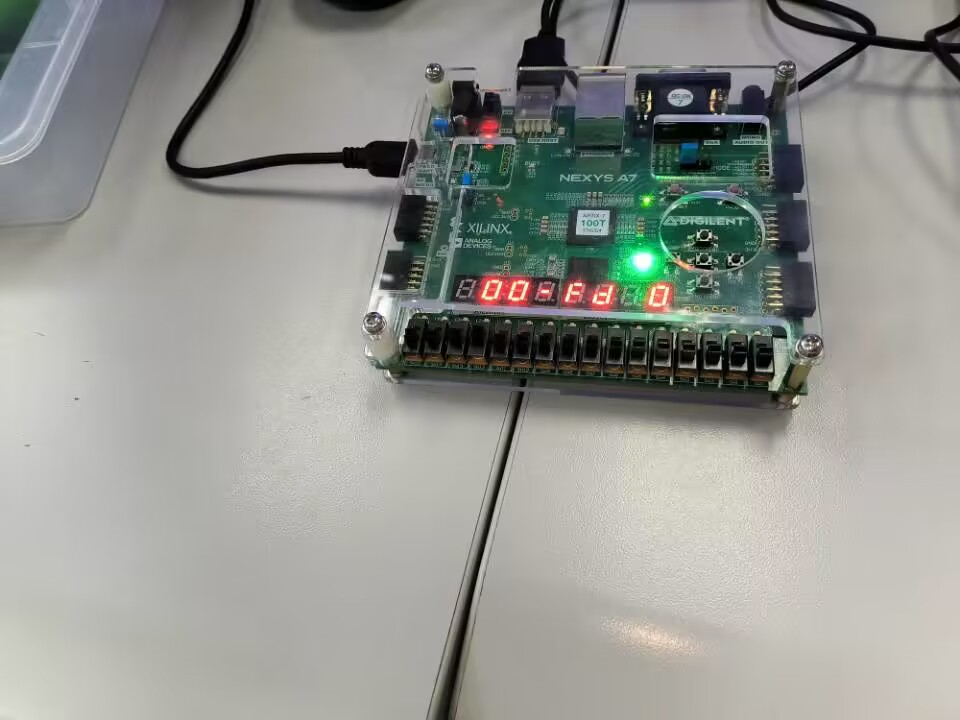
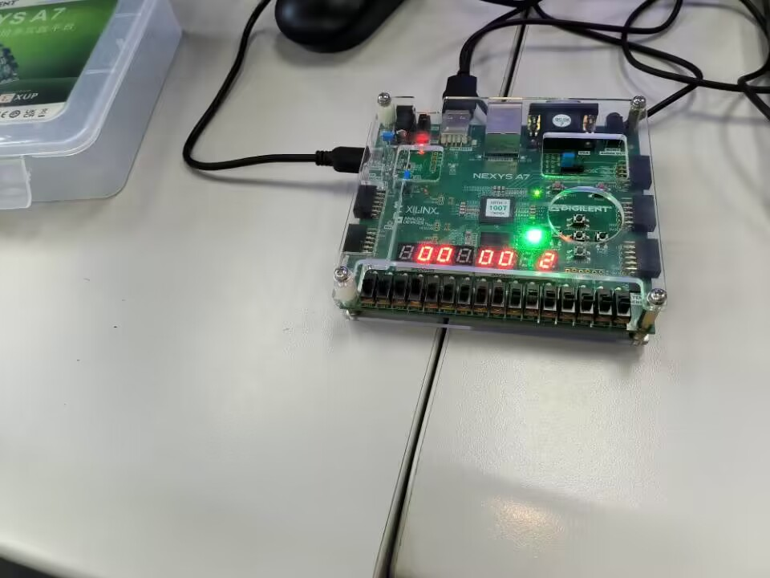
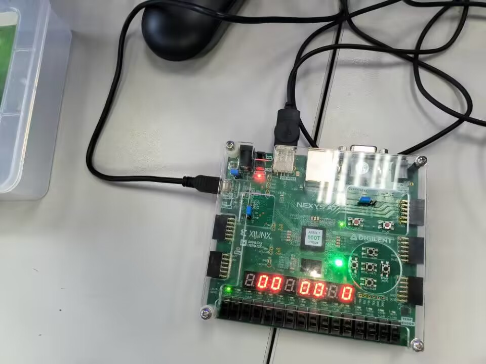
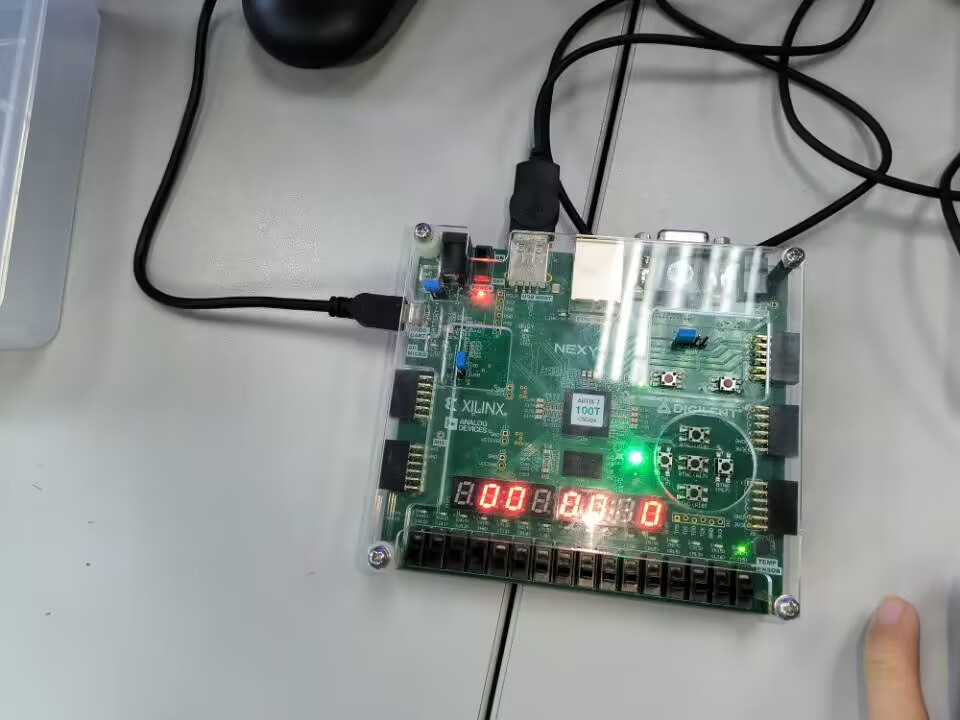

<center><font size=6>Lab5 键盘接口实验</font></center>

## 在进行实验内容之前我们先实现键盘扫描码接收装置
<font size=2>&emsp;&emsp;键盘由一组排列成 m×n 矩阵方式的按键开关组成，通常定义为 8 行×16 列，分成主键区、功能键区、控制键区、数字键区和状态指示区。键盘内部由控制器周期性扫描行、列，根据扫描信号线的结果，判断按键的位置，并把相应的键位码输入到计算机中去。
&emsp;&emsp;现代键盘共有三套的扫描码集，默认使用第二套扫描码，当按下某键时，键盘大约每隔 100 毫秒就向主机发送一次该键的通码；释放按键时，首先发送代码 0xF0，然后发送按键的通码。例如，按下字母 “A” 键，则 PS2_DAT 引脚将每隔 100 毫秒输出一次“A”键的通码 0x1C；如释放 “A” 键，则输出的“A” 键断码为 0xF01C，分两帧传输。</font>

<font size=2>&emsp;&emsp;机械键盘的按键为机械弹性开关，当机械触点断开、闭合时，由于机械触点的弹性作用，一个按键开关在闭合时不会马上稳定地接通，在断开时也不会一下子断开。因而在闭合及断开的瞬间均伴随有一连串的抖动。抖动时间的长短由按键的机械特性决定，一般为 5ms～10ms。为了消除抖动带来的影响，在读取时需要进行按键消抖。键盘接口通常需要具有消抖、去重、按键识别、键码产生四个基本功能。
&emsp;&emsp;KeyBoardReceiver 模块是用来接收键盘送来的连续 4 个字节的键盘扫描码数据，并进行了消抖和去重。下面是其源码
</font>
```
`timescale 1ns / 1ps
module KeyBoardReceiver(
    output [31:0] keycodeout,           //接收到连续4个键盘扫描码
    output ready,                     //数据就绪标志位
    input clk,                        //系统时钟 
    input kb_clk,                    //键盘 时钟信号
    input kb_data                    //键盘 串行数据
    );
    wire kclkf, kdataf;
    reg [7:0]datacur;              //当前扫描码
    reg [7:0]dataprev;            //上一个扫描码
    reg [3:0]cnt;                //收到串行位数
    reg [31:0]keycode;            //扫描码
    reg flag;                     //接受1帧数据
    reg readyflag;
//    reg error;                   //错误标志位
    initial begin                 //初始化
        keycode[7:0]<=8'b00000000;
        cnt<=4'b0000;
    end
    debouncer debounce( .clk(clk), .I0(kb_clk), .I1(kb_data), .O0(kclkf), .O1(kdataf));  //消除按键抖动
    always@(negedge(kclkf))begin
     case(cnt)
            0: readyflag<=1'b0;                       //开始位
            1:datacur[0]<=kdataf;
            2:datacur[1]<=kdataf;
            3:datacur[2]<=kdataf;
            4:datacur[3]<=kdataf;
            5:datacur[4]<=kdataf;
            6:datacur[5]<=kdataf;
            7:datacur[6]<=kdataf;
            8:datacur[7]<=kdataf;
            9:flag<=1'b1;         //已接收8位有效数据
            10:
            begin 
                flag<=1'b0;       //结束位
                readyflag<=1'b1;              //数据就绪标志位置1
            end
          endcase
        if(cnt<=9) cnt<=cnt+1;
        else if(cnt==10)  cnt<=0;
    end
    always @(posedge flag)begin
//        if (keycode[15:8]==8'hf0 || dataprev!=datacur)begin           //去除重复按键数据
            keycode[31:24]<=keycode[23:16];
            keycode[23:16]<=keycode[15:8];
            keycode[15:8]<=dataprev;
            keycode[7:0]<=datacur;
            dataprev<=datacur;
//        end
    end
    assign keycodeout=keycode;
    assign ready=readyflag;    
endmodule

module debouncer(
    input clk,
    input I0,
    input I1,
    output reg O0,
    output reg O1
    );
    reg [4:0]cnt0, cnt1;
    reg Iv0=0,Iv1=0;
    reg out0, out1;
    always@(posedge(clk))begin
    if (I0==Iv0)begin
        if (cnt0==19) O0<=I0;   //接收到20次相同数据
        else cnt0<=cnt0+1;
      end
    else begin
        cnt0<="00000";
        Iv0<=I0;
    end
    if (I1==Iv1)begin
            if (cnt1==19) O1<=I1;  //接收到20次相同数据
            else cnt1<=cnt1+1;
          end
        else begin
            cnt1<="00000";
            Iv1<=I1;
        end
    end
endmodule
```

<font size=2>&emsp;&emsp;为了验证键盘接收模块的功能，确认键盘基本通信正常，并测试键码传输的准确性，可将收到的每个键码用七段数码管显示出来。开发板上的 8 个七段数码管可以显示 KeyBoardReceiver 模块中收到的 4 个连续键码。下面是KeyBoardTest模块:</font>
```
`timescale 1ns / 1ps
module KeyBoardTest(
    output [6:0]SEG,
    output [7:0]AN,
    output DP,
    output ready,
    input CLK100MHZ,
    input PS2_CLK,
    input PS2_DATA
    );
    
reg CLK50MHZ=0;    
wire [31:0]keycode;


always @(posedge(CLK100MHZ))begin
    CLK50MHZ<=~CLK50MHZ;
end

KeyBoardReceiver keyboard_uut(.keycodeout(keycode[31:0]),.ready(ready),.clk(CLK50MHZ),
.kb_clk(PS2_CLK),.kb_data(PS2_DATA));

seg7decimal sevenSeg (.x(keycode[31:0]),.clk(CLK100MHZ),.seg(SEG[6:0]),.an(AN[7:0]),.dp(DP) );

endmodule
```
综合、实现后，电路图如图:



验证:




## 实验内容
## 1、键盘接口实验
### (1)实验整体方案设计
<font size=2>&emsp;&emsp;这里我们是进行键盘接口的设计。之前做的是键盘扫描码接收装置，现在需要接收扫描码后将扫描码转化为ascii码。 键盘上按键后，在 8 个七段数码管的高两位上显示按键的总次数，中间四位显示上一次按键和当前按键的扫描码，最低两位显示当前按键对应的 ASCII 码，如果按键没有对应的 ASCII 码，则显示00。同时支持锁定键、组合键。</font>
### (2)功能表、原理图、关键设计语句与源码
源码:
```
`timescale 1ns / 1ps
module KeyboardSim(
    input CLK100MHZ,   //系统时钟信号
    input PS2_CLK,    //来自键盘的时钟信号
    input PS2_DATA,  //来自键盘的串行数据位
    input BTNC,      //Reset
    output [6:0]SEG,
    output [7:0]AN,
    output [15:0] LED   //显示
    );
    
// Add your code here

wire ready;
reg CLK50MHZ=0;    
wire [31:0]keycode;

wire rst;
assign rst = BTNC;

always @(posedge(CLK100MHZ))begin
    CLK50MHZ<=~CLK50MHZ;
end

KeyBoardReceiver keyboard_uut(.keycodeout(keycode[31:0]),.ready(ready),.clk(CLK50MHZ),
.kb_clk(PS2_CLK),.kb_data(PS2_DATA));

wire [7:0] ascii;
kbcode2ascii kbcode2ascii_inst(.asciicode(ascii), .kbcode(keycode[7:0]));

wire [31:0] seg7_data;
reg [7:0] prev, cur;
reg [7:0] cnt;
reg [7:0] real_ascii;

reg [23:0] prekey;
reg [23:0] curkey;
wire [23:0] nxtkey;
assign nxtkey = {curkey[15:0], keycode[7:0]};

reg CapsLock_state, NumLock_state, LShift_state, RShift_state, LCtrl_state, 
RCtrl_state, LAlt_state, RAlt_state;
assign LED[15:8] = {CapsLock_state, NumLock_state, LShift_state, RShift_state, LCtrl_state, 
RCtrl_state, LAlt_state, RAlt_state};
assign LED[7:0] = real_ascii;


assign seg7_data[31:24] = cnt;
assign seg7_data[23:16] = prev;
assign seg7_data[15:8] = cur;
assign seg7_data[7:0] = real_ascii;

initial begin
    cnt <= 0;
    prev <= 0;
    cur <= 0;
    real_ascii <= 0;
    prekey <= 0;
    curkey <= 0;
    CapsLock_state <= 0;
    NumLock_state <= 0;
    LShift_state <= 0;
    RShift_state <= 0;
    LCtrl_state <= 0;
    RCtrl_state <= 0;
    LAlt_state <= 0;
    RAlt_state <= 0;
end

wire iscomp, isbrk;
assign iscomp = keycode[7:0] != 8'he0 && keycode[7:0] != 8'hf0;
assign isbrk = keycode[15:8] == 8'hf0;

always @(posedge ready or posedge rst) begin
    if (rst) begin
        cnt <= 0;
        prev <= 0;
        cur <= 0;
        real_ascii <= 0;
        prekey <= 0;
        curkey <= 0;
        CapsLock_state <= 0; //Questionable
        NumLock_state <= 0; //Questionable
        LShift_state <= 0;
        RShift_state <= 0;
        LCtrl_state <= 0;
        RCtrl_state <= 0;
        LAlt_state <= 0;
        RAlt_state <= 0;
    end
    else begin
        curkey <= nxtkey;
        if (iscomp) begin
        prekey <= nxtkey;
        curkey <= 0;
            if (prekey != nxtkey) begin //Remove same key
                if (isbrk) begin
                    if (keycode[7:0] == 8'h12) LShift_state <= 0;
                    if (keycode[7:0] == 8'h59) RShift_state <= 0;
                    if (keycode[7:0] == 8'h14) begin
                        if (keycode[23:16] != 8'he0) LCtrl_state <= 0;
                        else RCtrl_state <= 0;
                    end
                    if (keycode[7:0] == 8'h11) begin
                        if (keycode[23:16] != 8'he0) LAlt_state <= 0;
                        else RAlt_state <= 0;
                    end
                end
                else begin
                    cnt <= cnt + 1;
                    prev <= cur;
                    cur <= keycode[7:0];
                    real_ascii <= ascii;
                    if (ascii >= 97 && ascii <= 122) begin
                        if ((LShift_state | RShift_state) ^ CapsLock_state)
                            real_ascii <= ascii - 32;
                    end
                    if (keycode[7:0] == 8'h58) CapsLock_state <= ~CapsLock_state;
                    if (keycode[7:0] == 8'h77) NumLock_state <= ~NumLock_state;
                    if (keycode[7:0] == 8'h12) LShift_state <= 1;
                    if (keycode[7:0] == 8'h59) RShift_state <= 1;
                    if (keycode[7:0] == 8'h14) begin
                        if (keycode[15:8] != 8'he0) LCtrl_state <= 1;
                        else RCtrl_state <= 1;
                    end
                    if (keycode[7:0] == 8'h11) begin
                        if (keycode[15:8] != 8'he0) LAlt_state <= 1;
                        else RAlt_state <= 1;
                    end
                end
            end
        end
    end
end

seg7decimal sevenSeg (
.x(seg7_data[31:0]),
.clk(CLK100MHZ),
.seg(SEG[6:0]),
.an(AN[7:0]),
.dp(0)
);
endmodule
```
### (3)实验数据仿真测试波形图
### (4)验证
验证如下:
字母'a':

字母'c':

大写锁定,'A':

shift+a变大写

### (5)错误现象及分析
&emsp;&emsp;开始设计的时候没有考虑组合键的特殊情况，且capslock设置有误，导致shift+字母并不是大写，capslock只有按住的时候才是大写锁定。经过修改后错误消除。

## 2、鼠标接口实验
### (1)实验整体方案设计
<font size=2>&emsp;&emsp;鼠标连接到 USB 端口后，进入初始化状态，在该状态下执行一个测试，测试结束后，发送结果：AAh表示测试正常，FCh 表示错误；然后它发送设备 ID：00h 表示鼠标不带滚轮，03h 表示鼠标带滚轮。完成后鼠标进入上传状态（数据流模式）发送鼠标的移动数据包或按钮状态的更改。
&emsp;&emsp;鼠标上传数据格式如图:</font>

### (2)功能表、原理图、关键设计语句与源码
源码:
```
`timescale 1ns / 1ps
module MouseReceiver(
    output [6:0]SEG,
    output [7:0]AN,
    output DP,
    output LeftButton,   //左键按下
    output RightButton,  //左键按下
    output ready,
    input CLK100MHZ,
    input PS2_CLK,
    input PS2_DATA
    );
 // add your code here
    reg inerror;
    reg withroll;
    reg [7:0] testinfo;
    reg [7:0] mouseinfo;
    reg [7:0] initcnt;
    reg [7:0] cnt;
    reg [63:0] mousecode;
    reg [31:0] codecur;
    reg [31:0] codeprev;
    reg readyflag [3:0];
    reg flag;//接受1帧数据
    reg [15:0] counter;//数码管刷新计数器
    wire [6:0] connection [4:0];
    reg [7:0] anout;
    reg [6:0] segsout;
    assign SEG=segsout;
    assign AN=anout;
    assign LeftButton=mousecode[0];
    assign RightButton=mousecode[1];
    assign DP=1'b1;
    assign ready=readyflag[0];
    initial begin
        mousecode<=8'h00000000;
        cnt<=0;
        initcnt<=0;
    end
    always @(negedge PS2_CLK) begin
        /*if(initcnt>15) begin
            if(inerror==1'b0)begin
                if(withroll==1'b1)begin//有滚轮*/
                    case(cnt)
                        0:readyflag[0]<=1'b0;
                        1:codecur[0]<=PS2_DATA;
                        2:codecur[1]<=PS2_DATA;
                        3:codecur[2]<=PS2_DATA;
                        4:codecur[3]<=PS2_DATA;
                        5:codecur[4]<=PS2_DATA;
                        6:codecur[5]<=PS2_DATA;
                        7:codecur[6]<=PS2_DATA;
                        8:codecur[7]<=PS2_DATA;
                        9:flag<=1'b1;
                        10:flag<=1'b0;//第一帧结束
                        11:readyflag[1]<=1'b0;
                        12:codecur[8]<=PS2_DATA;
                        13:codecur[9]<=PS2_DATA;
                        14:codecur[10]<=PS2_DATA;
                        15:codecur[11]<=PS2_DATA;
                        16:codecur[12]<=PS2_DATA;
                        17:codecur[13]<=PS2_DATA;
                        18:codecur[14]<=PS2_DATA;
                        19:codecur[15]<=PS2_DATA;
                        20:flag<=1'b1;
                        21:flag<=1'b0;//第二帧结束
                        22:readyflag[2]<=1'b0;
                        23:codecur[16]<=PS2_DATA;
                        24:codecur[17]<=PS2_DATA;
                        25:codecur[18]<=PS2_DATA;
                        26:codecur[19]<=PS2_DATA;
                        27:codecur[20]<=PS2_DATA;
                        28:codecur[21]<=PS2_DATA;
                        29:codecur[22]<=PS2_DATA;
                        30:codecur[23]<=PS2_DATA;
                        31:flag<=1'b1;
                        32:flag<=1'b0;
                        33:readyflag[3]<=1'b0;
                        34:codecur[24]<=PS2_DATA;
                        35:codecur[25]<=PS2_DATA;
                        36:codecur[26]<=PS2_DATA;
                        37:codecur[27]<=PS2_DATA;
                        38:codecur[28]<=PS2_DATA;
                        39:codecur[29]<=PS2_DATA;
                        40:codecur[30]<=PS2_DATA;
                        41:codecur[31]<=PS2_DATA;
                        42:begin 
                            flag<=1'b1;
                            if(codecur!=codeprev) begin
                                mousecode[63:32]<=mousecode[31:0];
                                mousecode[31:0]<=codecur;
                                codeprev<=codecur;
                                readyflag[0]<=1'b1;
                            end
                        end
                        43:flag<=1'b0;
                    endcase
                    if(cnt<=42) cnt<=cnt+1;
                    else if(cnt==43) cnt<=0;
                end
    //显示模块
    seg_decode seg_6(.in(mousecode[15:12]),.out(connection[4]));
    seg_decode seg_5(.in(mousecode[11:8]),.out(connection[3]));
    seg_decode seg_3(.in(mousecode[23:20]),.out(connection[2]));
    seg_decode seg_2(.in(mousecode[19:16]),.out(connection[1]));
    seg_decode seg_0(.in(mousecode[27:24]),.out(connection[0]));
    always @(posedge CLK100MHZ) begin
    counter<=counter+1;
        case (counter)
            6000: begin
                anout<=8'b01111111;
                if(mousecode[4]==1'b1)begin
                    segsout<=7'b0111111;
                end
                else begin
                    segsout<=7'b1111111;
                end
            end
            12000: begin
                anout<=8'b10111111;
                segsout<=connection[4];
            end
            18000: begin
                anout<=8'b11011111;
                segsout<=connection[3];
            end
            24000: begin
                anout<=8'b11101111;
                if(mousecode[5]==1'b1)begin
                    segsout<=7'b0111111;
                end
                else begin
                    segsout<=7'b1111111;
                end
            end
            30000: begin
                anout<=8'b11110111;
                segsout<=connection[2];
            end
            36000: begin
                anout<=8'b11111011;
                segsout<=connection[1];
            end
            42000: begin
                anout<=8'b11111101;
                if(mousecode[27]==1'b1)begin
                    segsout<=7'b0111111;
                end
                else begin
                    segsout<=7'b1111111;
                end
            end
            48000: begin
                anout<=8'b11111110;
                segsout<=connection[0];
                counter<=0;
            end
        endcase
    end
endmodule
```
### (3)实验数据仿真测试波形图
### (4)验证
x方向移动:

y方向移动:

滚轮滚动:

左键:

右键:


### (5)错误现象及分析
完成该实验的过程中没有出现错误。

## 思考题
### 1、如何在键盘接收模块 KeyBoardReceiver 中考虑串行数据收到干扰导致传输出错的问题。
<font size=2>&emsp;&emsp;1.在键盘接收模块中实现一些错误检测和纠正机制，例如使用奇偶校验位或CRC校验来检测和纠正传输中的错误。这将有助于确保数据的准确性。
&emsp;&emsp;2.引入信号滤波器，以便减小串行数据信号的噪声和干扰。这可以通过使用低通滤波器等技术来实现。
&emsp;&emsp;3.在串行数据中引入数据帧同步标志，以便正确确定数据的起始点和结束点。这有助于正确解析每个数据帧。
&emsp;&emsp;4.在数据接收过程中，实施一个超时机制，以防止无法完全接收一帧数据时的问题。如果数据接收未完成，可以舍弃当前帧并等待下一帧的开始。</font>
### 2、什么是键盘的键位冲突？如何解决？
<font size=2>&emsp;&emsp;一般薄膜键盘会发生键位冲突。对薄膜键盘，键盘上的导线远远少于键盘上的按键，而且每条导线同时会连接多个按键触点，上层和下层的任何两层导线只在一个按键触点上有交集，也就是说，上层的1号导线可能经过Q、W、E、1等按键，下层的1号导线有可能经过1、2、3、4等按键，且两条导线只在按键1上重合。通过上下导线经过按键触点的原理，可以罗列出一组表格，不同的导线之间相交的结果对应一个按键。在薄膜接触式键盘的接口控制电路中，就存储着这样一张表格，当按下某个按键时，上下两个导线的共同触点被接通了，反映到接口电路中，就能在屏幕上显示相应的结果。
&emsp;&emsp;也正是因为薄膜键盘按键的输出是根据薄膜上下导线的交叉点来识别的。当我们按下一个按键时，键盘能够很好的识别，按下两个按键时，就算有一条导线重合也能显示出来，甚至三个按键也能识别出来，但是当输入的几个按键中重叠的导线过多时，键盘可能会选择按照固定的输出按键输出固定的代码，从而忽视掉其中某一个按键的输入，造成按键冲突的情况。
&emsp;&emsp;薄膜键盘受自身结构影响，无法避免按键冲突，而机械键盘由于其不同于薄膜键盘的结构，反而可以做到全按键无冲。机械键盘之所以能做到全按键无冲，是因为每个按键都采用了独立的开关（利用的是二极管的单向导电性），按下按键之后，相应的电路导通，所以一同按下多个按键时不会产生冲突。</font>