<center><font size=6>Lab6 VGA 接口实验</font></center>

## 在进行实验之前，先看看VGA原理
显示控制器:
```
`timescale 1ns / 1ps
module VGACtrl(
    input   wire            pix_clk,     //像素时钟信号
    input   wire            pix_rst,     //复位信号
    output  wire  [11:0]    pix_x,      //像素在可显示区域中的水平位置
    output  wire  [11:0]    pix_y,      //像素在可显示区域中的垂直位置
    output  wire            hsync,      //水平同步信号
    output  wire            vsync,      //垂直同步信号
    output wire             pix_valid    //像素在可显示区域标志
);
//hsync1688 	1280×1024@60Hz
   parameter    H_Sync_Width = 112;
   parameter    H_Back_Porche = 248;
   parameter    H_Active_Pixels =1280;
   parameter    H_Front_Porch = 48;
   parameter    H_Totals = 1688;
 //vsync1066
   parameter    V_Sync_Width = 3;
   parameter    V_Back_Porche = 38;
   parameter    V_Active_Pixels =1024;
   parameter    V_Front_Porch = 1;
   parameter    V_Totals = 1066;
   reg [11:0]   cnt_h       ;
   reg [11:0]   cnt_v       ;
   wire         rgb_valid   ;
  //低电平有效   
assign hsync = ((cnt_h >= H_Sync_Width)) ? 1'b0 : 1'b1;  //大于水平同步像素，hsync=0
assign vsync = ((cnt_v >= V_Sync_Width)) ? 1'b0 : 1'b1;  //大于帧同步像素，vsync=0
//cnt_h，cnt_v像素位置计数
always@(posedge pix_clk) begin
         if (pix_rst) begin
            cnt_h <= 0;
            cnt_v <= 0;
        end
       if (cnt_h == (H_Totals-1)) begin               // 行像素结束
            cnt_h <= 0;
            cnt_v <= (cnt_v == (V_Totals-1)) ? 0 : cnt_v + 1;  // 帧像素结束
          end 
        else begin
               cnt_h <= cnt_h + 1;
            end
 end
//pix_valid=1，表示像素处于有效显示区域
assign  pix_valid = (((cnt_h >= H_Sync_Width +H_Back_Porche)
                    && (cnt_h <= H_Totals- H_Front_Porch))
                    &&((cnt_v >= V_Sync_Width +V_Back_Porche)
                    && (cnt_v <= V_Totals - V_Front_Porch)))
                    ? 1'b1 : 1'b0;
//Hsync,Vsync active，计算像素在可显示区域的位置
   assign pix_x = (pix_valid==1) ? (cnt_h - (H_Sync_Width + H_Back_Porche)):12'h0;
   assign pix_y = (pix_valid==1) ? (cnt_v - (V_Sync_Width + V_Back_Porche)):12'h0;
endmodule
```
画图逻辑以及静态图像:
```
`timescale 1ns / 1ps
module VGADraw(
   input   wire            pix_clk  ,
   input   wire    [11:0]   pix_x  ,
    input   wire    [11:0]   pix_y  ,
    input   wire            pix_valid,    
    output  wire     [11:0]  pix_data    
);
    
wire    [18:0] ram_addr;
vga_mem my_pic(.clka(pix_clk),.ena(1'b1),.wea(1'b0),.addra({ram_addr}),.dina(12'd0),.douta(pix_data));
assign ram_addr=pix_x+pix_y*640;
//reg [27:0] cntdyn;
// [7:0] temp_r,temp_g,temp_b,temp_d;

/*always@(posedge pix_clk )begin
    cntdyn<=cntdyn+1;
    temp_d <=cntdyn>>20;
    temp_r<=-pix_x-pix_y-temp_d;
    temp_g<=pix_x-temp_d;
    temp_b<=pix_y-temp_d;
end
assign  pix_data[11:8]=temp_r[7:4];
assign  pix_data[7:4]=temp_g[7:4];
assign  pix_data[3:0]=temp_b[7:4];*/
endmodule
```
封装IP, vga_mem
```
vga_mem your_instance_name (
  .clka(clka),    // input wire clka
  .ena(ena),      // input wire ena
  .wea(wea),      // input wire [0 : 0] wea
  .addra(addra),  // input wire [18 : 0] addra
  .dina(dina),    // input wire [11 : 0] dina
  .douta(douta)  // output wire [11 : 0] douta
);
```
VGASim：
```
`timescale 1ns / 1ps
module VGASim(
    input CLK100MHZ,        //系统时钟信号
    input  BTNC,           // 复位信号
    output [3:0] VGA_R,    //红色信号值
    output [3:0] VGA_G,    //绿色信号值
    output [3:0] VGA_B,     //蓝色信号值
    output  VGA_HS,         //行同步信号
    output  VGA_VS          //帧同步信号
 );
wire [11:0] vga_data;
wire valid;
wire [11:0] h_addr;
wire [11:0] v_addr;
reg CLK25MHZ=0;
reg [1:0] cnt=0;
always @(posedge CLK100MHZ) begin
    if(cnt==1) begin
        cnt<=0;
        CLK25MHZ<=~CLK25MHZ;
    end
    else begin
        cnt<=cnt+1;
    end
end

VGACtrl vgactrl(.pix_x(h_addr),.pix_y(v_addr),.hsync(VGA_HS),.vsync(VGA_VS),.pix_valid(valid),
.pix_clk(CLK25MHZ),.pix_rst(BTNC));
VGADraw vgadraw(.pix_data(vga_data),.pix_x(h_addr),.pix_y(v_addr),.pix_valid(valid),.pix_clk(CLK25MHZ));
assign VGA_R=vga_data[11:8];
assign VGA_G=vga_data[7:4];
assign VGA_B=vga_data[3:0];
endmodule
```
电路图:

最终效果:

## 实验内容
<font size=2>&emsp;&emsp;模仿 Window 命令行或 Linux 的字符终端，集成键盘接收模块，实现把键盘输入的字符在VGA 显示器上回显的交互界面。支持所有大小写英文字母、数字以及可显示的字符。用显示闪烁的竖线或横线作为字符光标。支持回车、删除、退格等功能键。支持系统提示符。键盘扫描码、显存和字符点阵字库等可以直接使用 FPGA 提供的分布式存储器来实现。
&emsp;&emsp;命令含义如下：
1、 当输入字符串为“[G]raphics”时，按回车后，显示一幅彩色图形。
2、 当输入字符串为“[I]mage”时，按回车后，显示一幅静态图像。
3、 当输入字符串为“[T]xt”时，按回车后，显示一段文本。
4、 当输入字符串为“[C]alculator”时，按回车后，输入一个四则运算表达式后，显示运算结果。</font>

### (1)实验整体方案设计
<font size=2>&emsp;&emsp;实验需要模拟命令行终端，同时集成lab5中实现的键盘模块实现输入。G的实现和之前的VGASim类似，I实现是静态图像。先用Python、matlab等语言由图像生成coe文件。后面和实验原理中的类似，进行IP封装，加载到FPGA的存储中。T的实现简单，提前准备好文本放入代码中，后由VGA显示即可。C的实现(怎么有硬件表达式求值这种毒瘤玩意啊)非常非常复杂。思路上考虑的是利用栈将中缀表达式转化为后缀表达式，再由后缀表达式求值。其中需要注意加、减、乘、除、负号、括号这些运算符的优先级(在此我用补码表示负数)</font>

### (2)功能表、原理图、关键设计语句与源码
实验需要用到lab5中的键盘接口，lab3中的加法器，lab4中的布斯乘法器、补码除法器。
以下是键盘接口:
```
`timescale 1ns / 1ps
module KeyboardSim(
    input CLK100MHZ,   //系统时钟信号
    input PS2_CLK,    //来自键盘的时钟信号
    input PS2_DATA,  //来自键盘的串行数据位
    input BTNC,      //Reset
    output [6:0]SEG,
    output [7:0]AN,
    output [15:0] LED,   //显示
    output [7:0] ascii_out,
    output [7:0] cnt_out
    );
    wire ready;
reg CLK50MHZ=0;
wire [31:0]keycode;

wire rst;
assign rst = BTNC;

always @(posedge(CLK100MHZ))begin
    CLK50MHZ<=~CLK50MHZ;
end

KeyBoardReceiver keyboard_uut(.keycodeout(keycode[31:0]),.ready(ready),.clk(CLK50MHZ),
.kb_clk(PS2_CLK),.kb_data(PS2_DATA));

wire [7:0] ascii;
kbcode2ascii kbcode2ascii_inst(.asciicode(ascii), .kbcode(keycode[7:0]));

wire [31:0] seg7_data;
reg [7:0] prev, cur;
reg [7:0] cnt;
reg [7:0] real_ascii;
assign ascii_out = real_ascii;
assign cnt_out = cnt;

reg [23:0] prekey;
reg [23:0] curkey;
wire [23:0] nxtkey;
assign nxtkey = {curkey[15:0], keycode[7:0]};

reg CapsLock_state, NumLock_state, LShift_state, RShift_state, LCtrl_state, RCtrl_state, 
LAlt_state, RAlt_state;
assign LED[15:8] = {CapsLock_state, NumLock_state, 
LShift_state, RShift_state, LCtrl_state, RCtrl_state, LAlt_state, RAlt_state};
assign LED[7:0] = real_ascii;

assign seg7_data[31:24] = cnt;
assign seg7_data[23:16] = prev;
assign seg7_data[15:8] = cur;
assign seg7_data[7:0] = real_ascii;

reg [7:0] pre_cnt;

initial begin
    cnt <= 0;
    prev <= 0;
    cur <= 0;
    real_ascii <= 0;
    prekey <= 0;
    curkey <= 0;
    CapsLock_state <= 0;
    NumLock_state <= 0;
    LShift_state <= 0;
    RShift_state <= 0;
    LCtrl_state <= 0;
    RCtrl_state <= 0;
    LAlt_state <= 0;
    RAlt_state <= 0;
    pre_cnt <= 0;
end

wire iscomp, isbrk;
assign iscomp = keycode[7:0] != 8'he0 && keycode[7:0] != 8'hf0;
assign isbrk = keycode[15:8] == 8'hf0;

parameter [7:0] CapsLock_kc = 8'h58;
parameter [7:0] NumLock_kc = 8'h77;
parameter [7:0] LShift_kc = 8'h12;
parameter [7:0] RShift_kc = 8'h59;
parameter [7:0] Ctrl_kc = 8'h14;
parameter [7:0] Alt_kc = 8'h11;

parameter [7:0] Leftarrow_kc = 8'h6b;
parameter [7:0] Rightarrow_kc = 8'h74;
parameter [7:0] Uparrow_kc = 8'h75;
parameter [7:0] Downarrow_kc = 8'h72;

always @(posedge ready or posedge rst) begin
    if (rst) begin
        cnt <= 0;
        prev <= 0;
        cur <= 0;
        real_ascii <= 0;
        prekey <= 0;
        curkey <= 0;
        CapsLock_state <= 0; //Questionable
        NumLock_state <= 1; //Questionable
        LShift_state <= 0;
        RShift_state <= 0;
        LCtrl_state <= 0;
        RCtrl_state <= 0;
        LAlt_state <= 0;
        RAlt_state <= 0;
    end
    else begin
        curkey <= nxtkey;
        if (iscomp) begin
        prekey <= nxtkey;
        curkey <= 0;
            if (prekey != nxtkey) begin //Remove same key
                if (isbrk) begin
                    if (keycode[7:0] == LShift_kc) LShift_state <= 0;
                    if (keycode[7:0] == RShift_kc) RShift_state <= 0;
                    if (keycode[7:0] == Ctrl_kc) begin
                        if (keycode[23:16] != 8'he0) LCtrl_state <= 0;
                        else RCtrl_state <= 0;
                    end
                    if (keycode[7:0] == Alt_kc) begin
                        if (keycode[23:16] != 8'he0) LAlt_state <= 0;
                        else RAlt_state <= 0;
                    end
                end
                else begin
                    cnt <= cnt + 1;
                    prev <= cur;
                    cur <= keycode[7:0];
                    real_ascii <= ascii;
                    if (ascii >= 97 && ascii <= 122) begin
                        if ((LShift_state | RShift_state) ^ CapsLock_state) begin
                            real_ascii <= ascii - 32;
                        end
                    end
                    else if (LShift_state | RShift_state) begin
                        case (ascii)
                            49: real_ascii <= 33;
                            50: real_ascii <= 64;
                            51: real_ascii <= 35;
                            52: real_ascii <= 36;
                            53: real_ascii <= 37;
                            54: real_ascii <= 94;
                            55: real_ascii <= 38;
                            56: real_ascii <= 42;
                            57: real_ascii <= 40;
                            48: real_ascii <= 41;
                            45: real_ascii <= 95;
                            61: real_ascii <= 43;
                            91: real_ascii <= 123;
                            93: real_ascii <= 125;
                            92: real_ascii <= 124;
                            59: real_ascii <= 58;
                            39: real_ascii <= 34;
                            44: real_ascii <= 60;
                            46: real_ascii <= 62;
                            47: real_ascii <= 63;
                            default: real_ascii <= ascii;
                        endcase
                    end
                    else if (NumLock_state) begin
                        case (keycode[7:0])
                            8'h71: real_ascii <= 0;
                            8'h70: real_ascii <= 0;
                            8'h69: real_ascii <= 0;
                            8'h72: real_ascii <= 0;
                            8'h7a: real_ascii <= 0;
                            8'h6b: real_ascii <= 0;
                            8'h73: real_ascii <= 0;
                            8'h74: real_ascii <= 0;
                            8'h6c: real_ascii <= 0;
                            8'h75: real_ascii <= 0;
                            8'h7d: real_ascii <= 0;
                        endcase
                    end
                    if (keycode[7:0] == CapsLock_kc) CapsLock_state <= ~CapsLock_state;
                    if (keycode[7:0] == NumLock_kc) NumLock_state <= ~NumLock_state;
                    if (keycode[7:0] == LShift_kc) LShift_state <= 1;
                    if (keycode[7:0] == RShift_kc) RShift_state <= 1;
                    if (keycode[7:0] == Ctrl_kc) begin
                        if (keycode[15:8] != 8'he0) LCtrl_state <= 1;
                        else RCtrl_state <= 1;
                    end
                    if (keycode[7:0] == Alt_kc) begin
                        if (keycode[15:8] != 8'he0) LAlt_state <= 1;
                        else RAlt_state <= 1;
                    end
                end
            end
        end
    end
end

seg7decimal sevenSeg (
.x(seg7_data[31:0]),
.clk(CLK100MHZ),
.seg(SEG[6:0]),
.an(AN[7:0])
);
endmodule
```
```
`timescale 1ns / 1ps
module KeyBoardReceiver(
    output [31:0] keycodeout,           //接收到连续4个键盘扫描码
    output ready,                     //数据就绪标志位
    input clk,                        //系统时钟 
    input kb_clk,                    //键盘 时钟信号
    input kb_data                    //键盘 串行数据
    );
    wire kclkf, kdataf;
    reg [7:0]datacur;              //当前扫描码
    reg [7:0]dataprev;            //上一个扫描码
    reg [3:0]cnt;                //收到串行位数
    reg [31:0]keycode;            //扫描码
    reg flag;                     //接受1帧数据
    reg readyflag;
//    reg error;                   //错误标志位
    initial begin                 //初始化
        keycode[7:0]<=8'b00000000;
        cnt<=4'b0000;
    end
    debouncer debounce( .clk(clk), .I0(kb_clk), .I1(kb_data), .O0(kclkf), .O1(kdataf));  //消除按键抖动
    always@(negedge(kclkf))begin
     case(cnt)
            0: readyflag<=1'b0;                       //开始位
            1:datacur[0]<=kdataf;
            2:datacur[1]<=kdataf;
            3:datacur[2]<=kdataf;
            4:datacur[3]<=kdataf;
            5:datacur[4]<=kdataf;
            6:datacur[5]<=kdataf;
            7:datacur[6]<=kdataf;
            8:datacur[7]<=kdataf;
            9:flag<=1'b1;         //已接收8位有效数据
            10:
            begin 
                flag<=1'b0;       //结束位
                readyflag<=1'b1;              //数据就绪标志位置1
            end
          endcase
        if(cnt<=9) cnt<=cnt+1;
        else if(cnt==10)  cnt<=0;
    end
    always @(posedge flag)begin
//        if (keycode[15:8]==8'hf0 || dataprev!=datacur)begin           //去除重复按键数据
            keycode[31:24]<=keycode[23:16];
            keycode[23:16]<=keycode[15:8];
            keycode[15:8]<=dataprev;
            keycode[7:0]<=datacur;
            dataprev<=datacur;
//        end
    end
    assign keycodeout=keycode;
    assign ready=readyflag;
endmodule

module debouncer(
    input clk,
    input I0,
    input I1,
    output reg O0,
    output reg O1
    );
    reg [4:0]cnt0, cnt1;
    reg Iv0=0,Iv1=0;
    reg out0, out1;
    always@(posedge(clk))begin
    if (I0==Iv0)begin
        if (cnt0==19) O0<=I0;   //接收到20次相同数据
        else cnt0<=cnt0+1;
      end
    else begin
        cnt0<="00000";
        Iv0<=I0;
    end
    if (I1==Iv1)begin
            if (cnt1==19) O1<=I1;  //接收到20次相同数据
            else cnt1<=cnt1+1;
          end
        else begin
            cnt1<="00000";
            Iv1<=I1;
        end
    end
endmodule
```
```
`timescale 1ns / 1ps
module kbcode2ascii(
    output[7:0] asciicode,
      input [7:0] kbcode
    );
    reg [7:0] kb_mem[255:0];
    initial
    begin
     $readmemh("C:/Vivadolabs/lab5/lab5_pdf_and_resources/lab5/scancode.txt", kb_mem, 0, 255);  
     //修改scancode.txt存放路径
    end
    assign   asciicode = kb_mem[kbcode];
endmodule
```
下面是模拟终端的代码:
显示控制器:
```
`timescale 1ns / 1ps
module VGACtrl2(
    input wire  pix_clk,     //像素时钟信号
    input wire  pix_rst,     //复位信号
    output wire  [11:0] pix_x,      //像素在可显示区域中的水平位置
    output wire  [11:0] pix_y,      //像素在可显示区域中的垂直位置
    output wire  hsync,      //水平同步信号
    output wire  vsync,      //垂直同步信号
    output wire  pix_valid    //像素在可显示区域标志
    );
    /*
//hsync1688 	1280×1024@60Hz
   parameter    H_Sync_Width = 112;
   parameter    H_Back_Porche = 248;
   parameter    H_Active_Pixels =1280;
   parameter    H_Front_Porch = 48;
   parameter    H_Totals = 1688;
 //vsync1066
   parameter    V_Sync_Width = 3;
   parameter    V_Back_Porche = 38;
   parameter    V_Active_Pixels =1024;
   parameter    V_Front_Porch = 1;
   parameter    V_Totals = 1066;
*/
//hsync800 	640×480@60Hz
   parameter    H_Sync_Width = 96;
   parameter    H_Back_Porche = 48;
   parameter    H_Active_Pixels =640;
   parameter    H_Front_Porch = 16;
   parameter    H_Totals = 800;
 //vsync525
   parameter    V_Sync_Width = 2;
   parameter    V_Back_Porche = 33;
   parameter    V_Active_Pixels =480;
   parameter    V_Front_Porch = 10;
   parameter    V_Totals = 525;
   reg [11:0]   cnt_h       ;
   reg [11:0]   cnt_v       ;
   wire         rgb_valid   ;
  //低电平有效
assign hsync = ((cnt_h >= H_Sync_Width)) ? 1'b0 : 1'b1;  //大于水平同步像素，hsync=0
assign vsync = ((cnt_v >= V_Sync_Width)) ? 1'b0 : 1'b1;  //大于帧同步像素，vsync=0
//cnt_h，cnt_v像素位置计数
always@(posedge pix_clk) begin
         if (pix_rst) begin
            cnt_h <= 0;
            cnt_v <= 0;
        end
       if (cnt_h == (H_Totals-1)) begin               // 行像素结束
            cnt_h <= 0;
            cnt_v <= (cnt_v == (V_Totals-1)) ? 0 : cnt_v + 1;  // 帧像素结束
          end 
        else begin
               cnt_h <= cnt_h + 1;
            end
 end
//pix_valid=1，表示像素处于有效显示区域
assign  pix_valid = (((cnt_h >= H_Sync_Width +H_Back_Porche)
                    && (cnt_h <= H_Totals- H_Front_Porch))
                    &&((cnt_v >= V_Sync_Width +V_Back_Porche)
                    && (cnt_v <= V_Totals - V_Front_Porch)))
                    ? 1'b1 : 1'b0;
//Hsync,Vsync active，计算像素在可显示区域的位置
   assign pix_x = (pix_valid==1) ? (cnt_h - (H_Sync_Width + H_Back_Porche)):12'h0;
   assign pix_y = (pix_valid==1) ? (cnt_v - (V_Sync_Width + V_Back_Porche)):12'h0;
endmodule
```
画图逻辑:
首先是G彩色图形:
```
`timescale 1ns / 1ps

module Mode_G(
    input   wire           pix_clk  ,
    input   wire    [11:0]   pix_x  ,
    input   wire    [11:0]   pix_y  ,
    input   wire            pix_valid,    
    output  wire     [11:0]  pix_data    
);

//wire    [18:0] ram_addr;
reg [27:0] cntdyn;
reg [7:0] temp_r,temp_g,temp_b,temp_d;

always@(posedge pix_clk) begin
    cntdyn<=cntdyn+1;
    temp_d <=cntdyn>>20;
    temp_r<=-pix_x-pix_y-temp_d;
    temp_g<=pix_x-temp_d;
    temp_b<=pix_y-temp_d;
end

assign  pix_data[11:8]=temp_r[7:4];
assign  pix_data[7:4]=temp_g[7:4];
assign  pix_data[3:0]=temp_b[7:4];

endmodule
```
再实现I指令，显示静态图像。
```
`timescale 1ns / 1ps
module Mode_I(
    input   wire           pix_clk  ,
    input   wire    [11:0]   pix_x  ,
    input   wire    [11:0]   pix_y  ,
    input   wire            pix_valid,    
    output  wire     [11:0]  pix_data    
    );
    wire [18:0] ram_addr;
    wire [11:0] tempdata;
assign ram_addr = pix_x + 640 * pix_y;
assign pix_data=(pix_valid==1'b1)?tempdata:12'h000;
vga_mem my_pic(.clka(pix_clk),.ena(1'b1),.wea(1'b0),.addra({ram_addr}),.dina(12'd0),.douta(tempdata));
endmodule
```
图像IP封装:
```
vga_mem your_instance_name (
  .clka(clka),    // input wire clka
  .ena(ena),      // input wire ena
  .wea(wea),      // input wire [0 : 0] wea
  .addra(addra),  // input wire [18 : 0] addra
  .dina(dina),    // input wire [11 : 0] dina
  .douta(douta)  // output wire [11 : 0] douta
);
```
再就是T指令:
```
`timescale 1ns / 1ps
module Mode_T(
    input   wire pix_clk,
    input   wire[11:0] pix_x,
    input   wire[11:0] pix_y,
    input   wire  pix_valid,
    output  wire[11:0] pix_data
    );
reg [8 * 80 - 1:0] text[29:0];

integer i;

initial begin
    for (i = 0; i < 30; i = i + 1) begin
        text[i] = 0;
    end
    text[0] = "What the fuck did you just fucking say about me, you little bitch? I'll have you";
    text[1] = "know I graduated top of my class in the Navy Seals, and I've been involved in   ";
    text[2] = "numerous secret raids on Al-Quaeda, and I have over 300 confirmed kills. I am   ";
    text[3] = "trained in gorilla warfare and I'm the top sniper in the entire US armed forces.";
    text[4] = "You are nothing to me but just another target. I will wipe you the fuck out with";
    text[5] = "precision the likes of which has never been seen before on this Earth, mark my  ";
    text[6] = "fucking words. You think you can get away with saying that shit to me over the  ";
    text[7] = "Internet? Think again, fucker. As we speak I am contacting my secret network of ";
    text[8] = "spies across the USA and your IP is being traced right now so you better        ";
    text[9] = "prepare for the storm, maggot. The storm that wipes out the pathetic little     ";
    text[10] = "thing you call your life. You're fucking dead, kid. I can be anywhere, anytime, ";
    text[11] = "and I can kill you in over seven hundred ways, and that's just with my bare     ";
    text[12] = "hands. Not only am I extensively trained in unarmed combat, but I have access to";
    text[13] = "the entire arsenal of the United States Marine Corps and I will use it to its   ";
    text[14] = "full extent to wipe your miserable ass off the face of the continent, you little";
    text[15] = "shit. If only you could have known what unholy retribution your little \"clever\" ";
    text[16] = "comment was about to bring down upon you, maybe you would have held your fucking";
    text[17] = "tongue. But you couldn't, you didn't, and now you're paying the price, you      ";
    text[18] = "goddamn idiot. I will shit fury all over you and you will drown in it. You're   ";
    text[19] = "fucking dead, kiddo.                                                            ";
end

wire [6:0] cha_x;
wire [4:0] cha_y;
wire [2:0] cha_pix_x;
wire [3:0] cha_pix_y;
assign {cha_x, cha_pix_x} = pix_x[9:0];
assign {cha_y, cha_pix_y} = pix_y[8:0];

wire [7:0] cha_ascii;
assign cha_ascii = text[cha_y][(640-8-8*cha_x)+:8];

posasc2bit posasc2bit_inst(
.cha_pix_x(cha_pix_x),
.cha_pix_y(cha_pix_y),
.pix_valid(pix_valid),
.cha_ascii(cha_ascii),
.pix_data(pix_data)
);
endmodule
```
```
`timescale 1ns / 1ps
module posasc2bit(
    input   wire [2:0] cha_pix_x,
    input   wire [3:0] cha_pix_y,
    input   wire [7:0] cha_ascii,
    input   wire pix_valid,
    output  wire [11:0] pix_data
    );
    reg [127:0] ascii_mem[255:0];

initial begin
    $readmemh("C:/Vivadolabs/lab6/lab6_pdf_and_resources/lab6/ASC16.txt", ascii_mem, 0, 255);
end
```
最后就是毒瘤C指令:
```
`timescale 1ns / 1ps
module Mode_X(
    input  wire pix_clk,
    input  wire[11:0] pix_x,
    input  wire[11:0] pix_y,
    input  wire pix_valid,
    input  wire[7:0] ascii,
    input  wire[7:0] cnt,
    output wire[11:0] pix_data,
    output wire[2:0] mode
    );
    parameter totlen = 256;

reg [7:0] display[29:0][79:0]; //stores the info being displayed
reg [6:0] cur_x;              //cursor/current x
reg [4:0] cur_y;              //cursor/current y
reg [63:0] cur_cnt;           //counts the light/dim time of cursor
reg cur_state;                //cursor is light or dim

reg [7:0] strbuf[255:0];
reg [7:0] strlen;

reg [2:0] mode_x;//same as mode, need a better name :(
assign mode = mode_x;
reg [7:0] pre_cnt;
reg [7:0] flag;

reg [3:0] msg_out;

//The following registers are for calculator

reg cal_working;
reg [2:0] s[totlen - 1:0]; //000:+  001:-  010:*  011:/  100:(  101:)
reg [31:0] l_val[totlen - 1:0];
reg [2:0] l_type[totlen - 1:0]; //000:+  001:-  010:*  011:/  111:NUMBER
reg [7:0] sp, lp, bp;
reg [7:0] l_len;
reg [2:0] state;
reg [31:0] temp;
wire [7:0] cha;
assign cha = strbuf[bp];
//convert
reg match_state;//0 idle 1 num
reg [2:0] prec; //000:+  001:-  010:*  011:/  100:(  101:)
//calculate
reg [31:0] ss[totlen - 1:0];
reg [7:0] ssp;
reg [1:0] caltype;
reg rst;
reg in_valid;
wire [31:0] add_res, div_res, div_rem;
wire [63:0] mul_res;
wire mul_valid, div_valid, div_error;
reg [31:0] calx, caly;
wire OF, SF, ZF, CF, cout;
Adder32 Adder32_inst(.f(add_res), .OF(OF), .SF(SF), .ZF(ZF), .CF(CF), .cout(cout), 
.x(calx), .y(caly), .sub(caltype[0]));
mul_32b mul_32b_inst(.clk(pix_clk),.rst_n(rst),.x(calx),.y(caly),.in_valid(in_valid),
.p(mul_res),.out_valid(mul_valid));
//mul_32u mul_32u_inst(.clk(pix_clk), .rst(rst), .x(calx), .y(caly), .in_valid(in_valid), 
//.p(mul_res), .out_valid(mul_valid));
div_32b div_32b_inst(.Q(div_res), .R(div_rem), .out_valid(div_valid), .in_error(div_error), 
//.clk(pix_clk), .rst(rst), .X(calx), .Y(caly), .in_valid(in_valid));
//result
reg [31:0] result;
reg [3:0] outcnt, outcntt;
reg [7:0] calout[9:0];

integer i, j;

reg [8*80-1:0] str[8:0];

initial begin
    str[0] = "-------Xterminal---------------------------221220126-Luo Yuanjing-20231031------";//80
    str[1] = "[G]raphics";//10
    str[2] = "[I]mage";//7
    str[3] = "[T]xt";//5
    str[4] = "[C]alculator";//12
    str[5] = "Main>";//5
    str[6] = "Calculator>";//11
    str[7] = "Divided by zero";//15
    str[8] = "Invalid expression";//18
    for (i = 0; i < 30; i = i + 1) begin
        for (j = 0; j < 80; j = j + 1) begin
            display[i][j] = 0;
        end
    end
    
    for (i = 0; i < 80; i = i + 1) display[0][i] = str[0][i * 8 +: 8];
    for (i = 0; i < 10; i = i + 1) display[1][i + 70] = str[1][i * 8 +: 8];
    for (i = 0; i < 7; i = i + 1) display[2][i + 73] = str[2][i * 8 +: 8];
    for (i = 0; i < 5; i = i + 1) display[3][i + 75] = str[3][i * 8 +: 8];
    for (i = 0; i < 12; i = i + 1) display[4][i + 68] = str[4][i * 8 +: 8];
    for (i = 0; i < 5; i = i + 1) display[6][i + 75] = str[5][i * 8 +: 8];
    
    cur_x = 5;
    cur_y = 6;
    
    for (i = 0; i < 256; i = i + 1) strbuf[i] = 0;
    strlen = 0;
    
    cal_working = 0;
    sp = 0;
    lp = 0;
    bp = 0;
    l_len = 0;
    state = 0;
    temp = 0;
    match_state = 0;
    prec = 0;
    ssp = 0;
    result = 0;
    in_valid = 0;
    outcnt = 0;
    outcntt = 0;
    rst = 0;
    
    cur_cnt = 0;
    cur_state = 0;
    
    mode_x = 0;
end

parameter return_asc = 8'h0d;
parameter backspace_asc = 8'h08;

wire [6:0] inp_x;
wire [4:0] inp_y;
wire [6:0] del_x;
wire [4:0] del_y;
assign inp_x = 80 - 1 - cur_x;
assign inp_y = cur_y;
assign del_x = cur_x == 0 ? 0 : 80 - cur_x;
assign del_y = cur_x == 0 ? cur_y - 1 : cur_y;

always @(posedge pix_clk) begin
    if (cal_working) begin
        case (state)
            3'b000: begin
                if (bp != strlen) begin
                    if (cha >= 48 && cha <= 57) begin
                        temp <= 10 * temp + cha - 48;
                        bp <= bp + 1;
                        match_state <= 1;
                        if (10 * temp + cha - 48 > 32'hffffffff) begin
                            state <= 3'b111;
                        end
                    end
                    else if (match_state) begin
                        l_val[lp] <= temp;
                        temp <= 0;
                        l_type[lp] <= 3'b111;
                        lp <= lp + 1;
                        match_state <= 0;
                    end
                    if (cha == "+" || cha == "-" || cha == "*" || cha == "/") begin
                        if (cha == "+") prec <= 3'b000;
                        if (cha == "-") prec <= 3'b001;
                        if (cha == "*") prec <= 3'b010;
                        if (cha == "/") prec <= 3'b011;
                        state <= 3'b001;
                    end
                    if (cha == "(") begin
                        s[sp] <= 3'b100;
                        sp <= sp + 1;
                        bp <= bp + 1;
                    end
                    if (cha == ")") begin
                        state <= 3'b010;
                    end
                    if (cha == " ") begin
                        bp <= bp + 1;
                    end
                end
                else if (match_state) begin
                    l_val[lp] <= temp;
                    temp <= 0;
                    l_type[lp] <= 3'b111;
                    lp <= lp + 1;
                    match_state <= 0;
                end
                else if (sp) begin
                    if (s[sp - 1] == 3'b100) begin
                        state <= 3'b111;
                    end
                    else begin
                        l_type[lp] <= s[sp - 1];
                        lp <= lp + 1;
                        sp <= sp - 1;
                    end
                end
                else begin
                    l_len <= lp;
                    lp <= 0;
                    state <= 3'b011;
                end
            end
            3'b001: begin
                if (prec == 3'b000 || prec == 3'b001) begin
                    if (sp == 0 || s[sp - 1] == 3'b100) begin
                        s[sp] <= prec;
                        sp <= sp + 1;
                        bp <= bp + 1;
                        state <= 3'b000;
                    end
                    else begin
                        l_type[lp] <= s[sp - 1];
                        lp <= lp + 1;
                        sp <= sp - 1;
                    end
                end
                else if (prec == 3'b010 || prec == 3'b011) begin
                    if (sp == 0 || s[sp - 1] == 3'b000 || s[sp - 1] == 3'b001 || s[sp - 1] == 3'b100) begin
                        s[sp] <= prec;
                        sp <= sp + 1;
                        bp <= bp + 1;
                        state <= 3'b000;
                    end
                    else begin
                        l_type[lp] <= s[sp - 1];
                        lp <= lp + 1;
                        sp <= sp - 1;
                    end
                end
            end
            3'b010: begin
                if (sp == 0) begin
                    state <= 3'b111;
                end
                else if (s[sp - 1] == 3'b100) begin
                    sp <= sp - 1;
                    bp <= bp + 1;
                    state <= 3'b000;
                end
                else begin
                    l_type[lp] <= s[sp - 1];
                    lp <= lp + 1;
                    sp <= sp - 1;
                end
            end
            3'b011: begin
                if (lp != l_len) begin
                    lp <= lp + 1;
                    if (l_type[lp][2] == 0) begin
                        if (ssp == 0 || ssp == 1) begin
                            state <= 3'b111;
                        end
                        else begin
                            state <= 3'b100;
                            calx <= ss[ssp - 2];
                            caly <= ss[ssp - 1];
                            caltype <= l_type[lp][1:0];
                            if (l_type[lp][1]) begin
                                in_valid <= 1;
                            end
                        end
                    end
                    else begin
                        ss[ssp] <= l_val[lp];
                        ssp <= ssp + 1;
                    end
                end
                else if (ssp == 1) begin
                    result <= ss[0];
                    temp <= ss[0];
                    outcnt <= 0;
                    outcntt <= 0;
                    cur_x <= 0;
                    cur_y <= cur_y + 1;
                    state <= 3'b101;
                end
                else begin
                    state <= 3'b111;
                end
            end
            3'b100: begin
                case (caltype)
                    2'b00: begin
                        ss[ssp - 2] <= add_res;
                        ssp <= ssp - 1;
                        state <= 3'b011;
                    end
                    2'b01: begin
                        ss[ssp - 2] <= add_res;
                        ssp <= ssp - 1;
                        state <= 3'b011;
                    end
                    2'b10: begin
                        if (in_valid) begin
                            in_valid <= 0;
                        end
                        else if (mul_valid) begin
                            ss[ssp - 2] <= mul_res[31:0];
                            ssp <= ssp - 1;
                            state <= 3'b011;
                        end
                    end
                    2'b11: begin
                        if (in_valid) begin
                            in_valid <= 0;
                        end
                        else if (div_valid) begin
                            ss[ssp - 2] <= div_res;
                            ssp <= ssp - 1;
                            state <= 3'b011;
                        end
                        else if (div_error) begin
                            if (caly) begin
                                ss[ssp - 2] <= 0;
                                ssp <= ssp - 1;
                                state <= 3'b011;
                            end
                            else begin
                                state <= 3'b110;
                            end
                        end
                    end
                    
                endcase
            end
            3'b101: begin
                if (temp) begin
                    calout[outcnt] <= temp % 10 + 48;
                    temp <= temp / 10;
                    outcnt <= outcnt + 1;
                end
                else if (outcnt != outcntt) begin
                    display[cur_y][80 - outcntt - 1] <= calout[outcnt - outcntt - 1];
                    outcntt <= outcntt + 1;
                end
                else begin
                    if (result == 0) display[cur_y][79] <= 48;
                    cur_x <= 5;
                    cur_y <= cur_y + 1;
                    for (i = 0; i < 5; i = i + 1) display[cur_y + 1][i + 75] <= str[5][i * 8 +: 8];
                    strlen <= 0;
                    mode_x <= 0;
                    cal_working <= 0;
                end
            end
            3'b110: begin
                cur_x <= 5;
                cur_y <= cur_y + 2;
                for (i = 0; i < 15; i = i + 1) display[cur_y + 1][i + 65] = str[7][i * 8 +: 8];
                for (i = 0; i < 5; i = i + 1) display[cur_y + 2][i + 75] = str[5][i * 8 +: 8];
                strlen <= 0;
                mode_x <= 0;
                cal_working <= 0;
            end
            3'b111: begin
                cur_x <= 5;
                cur_y <= cur_y + 2;
                for (i = 0; i < 18; i = i + 1) display[cur_y + 1][i + 62] = str[8][i * 8 +: 8];
                for (i = 0; i < 5; i = i + 1) display[cur_y + 2][i + 75] = str[5][i * 8 +: 8];
                strlen <= 0;
                mode_x <= 0;
                cal_working <= 0;
            end
            default:;
        endcase
    end
    else if (pre_cnt != cnt) begin
        pre_cnt <= cnt;
        flag <= 1;
    end
    else if (flag) begin
        flag <= 0;
        if (mode_x == 0) begin
            if (ascii == return_asc) begin
                if (strbuf[0] == "C") begin
                    cur_x <= 11;
                    cur_y <= cur_y + 1;
                    for (i = 0; i < 11; i = i + 1) display[cur_y + 1][i + 69] <= str[6][i * 8 +: 8];
                    strlen <= 0;
                    for (i = 0; i < 256; i = i + 1) strbuf[i] <= 0;
                    mode_x <= 4;
                end
                else begin
                    cur_x <= 5;
                    cur_y <= cur_y + 1;
                    for (i = 0; i < 5; i = i + 1) display[cur_y + 1][i + 75] <= str[5][i * 8 +: 8];
                    strlen <= 0;
                    for (i = 0; i < 256; i = i + 1) strbuf[i] <= 0;
                    if (strbuf[0] == "G") begin
                        mode_x <= 1;
                    end
                    if (strbuf[0] == "I") begin
                        mode_x <= 2;
                    end
                    if (strbuf[0] == "T") begin
                        mode_x <= 3;
                    end
                end
            end
            if (ascii == backspace_asc) begin
                if (strlen != 0) begin
                    display[del_y][del_x] <= 0;
                    cur_x <= cur_x == 0 ? 79 : cur_x - 1;
                    cur_y <= cur_x == 0 ? cur_y - 1 : cur_y;
                    strbuf[strlen - 1] <= 0;
                    strlen <= strlen - 1;
                end
            end
            if (ascii >= 32 && ascii <= 126) begin
                display[inp_y][inp_x] <= ascii;
//                display[29][79] <= ascii;
                cur_x <= cur_x == 79 ? 0 : cur_x + 1;
                cur_y <= cur_x == 79 ? cur_y + 1 : cur_y;
                strbuf[strlen] <= ascii;
                strlen <= strlen + 1;
            end
        end
        else if (mode_x == 1 || mode_x == 2 || mode_x == 3) begin
            mode_x <= 0;
        end
        
        else begin //mode_x == 4
            if (ascii == return_asc) begin
                cal_working <= 1;
                sp <= 0;
                lp <= 0;
                bp <= 0;
                ssp <= 0;
                state <= 0;
                match_state <= 0;
            end
            if (ascii == backspace_asc) begin
                if (strlen != 0) begin
                    display[del_y][del_x] <= 0;
                    cur_x <= cur_x == 0 ? 79 : cur_x - 1;
                    cur_y <= cur_x == 0 ? cur_y - 1 : cur_y;
                    strbuf[strlen - 1] <= 0;
                    strlen <= strlen - 1;
                end
            end
            if (ascii >= 40 && ascii <= 57 && ascii != 44 && ascii != 46 || ascii == 32) begin
                display[inp_y][inp_x] <= ascii;
                cur_x <= cur_x == 79 ? 0 : cur_x + 1;
                cur_y <= cur_x == 79 ? cur_y + 1 : cur_y;
                strbuf[strlen] <= ascii;
                strlen <= strlen + 1;
            end
        end
        
    end
end

reg [6:0] pre_cur_x;
reg [4:0] pre_cur_y;

always @(posedge pix_clk) begin
    cur_cnt <= cur_cnt + 1;
    
    if (pre_cur_x != cur_x || pre_cur_y != cur_y) begin
        cur_cnt <= 0;
        cur_state <= 0;
    end else
    if (cur_cnt == 12499999) begin
        cur_cnt <= 0;
        cur_state <= ~cur_state;
    end
    pre_cur_x <= cur_x;
    pre_cur_y <= cur_y;
end

wire [6:0] cha_x;
wire [4:0] cha_y;
wire [2:0] cha_pix_x;
wire [3:0] cha_pix_y;
assign {cha_x, cha_pix_x} = pix_x[9:0];
assign {cha_y, cha_pix_y} = pix_y[8:0];

wire [7:0] cha_ascii;
assign cha_ascii = cha_x == cur_x && cha_y == cur_y ? cur_state ? 8'h20 : 
8'hdd : display[cha_y][80 - 1 - cha_x];

wire [11:0] display_data;
posasc2bit posasc2bit_inst(
.cha_pix_x(cha_pix_x),
.cha_pix_y(cha_pix_y),
.pix_valid(pix_valid),
.cha_ascii(cha_ascii),
.pix_data(pix_data)
);
endmodule
```
VGASim
```
`timescale 1ns / 1ps
module VGASim2(
    input CLK25MHZ,
    input  BTNC,           // 复位信号
    input  [7:0] ascii,
    input  [7:0] cnt,
    output [3:0] VGA_R,    //红色信号值
    output [3:0] VGA_G,    //绿色信号值
    output [3:0] VGA_B,     //蓝色信号值
    output  VGA_HS,         //行同步信号
    output  VGA_VS          //帧同步信号
    );
    wire [11:0] vga_data;
    wire valid;
    wire [11:0] h_addr;
    wire [11:0] v_addr;

    VGACtrl2 vgactrl(.pix_x(h_addr),.pix_y(v_addr),.hsync(VGA_HS),.vsync(VGA_VS),
    .pix_valid(valid),.pix_clk(CLK25MHZ),.pix_rst(BTNC));
    VGADraw2 vgadraw(.pix_clk(CLK25MHZ),.pix_x(h_addr),.pix_y(v_addr),
    .pix_valid(valid),.ascii(ascii),.cnt(cnt),.pix_data(vga_data));

    assign VGA_R=vga_data[11:8];
    assign VGA_G=vga_data[7:4];
    assign VGA_B=vga_data[3:0];
endmodule
```
最后是顶层模块:
```
`timescale 1ns / 1ps
module xterm(
    input CLK100MHZ,   //系统时钟信号
    input PS2_CLK,    //来自键盘的时钟信号
    input PS2_DATA,  //来自键盘的串行数据位
    input BTNC,      //Reset
    output [6:0]SEG,
    output [7:0]AN,     //显示扫描码和ASCII码
    output [15:0] LED,   //显示键盘状态
    output [3:0] VGA_R,
    output [3:0] VGA_G,
    output [3:0] VGA_B,
    output  VGA_HS,
    output  VGA_VS
);
// Add your code here
wire [7:0] ascii;
wire [7:0] cnt;
wire CLK25MHZ_out, CLK100MHZ_out;
wire locked;

myclk_wiz myclk_wiz_inst(
.reset(1'b0),
.locked(locked),
.clk_out1(CLK100MHZ_out),
.clk_out2(CLK25MHZ_out),
.clk_in1(CLK100MHZ)
);

KeyboardSim KeyboardSim_inst(
.CLK100MHZ(CLK100MHZ_out),
.PS2_CLK(PS2_CLK),
.PS2_DATA(PS2_DATA),
.BTNC(BTNC),
.SEG(SEG),
.AN(AN),
.LED(LED),
.ascii_out(ascii),
.cnt_out(cnt)
);

VGASim2 myVGASim2(
.CLK25MHZ(CLK25MHZ_out),
.BTNC(BTNC),
.ascii(ascii),
.cnt(cnt),
.VGA_R(VGA_R),
.VGA_G(VGA_G),
.VGA_B(VGA_B),
.VGA_HS(VGA_HS),
.VGA_VS(VGA_VS)
);
endmodule
```
### (3)验证
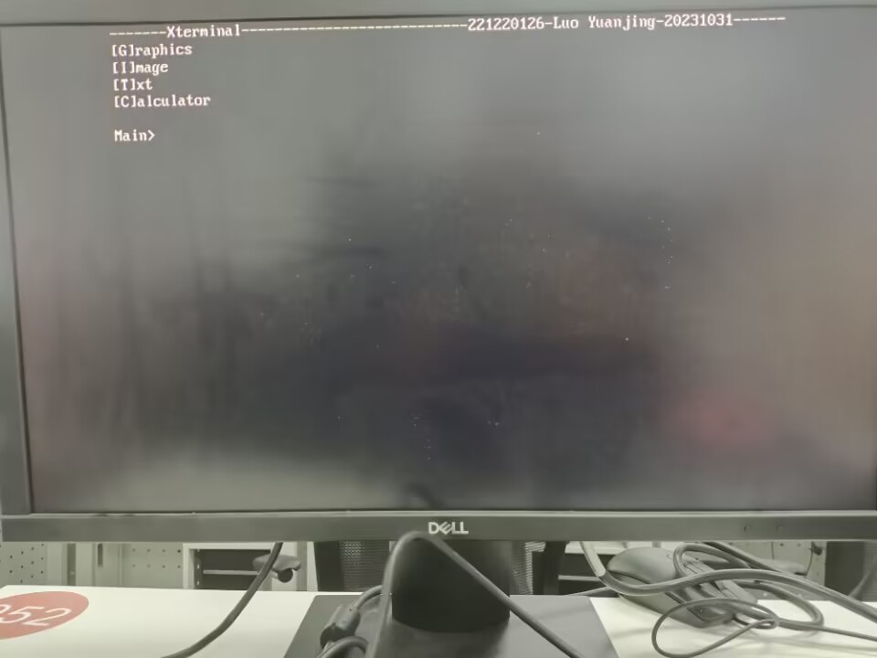
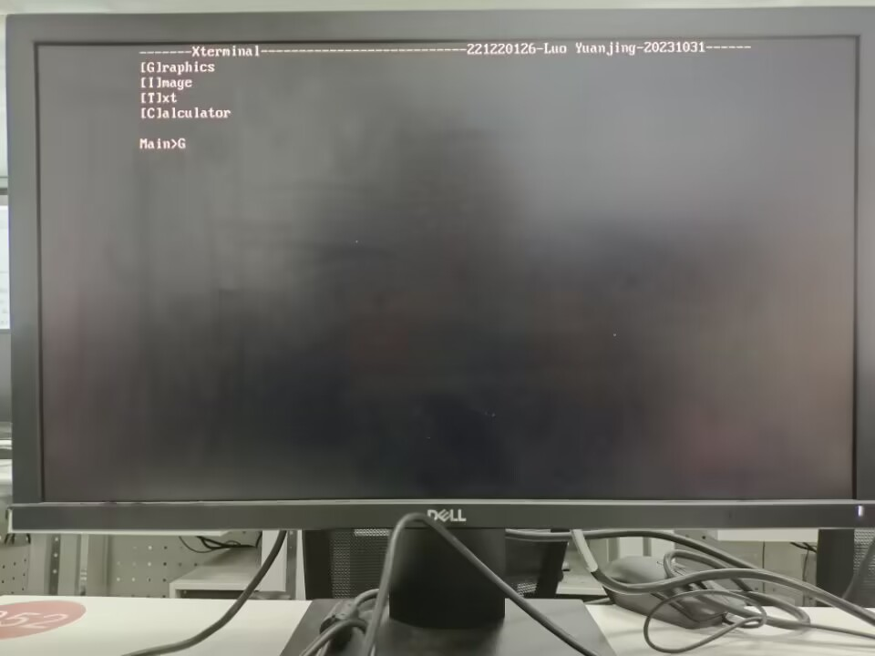
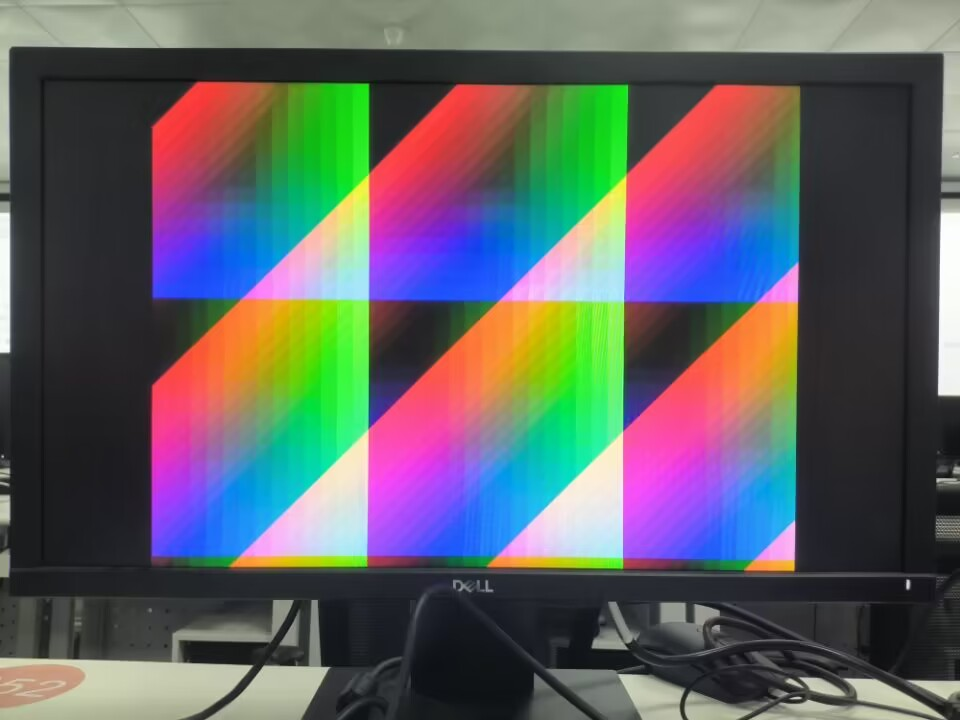

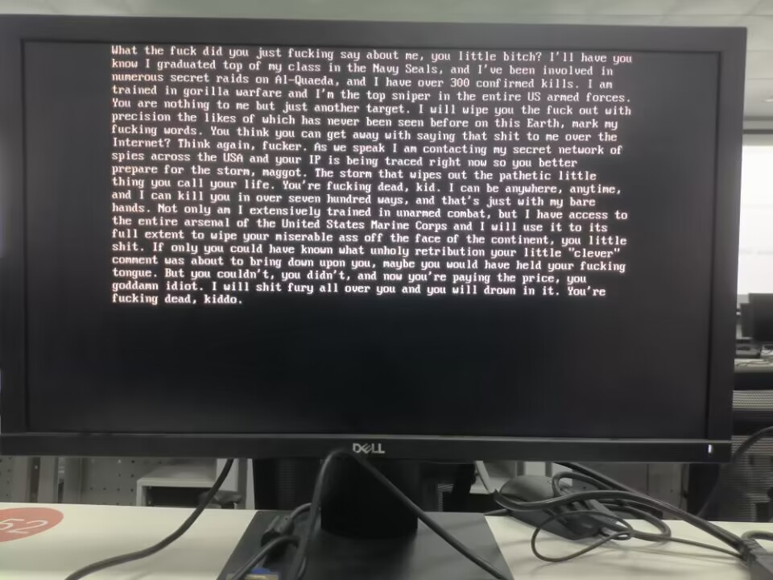
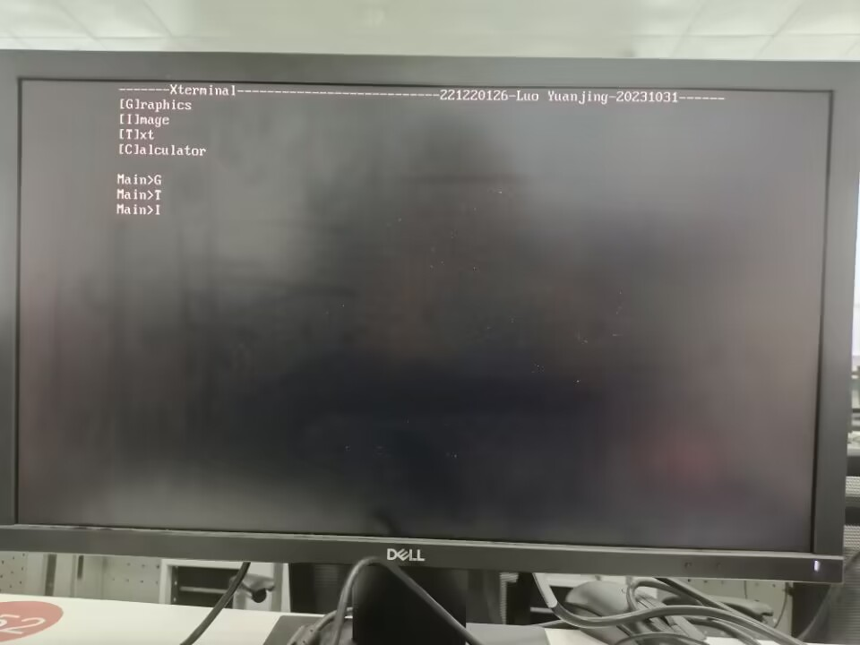

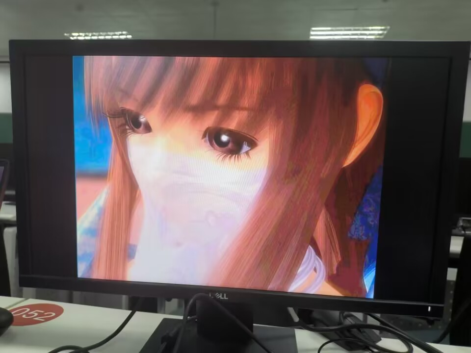

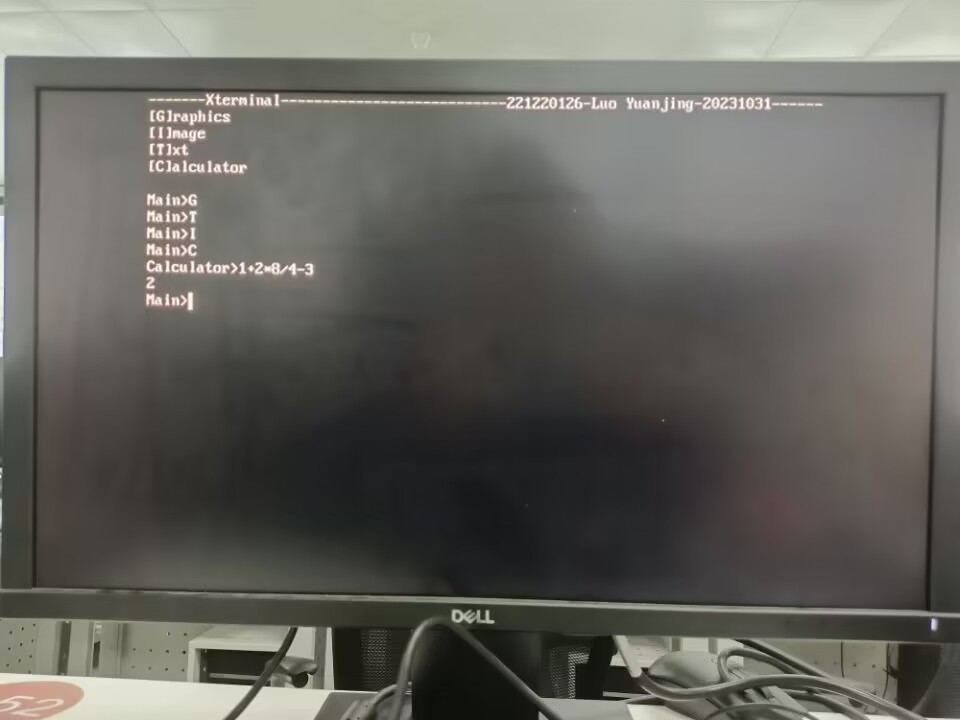
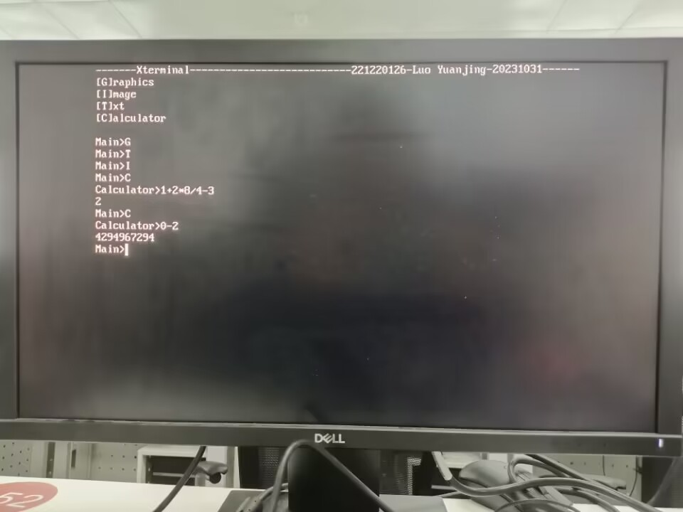
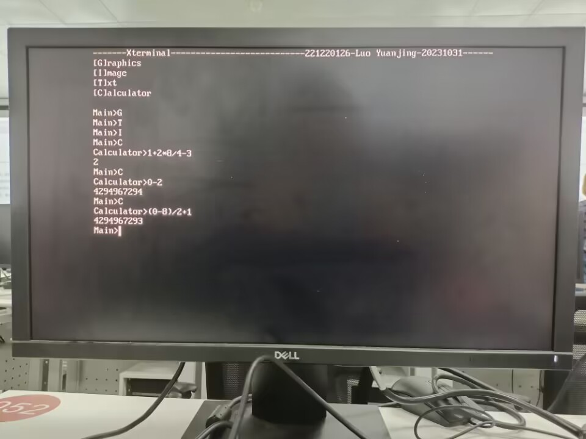
### (4)错误现象及分析
&emsp;&emsp;实验过程中，未对每行的不显示像素进行不显示特判，显示出来的图像较暗。添加后图像显示正常。

## 思考题
### 1、 如何在显示器分辨率设置为1280×1024时，在屏幕中间显示640×480的图像？
&emsp;&emsp;相较于实验原理部分，这里VGADraw代码需要有所改动
```
`timescale 1ns / 1ps
module VGADraw(
   input   wire  pix_clk  ,
   input   wire    [11:0]   pix_x  ,
   input   wire    [11:0]   pix_y  ,
   input   wire  pix_valid,    
   output  wire     [11:0]  pix_data    
    );
    wire [18:0] ram_addr;
wire [11:0] data;
wire i_vaild;
assign i_valid = pix_x >= 320 && pix_x < 960 && pix_y >= 272 && pix_y < 752;
assign ram_addr = i_valid ? (pix_x - 320) + 640 * (pix_y - 272) : 0;
assign pix_data = i_valid & pix_valid ? data : 12'h000;
vga_mem my_pic(.clka(pix_clk),.ena(1'b1),.wea(1'b0),.addra({ram_addr}),.dina(12'd0),.douta(data));
endmodule
```
最后效果如图:

### 2、 试试实现在屏幕上彩色字符（如图6.15所示）或实现类似电影Matrix开头的字符雨效果。
修改VGADraw：
```
`timescale 1ns / 1ps

module VGADraw(
    input   wire            pix_clk  ,
   input   wire    [11:0]   pix_x  ,
    input   wire    [11:0]   pix_y  ,
    input   wire            pix_valid,    
    output  wire     [11:0]  pix_data 
    );
    reg [8 * 80 - 1:0] text[29:0];

integer i;

initial begin
    for (i = 0; i < 30; i = i + 1) begin
        text[i] = 0;
    end
    text[0] = "    N   N           J       U   U        CCC         SSS                        ";
    text[1] = "    N   N           J       U   U       C   C       S   S                       ";
    text[2] = "    NN  N           J       U   U       C           S                           ";
    text[3] = "    N N N           J       U   U       C            SSS                        ";
    text[4] = "    N  NN           J       U   U       C               S                       ";
    text[5] = "    N   N       J   J       U   U       C   C       S   S                       ";
    text[6] = "    N   N        JJJ         UUU         CCC         SSS                        ";
end

wire [6:0] cha_x;
wire [4:0] cha_y;
wire [2:0] cha_pix_x;
wire [3:0] cha_pix_y;
assign {cha_x, cha_pix_x} = pix_x[9:0];
assign {cha_y, cha_pix_y} = pix_y[8:0];

wire [7:0] cha_ascii;
assign cha_ascii = text[cha_y][(640-8-8*cha_x)+:8];

wire [3:0] para;
assign para = (cha_x + cha_y) % 12;
wire [11:0] color;

assign color = para == 0 ? 12'b000000001111
             : para == 1 ? 12'b000000011110
             : para == 2 ? 12'b000000111100
             : para == 3 ? 12'b000001111000
             : para == 4 ? 12'b000011110000
             : para == 5 ? 12'b000111100000
             : para == 6 ? 12'b001111000000
             : para == 7 ? 12'b011110000000
             : para == 8 ? 12'b111100000000
             : para == 9 ? 12'b111000000001
             : para == 10 ? 12'b110000000011
             : para == 11 ? 12'b100000000111
             : 12'b000000000000;

wire [11:0] data;

posasc2bit posasc2bit_inst(
.cha_pix_x(cha_pix_x),
.cha_pix_y(cha_pix_y),
.pix_valid(pix_valid),
.cha_ascii(cha_ascii),
.pix_data(data)
);

assign pix_data = pix_valid && data != 0 ? color : 0;
endmodule
```
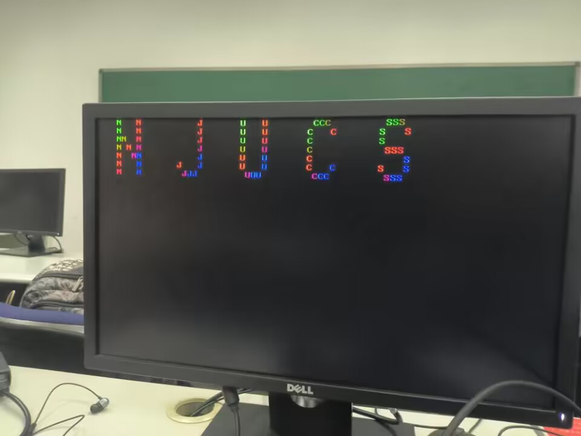
### 3、 说说如何字屏幕上显示汉字（实验资源中HZK16S汉字16×16点阵字库文件）？
修改VGADraw：
```
`timescale 1ns / 1ps

module VGADraw(
input   wire            pix_clk  ,
   input   wire    [11:0]   pix_x  ,
    input   wire    [11:0]   pix_y  ,
    input   wire            pix_valid,    
    output  wire     [11:0]  pix_data    
    );
    wire [5:0] cha_x;
wire [4:0] cha_y;
wire [3:0] cha_pix_x;
wire [3:0] cha_pix_y;
assign {cha_x, cha_pix_x} = pix_x[9:0];
assign {cha_y, cha_pix_y} = pix_y[8:0];

wire [15:0] cha_ascii;
assign cha_ascii = cha_x + 40 * cha_y;

posasc2bit posasc2bit_inst(
.cha_pix_x(cha_pix_x),
.cha_pix_y(cha_pix_y),
.pix_valid(pix_valid),
.cha_ascii(cha_ascii),
.pix_data(pix_data)
);
endmodule
```
posasc2bit进行如下修改:
```
`timescale 1ns / 1ps
module posasc2bit(
 input   wire    [3:0]  cha_pix_x,
    input   wire    [3:0]  cha_pix_y,
    input   wire    [15:0]  cha_ascii,
    input   wire           pix_valid,
    output  wire    [11:0] pix_data
    );
    reg [255:0] ascii_mem[33143:0];

initial begin
    $readmemh("C:/Vivadolabs/lab6/VGA_interface/reflection_questions/question3/HZK16S.txt", ascii_mem, 0, 33143);
end

wire [255:0] cha_font;
assign cha_font = ascii_mem[cha_ascii];
assign pix_data = cha_font[-cha_pix_x - 16 * cha_pix_y - 1] && pix_valid ? 12'hfff : 12'h000;
endmodule
```
最终效果如图:
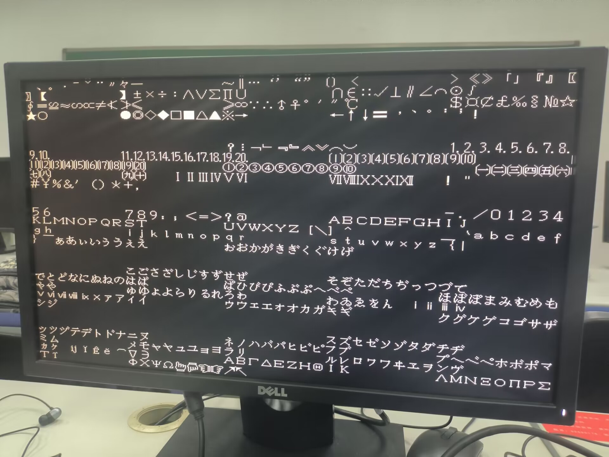